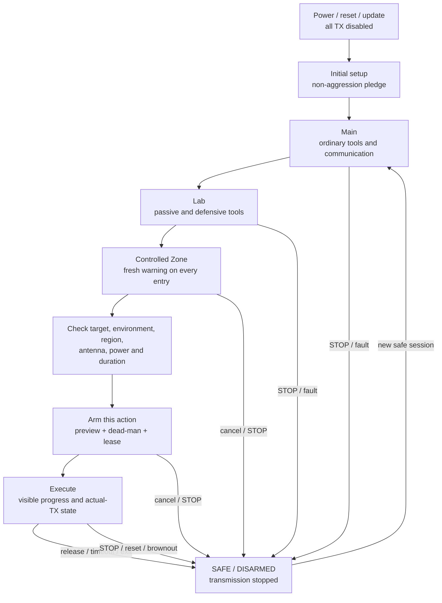

# Leshy2 Firmware

> **Target firmware site.** This page describes the finished Leshy2 behavior:
> its interface, radio services, safety, data, updates and recovery. Engineering
> history and open validation work live in separate documents.

- [Русская версия](README.ru.md)
- [Hardware target product](https://github.com/anton-vinogradov/esp32-leshy2)
- [Current engineering state](docs/status/current-state.md)
- [Engineering decisions and evidence](https://github.com/anton-vinogradov/esp32-leshy2/tree/main/docs/review)

## Finished-software intent

The firmware turns Leshy2 into an autonomous all-in-one instrument for
communication, observation, diagnostics and authorized research into wireless
and contact systems. Every core workflow is available on the device: a phone or
computer may assist with text entry and export, but never becomes the required
control surface.

Hardware reachability does not imply permission to transmit. Firmware always
binds an action to a region, antenna, power, target, duration, functional level
and the current physical STOP state.

## Three functional levels

1. **Main** — everyday tools, reception, diagnostics, navigation, maintenance
   and legitimate communications.
2. **Lab** — passive, defensive and bounded security-research tools.
3. **Lab → Controlled Zone** — dangerous active/disruptive tools. Every entry
   requires a fresh non-suppressible warning; every action separately checks
   authorized target and/or isolated/conducted environment requirements.

Leaving the level, lock, timeout, reset, watchdog, update, STOP or loss of a
required accessory invalidates every affected arm and lease. Initial setup also
requires explicit acceptance of the non-aggression pledge.

## How the finished software works

## User interface

- The home screen shows the active signal group, profile, antenna,
  channel/frequency, recording, power and safety state.
- Menus and critical warnings respond within `100 ms`; dirty/tiled waterfall
  updates yield to radio, audio and storage service.
- The complete local set is D-pad directions plus OK, BACK, OPT, F1, F2,
  rotary encoder with push, dedicated hold-to-talk PTT, hardware STOP and
  recessed RE-ARM. Touch and phone text input do not replace any of them.
- D-pad/OK/BACK/OPT/F1/F2 and encoder push use a dedicated `TCA9534APWR`
  (`P0…P6`, candidate address `0x3F`) for an interrupt-started 4×3 scan; `P7`
  remains reserved for local control growth.
  Encoder phases are captured independently by S3 PCNT0 on GPIO39/GPIO47, so
  display, storage and I²C work cannot lose quadrature edges. PTT is a direct
  RP GPIO21 input; STOP and RE-ARM remain asynchronous AON hardware controls.
- Display and touch stay in hardware reset until their common protected logic
  rail is stable. Firmware waits at least `120 ms` before display Sleep Out and
  `100 ms` before touch use, then enables the PWM backlight last. A latched
  backlight fault is never auto-retried; loss of the screen cannot stop radio,
  recording or the physical STOP path.
- Any visual frame loss is reported explicitly and never implies loss of raw
  radio or audio data.
- A microSD session starts only after stable insertion, isolated-rail power-up
  and card entry into SPI mode while display CS remains high. Safe removal
  blocks new writers and drains committed data before power-off. Unexpected
  removal is reported as possible loss of the unwritten tail and enters checked
  recovery; it is never presented as a clean recording.
- Commanded TX, measured current, radio-reported state and independent
  actual-TX evidence are displayed separately. `Unknown` remains visible.
- Long-form text may come from a locally paired phone. Preview and consequences
  remain on Leshy2; the phone cannot accept the pledge, enter Controlled Zone
  or authorize TX and destructive actions.

## Radio services

- Every physical radio owner locally enforces timing, queues, timestamps,
  timeouts, TX leases and safe-off. Inter-processor communication carries
  commands and data rather than becoming remote raw GPIO.
- Three nRF24 paths retain independent PTX/PRX in every simultaneous
  `3R/1T2R/2T1R/3T` mix without automatic peer standby.
- Only one qualified top-level signal group is active at a time; unused
  interfaces enter a verified quiet state.
- 2.4/5 GHz Wi-Fi, BLE, ESP-NOW, IEEE 802.15.4, packet Sub-GHz, analog voice,
  broadcast reception, IR and external GNSS/LoRa/NFC use separate profiles,
  permissions and result evidence.
- iButton/1-Wire separates ordinary use of owned devices, Lab reading and
  individually armed Controlled-Zone emulation/write; attaching the adapter
  authorizes nothing by itself.
- M5 Unit and U214 Cap accessories are profile-managed. If an external raw-SDR
  or RF-analysis module needs high-throughput transport, its profile defines
  that transport rather than relabelling a low-rate command link.
- Changing an antenna, regional profile, frequency profile or accessory clears
  TX arm. Unknown or incompatible identity denies transmission.

## Data and privacy

- Every record carries time, source, profile, frequency/channel, antenna,
  quality, gaps and applicable calibration metadata.
- Raw capture stays separate from decoded and derived results; reprocessing
  never rewrites the original.
- Imported files, scripts and captures remain inert until a tool is explicitly
  selected, checked and armed.
- Secrets, credential data and third-party recordings have explicit storage
  scope, lifetime, export policy and secure-deletion behavior.
- Missing GNSS, IMU or accessory metadata is marked unavailable and never
  replaced by an inference.
- A qualified external IMU may record raw acceleration/gyro, pitch/roll and
  short-term relative rotation. Without an indexed mount it is never described
  as absolute heading or RF bearing.

## STOP and safe state

- Every transmitter starts disabled after power, reset, brownout, watchdog or
  update. Previous target, power, payload, session and lease are not restored.
- Physical STOP dominates UI, IPC, storage and a hung compute domain. Releasing
  STOP does not re-arm the device; a separate fresh physical RE-ARM starts a
  new TX-off boot of every compute domain.
- Eight source-specific hardware observations cover the two native radios,
  three nRF paths, packet Sub-GHz, analog voice and optical IR. A separate
  wired aggregate and red indicator do not depend on firmware; missing or
  inconsistent evidence is shown as `Unknown`, never silently treated as safe.
- Leaving a tool or level, lock, timeout, link loss, accessory removal and
  profile error immediately invalidate affected TX permissions.
- The supervised 2S battery reports its two replaceable exact
  `XTAR 18650 4000mAh` protected button-top cells separately and as one
  required pair (`28.8 Wh` nominal). An unsafe combination, either removed
  cell, contact fault or incomplete battery identity blocks battery operation
  and charging and cannot be overridden in software. A dedicated fail-closed
  admission controller makes that decision before the application processor
  is required and retains independent programming and recovery. A deeply
  discharged cell is refused: the handheld has no zero-volt/prequalification
  recovery command, and any recovery research requires a separate isolated
  Controlled-Zone fixture. Before admission, a common-path diagnostic applies
  approximately 0.57-0.88 A for no more than 50 ms and compares both cells;
  one non-retriggerable hardware channel prevents pulse stretching and a
  second blocks every retry for at least 350 ms even with stuck firmware.
  Normal software waits at least 10 seconds. Factory acceptance also rejects a
  timer pulse shorter than 25 ms, preserving the filtered loaded-sample window. This
  screen is never presented as full-load
  qualification.
- Supported cells are exact `XTAR 18650 4000mAh` protected button-top devices
  installed in the polarized `Keystone 1048P`; raw flat-top cells are
  unsupported, as are USB-equipped variants. Normal charge never exceeds 2 A and is blocked
  outside the conservative allowed temperature window, initially `0…45 °C`. Two cell
  temperature channels and the charger's independent temperature channel must
  all be valid. Software cannot infer cell authenticity from two contacts or
  replace a lifted temperature sensor with an estimate.
- USB-C power is sink-only: firmware accepts 5-V fallback, 9 V/3 A or 15 V/2 A
  up to 30 W, reports the actual contract and load-aware charge limit, and
  never enables 20 V, PPS, source, power-bank or charger-OTG behavior.
- Native S3 USB2 Full-Speed data (12 Mbit/s) and both Type-C configuration
  lines have automatic hardware short-to-VBUS/ESD protection. A port fault
  closes the USB session and waits for safe physical recovery and
  re-enumeration; Alt Mode is not supported.
- On raw USB power the PD controller enters hardware SafeMode and loads its
  dedicated EEPROM without S3. The protected VBUS path and charging remain off
  until a valid policy is present; missing or corrupt policy requires the
  independent recovery pads rather than a permissive software fallback.
- The charger is physically fixed to 2S/750 kHz. Reset charging is `1 A`;
  runtime may use at most `2 A` only after it applies the actual USB current
  contract, accounts for system load, verifies both cells and passes the
  charger's independent battery-temperature gate.
- System operation always has priority over charging. The initial admission
  budget treats only 85% of the negotiated input power as usable, reserves the
  larger of the declared scenario load or measured load plus margin, and gives
  only the remainder to the battery. Missing power evidence, input-current
  limiting, a thermal condition or a power fault reduces charge to zero.
- Always-on safety, 3.3-V compute, 4.0-V voice and protected 5.0-V accessory
  power are separate fixed rails. Unused nRF, CC1101, storage, codec and
  receiver branches are powered down, discharged and verified quiet; software
  cannot select another rail voltage or bypass a hardware power fault.
- Every internal converter output crosses an independent overvoltage, current
  and short-circuit cutoff before reaching a load. Runtime trusts only
  protected-side power-good evidence. A latched main trip needs a complete
  source-removal cycle. The always-on cutoff may perform bounded hardware
  recovery attempts, but firmware cannot accelerate them or release compute
  before protected power is stably valid.
- An admitted source starts the always-on rail directly. Its power-good and a
  3.07-V supervisor threshold must both hold before a delayed hardware POR
  enables the main 3.3-V rail; firmware cannot bypass startup or keep compute
  alive through an always-on brownout.
- Voice/accessory power-good evidence is qualified by its hardware enable:
  an intentionally disabled rail is normal, while an enabled rail that does
  not become good within its bounded startup window fails closed.
- The accessory current limit is active immediately during startup; a
  controlled voltage ramp admits the external capacitance. The port supports
  `1.25 A` continuously and one bounded `2.0 A` post-start transient, never
  treating the transient timer as startup or continuous current budget.
- An external-accessory power fault latches the protected port off. Removing
  the cause and explicitly starting a new session is required; firmware never
  runs an automatic power-retry loop against a faulty accessory.
- Ordinary UI effects may be muted, but active TX, STOP failure, critical
  battery and other unsafe states cannot be hidden.

## Updates and recovery

- Every installable image has a signed manifest with hardware/profile identity,
  protocol range, hash, rollback index and migration rules.
- Normal update validates target and signature before activation, supports A/B
  rollback and never arms TX after restart.
- Every programmable domain can be independently flashed, recovered and
  diagnosed without a healthy application image or peer processor.
- The PD policy image is a versioned, reproducible, owner-signed artifact.
  Field update writes an inactive EEPROM region and keeps rollback; direct
  factory/recovery pads can restore a blank or corrupt device without S3 after
  the current-limited raw-VBUS fixture confirms the controller bus is idle.
- The owner retains offline/reproducible build and signing tools. Owner firmware
  remains installable through an explicit recovery workflow; irreversible
  lockdown is not the standard mode.

## Software boundary

Firmware does not promise 6 GHz/Wi-Fi 6E, generic USB host, personal FIDO/U2F,
an integrated keyboard or onboard-IMU functions. BadUSB/DuckyScript is only an
optional Controlled-Zone tool over the existing USB device path; it never
autoruns and cannot block delivery of the radio/key product core.

## Architecture contract

The finished device may use multiple signed images. Event types, manifests,
package formats and test vectors are shared, while physical radio ownership,
local deadlines and independent recovery paths remain explicit.

## Project documentation

- [Current firmware engineering state](docs/status/current-state.md)
- [Firmware architecture inputs](docs/architecture/README.md)
- [Hardware target product](https://github.com/anton-vinogradov/esp32-leshy2)
- [Complete requirements, decisions and evidence ledger](https://github.com/anton-vinogradov/esp32-leshy2/tree/main/docs/review)
