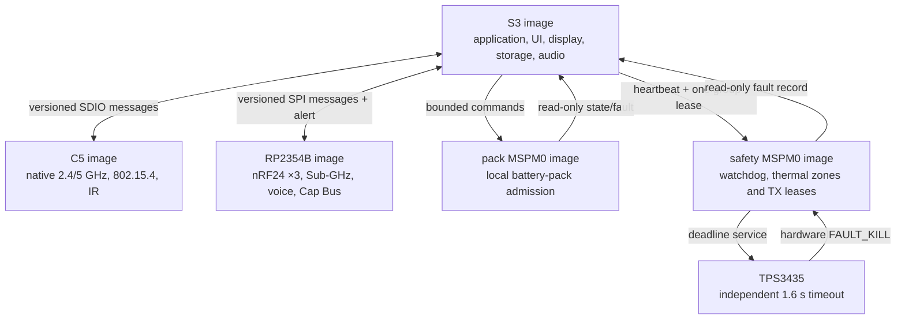

# Leshy2 firmware

[Русский](README.ru.md) · [Hardware](https://github.com/anton-vinogradov/esp32-leshy2)

> **Firmware status: F4 — IPC and scheduling.** F0–F3 are reviewed;
> the [F3 result](docs/f3-boot-memory-emulation-report.md) records exact S3 QEMU execution and honest physical gates. Follow the
> [firmware roadmap](docs/roadmap.md).

## Firmware roadmap and current position

This block stays on the firmware landing page through firmware release.
Detailed exit criteria and the explicit intersections with the separate
[hardware roadmap](https://github.com/anton-vinogradov/esp32-leshy2/blob/main/docs/roadmap.md)
are kept in the [firmware roadmap](docs/roadmap.md).

| Stage | Status | Result |
|---|---|---|
| F0 · Product contracts | ✅ Reviewed | five domains, ownership, L2IP, memory, safety, update and HW↔FW boundary |
| F1 · Portable cores | ✅ Reviewed | [F1 result: 24/24 host scenarios and clean ASan/UBSan](docs/f1-portable-cores-report.md) |
| F2 · Target projects and build system | ✅ [Reviewed](docs/f2-target-build-system-report.md) | five production-SDK projects; 52/52 artifacts reproduce byte-for-byte |
| F3 · Boot, memory and emulation | ✅ [Reviewed](docs/f3-boot-memory-emulation-report.md) | exact S3 debug/release QEMU; 52/52 reproducible artifacts; explicit physical gates |
| **F4 · IPC and scheduling** | **▶️ Current boundary** | real transports, typed messages, credits and priority isolation |
| F5 · BSP and drivers | ⏳ Waiting for F4 and current schematic | all device, control, sensor and power-state drivers |
| F6 · UI, display, storage and audio | ⏳ Waiting for F5 | responsive menu/waterfall, recording, audio and fault viewer |
| F7 · Radio, IR and expansion | ⏳ Waiting for F5/F6 | receive/TX profiles, full 3×nRF24 operation and quiet inactive paths |
| F8 · Functional levels and safety UX | ⏳ Waiting for F7 | Normal, Laboratory and Controlled Zone workflows |
| F9 · Signed update and recovery | ⏳ Waiting for F1/F3 | owner-controlled five-target bundle, rollback and physical recovery |
| F10 · HIL and system qualification | 🔒 Waiting for F4–F9 and hardware H7 | prototype fault, RF, power, thermal and endurance evidence |
| F11 · Firmware release | 🔒 Waiting for F10 and hardware H8 | reproducible signed images, installer, recovery kit and release tag |

Every completed top-level `F*` phase receives a separate result report linked
from this table; internal substeps only move the exact marker.

**Firmware is at F4.** The accepted hardware H2 BSP remains the pin source;
the hardware [H4 joined gate](https://github.com/anton-vinogradov/esp32-leshy2/blob/main/docs/h4-prelayout-gate-report.md)
is reviewed. At H5.0.3, [JLCPCB Standard PCBA is the non-exclusive manufacturing reference](https://github.com/anton-vinogradov/esp32-leshy2/blob/main/docs/manufacturing-platform.md):
10 critical lines of the 209-line production BOM are mapped and the full audit
is current. The minimum MPN-and-quantity upload is prepared but awaits user
sign-in; purchasing, replacement, layout and fabrication are still blocked.
F3 is reviewed: S3 debug/release boots and runs the
8-MiB octal-PSRAM and isolated fault paths in exact QEMU; all 52 target
artifacts reproduce. Peripheral execution and four non-S3 boots remain named
physical gates rather than emulator claims.

### Current phase F4 — detailed position

<!-- current-substep: F4.0.0 -->

**Exact marker: `F4.0.0`** — inventory exact SDK support and testability for
SDIO S3↔C5, SPI+alert S3↔RP and the Pack/Safety I²C mailboxes. The result must
separate executable host/virtual evidence from dev-board/HIL-only behavior.
This marker and its evidence move together in each commit.

- `F2.0` — freeze the target/toolchain matrix.
  - ✅ `F2.0.0` — register the five targets and their flash/RAM/rollback
    contracts.
  - ✅ `F2.0.1` — reviewed exact SDK/toolchain versions, official support,
    lifecycle, license and build-host requirements; see the
    [five-image build environment](docs/toolchains.md).
  - ✅ `F2.0.2` — immutable SDK revisions, 26 verified archive records and the
    hash-locked ESP-IDF Python environment passed review.
  - ✅ `F2.0.3` — one local/CI matrix, shell-free dispatcher, fail-closed
    preflight and 26 named target artifacts passed review.
- `F2.1` — create the shared source/component tree without target pins.
  - ✅ `F2.1.0` — directories, single ownership, target-neutral portable code
    and the empty-until-F2.3 generated-source boundary passed review.
  - ✅ `F2.1.1` — strict C17/C++17, warnings-as-errors for project code,
    debug/release optimization and map-producing link policy passed review.
  - ✅ `F2.1.2` — the integrated environment, source, build-policy, H2-contract
    and 24-scenario host review passed together.
- `F2.2` — create minimal S3, C5, RP, Pack and Safety SDK projects.
  - ✅ `F2.2.0` — the S3 ESP-IDF project, portable component, production
    memory defaults and debug/release inputs passed structural review.
  - ✅ `F2.2.1` — the C5 ESP-IDF project, portable component, production
    memory defaults and debug/release inputs passed structural review.
  - ✅ `F2.2.2` — the exact RP2354B Arm-secure project, 2-MiB custom board,
    partition input and debug/release policy passed structural review.
  - ✅ `F2.2.3` — the exact Pack MSPM0C1106 project, separate boot/application
    images, memory boundaries and debug/release policy passed structural review.
  - ✅ `F2.2.4` — the exact Safety MSPM0C1106 project, separate boot/application
    images, fail-closed entry and debug/release policy passed structural review.
  - ✅ `F2.2.5` — one integrated review passed for five projects, 29 files,
    26 artifacts and 20 debug/release command plans with zero target execution.
- `F2.3` — consume the accepted generated pin/BSP contract.
  - ✅ `F2.3.0` — the immutable H2 source identity, 5 domains, 125 contacts,
    112 nets, 4 transports, 10 groups and proof-field model passed review.
  - ✅ `F2.3.1` — 11 generated C/header files preserve all 125 contacts, pass
    strict C17 syntax checks and reproduce byte-for-byte with a hashed manifest.
  - ✅ `F2.3.2` — every target consumes exactly its domain table and include
    path; no foreign table, copied BSP file or hand-authored pin was found.
  - ✅ `F2.3.3` — sibling H2, deterministic generation, strict C17 tables and
    one-owner consumption passed one integrated review.
- `F2.4` — pass debug/release builds, map files and image-size gates.
  - ✅ `F2.4.0` — locked-toolchain preflight for five targets passed review.
    - ✅ `F2.4.0.1` — exact ESP-IDF `v6.0.2`, Pico SDK/picotool `2.3.0` and TI
      MSPM0 SDK `2.11.00.07` sources and revisions passed review.
    - ✅ `F2.4.0.2` — exact S3/C5 compilers, debuggers, ULP tools, OpenOCD and
      ROM ELFs installed, recognized and passed review.
    - ✅ `F2.4.0.3` — hash-locked Python 3.12 environment and exact CMake/Ninja
      passed review; evidence is in [`config/f2_4_preflight_progress.json`](config/f2_4_preflight_progress.json).
    - ✅ `F2.4.0.4` — hash-verified native Arm GNU `15.2.Rel1` passed review for RP2354B.
    - ✅ `F2.4.0.5` — hash-verified TI Arm Clang `4.0.5.LTS` and SysConfig
      `1.28.0.4712` passed review for Pack/Safety.
    - ✅ `F2.4.0.6` — 30 exact SDK, Git, lock, compiler and input checks plus
      debug/release dispatcher preflight passed; [machine evidence](config/f2_4_preflight_review.json).
  - ✅ `F2.4.1` — S3 debug/release configure, build, ten-artifact presence and
    image-size gates passed; [machine evidence](config/f2_4_s3_build_review.json).
  - ✅ `F2.4.2` — C5 debug/release configure, build, ten-artifact presence and
    image-size gates passed; [machine evidence](config/f2_4_c5_build_review.json).
  - ✅ `F2.4.3` — RP debug/release configure, build, eight-artifact presence and
    image-size gates passed; [machine evidence](config/f2_4_rp_build_review.json).
  - ✅ `F2.4.4` — Pack debug/release configure, build, twelve-artifact presence
    and image-size gates passed; [machine evidence](config/f2_4_pack_build_review.json).
  - ✅ `F2.4.5` — Safety debug/release configure, build, twelve-artifact presence
    and image-size gates passed; [machine evidence](config/f2_4_safety_build_review.json).
  - ✅ `F2.4.6` — all 52 debug/release artifacts, 14 maps and 10 image-size
    gates passed one integrated review; [machine evidence](config/f2_4_build_review.json).
- ✅ `F2.5` — two complete clean passes produced 52/52 byte-identical
  artifacts; 24 distributable images contained no absolute workspace path.
  See the [F2 result report](docs/f2-target-build-system-report.md) and
  [machine evidence](config/f2_5_reproducibility_review.json).
- `F3.0` — freeze the runtime-evidence plan before claiming a boot.
  - ✅ `F3.0.0` — official emulator/simulator support, instruction coverage,
    boot observability and unavoidable dev-board gates
    for all five targets passed review: exact vendor QEMU exists only for S3;
    [machine matrix](config/f3_execution_capability_matrix.json).
  - ✅ `F3.0.1` — exact hash-locked QEMU archives, debug/release recipes, six
    ordered boot markers, a 30-second timeout and fail-closed result contract
    passed review; [machine plan](config/f3_runtime_plan.json).
  - ✅ `F3.0.2` — the five-target evidence matrix and one fail-closed runner
    passed review without executing a target; [machine matrix](config/f3_acceptance_matrix.json).
- ✅ `F3.1` — S3 debug and release images each passed six ordered markers in
  exact Espressif QEMU, including 8-MiB octal-PSRAM initialization and memory
  test; [debug evidence](config/f3_1_s3_debug_runtime_review.json) and
  [release evidence](config/f3_1_s3_release_runtime_review.json).
- ✅ `F3.2` — S3 debug/release each passed nine ordered markers for boot,
  self-test, retained-first-fault and failed-update RAM rollback; 24 portable
  scenarios also passed ASan/UBSan. This does not claim nonvolatile persistence
  or flash rollback; [integrated evidence](config/f3_2_runtime_review.json).
- ✅ `F3.3` — a fresh double clean-build reproduced 52/52 artifacts; ten current
  image/RAM gates and five static rollback topologies fit. S3 debug is 182,688
  bytes with 6,895,200 bytes before its maximum; zero physical rollback
  transitions are claimed. See the
  [boundary evidence](config/f3_3_boundary_review.json).
- ✅ `F3.4` — the [global F3 result](docs/f3-boot-memory-emulation-report.md)
  closes the phase with exact S3 execution, 52 reproducible artifacts and five
  explicit physical target/HIL gates.
- `F4.0` — freeze the transport execution and evidence plan.
  - ▶️ **`F4.0.0` — current:** inventory exact SDK transport support,
    observability and emulator/dev-board boundaries.
  - `F4.0.1` — freeze adapter states, credits, deadlines and reset behavior.
  - `F4.0.2` — freeze one integrated execution and evidence runner.
- `F4.1` — implement and exercise S3↔C5 SDIO.
- `F4.2` — implement and exercise S3↔RP SPI+alert.
- `F4.3` — implement and exercise Pack/Safety I²C mailboxes.
- `F4.4` — inject saturation, duplicate, deadline, reset and link-loss faults.
- `F4.5` — reconcile target evidence and publish the global F4 result.

F3 is reviewed at its honest evidence boundary. F4 now turns the accepted
message contracts into real target transports while preserving safety/control
priority under waterfall and bulk traffic. Each substep updates evidence, this
exact marker and both language pages in the same commit.

The firmware turns Leshy2 radio paths into one field instrument: it renders the
menu and waterfall, controls receive and transmit, records data, manages
expansion and preserves a safe state through faults. This documentation
describes the resulting product and its implementation.

## User capabilities

- Fast navigation through D-pad, `OK`, `BACK`, `OPT`, `F1`, `F2`, encoder,
  touch and `PTT`; one maintained `RUN/KILL` switch controls admission and
  physical fault recovery.
- A continuously scrolling spectrum waterfall and path indicators, updating
  only the changed display regions.
- Receive profiles, scanning, supported-protocol decoding and recording of RF
  events, audio and metadata to microSD.
- Stereo playback and external-microphone capture through a CTIA headset, with
  continuous insertion detection and an internal-microphone option for
  ordinary TRS headphones.
- Full mixed operation of three nRF24 radios: `3R`, `1T2R`, `2T1R` and `3T`
  without software disabling a neighboring receiver.
- 2.4/5-GHz Wi-Fi, BLE, ESP-NOW, IEEE 802.15.4, Sub-GHz, broadcast RX,
  VHF/UHF voice, IR, stock U214 LoRa RX/GNSS and exact evidence-qualified
  `LESHY2-LORA-CAP-01-EU868/US915` RX/TX profiles.
- Import, export and backup of owner profiles; a locally paired phone may supply
  occasional long-form text.

## Three functional levels

1. **Normal mode** — ordinary receive, diagnostics, maintenance and lawful
   communications.
2. **Laboratory** — passive, defensive and constrained research tools.
3. **Laboratory → Controlled Zone** — potentially dangerous active functions.
   Every entry shows a fresh mandatory banner; each action requires separate
   arming and an authorized target or isolated environment.

Firmware cannot override hardware `FAULT_KILL`, derive permission from detected
transmission or restore old arming after reset, recovery, profile change or a
fault. A latched fault requires a physical `KILL`→`RUN` cycle.

## Five-domain runtime

Hard real-time reactions execute at the physical path owner. Inter-processor
messages are typed and versioned; link loss revokes the lease and moves the
dependent function to a safe state. Display, storage and radio avoid long
cross-subsystem blocking operations.

On a fault, C5 and RP stay in reset. If the UI thermal zone remains safe, S3
may run only a signed fault viewer showing the cause, measured value and limit,
action taken, event identifier and `KILL`→`RUN` instruction. If the display or
UI zone is unsafe, the screen turns off and the independent amber `FAULT` LED
remains visible.

Long operation uses a qualified USB-PD source; the product makes no battery-
autonomy or uptime-hours promise. `Settings > Safety > Full self-test` offers
24-hour, default 48-hour and explicitly warned startup-only proof intervals.
Only the local physical UI may stage a change, and it takes effect after the
next physical `KILL`→`RUN` proof. The safety controller owns the deadline;
expiry revokes leases and enters the retained fault state. This setting cannot
weaken the watchdog, thermal limits, power-fault response or TX-lease checks.

## Update and owner control

Images are signed, target-bound and installed with rollback. Signatures protect
against package substitution without closing the device: owners can build from
source, use their own keys and recover each controller through an independent
physical interface. Irreversible lockdown is not enabled by default.

## Documentation

- [Firmware roadmap and current position](docs/roadmap.md)
- [Build environment for all five images](docs/toolchains.md)
- [Firmware architecture and subsystem behavior](docs/architecture.md)
- [Flash, PSRAM and rollback layout](docs/memory.md)
- [Hardware architecture](https://github.com/anton-vinogradov/esp32-leshy2/blob/main/docs/hardware.md)
- [Safety model](https://github.com/anton-vinogradov/esp32-leshy2/blob/main/docs/safety.md)
