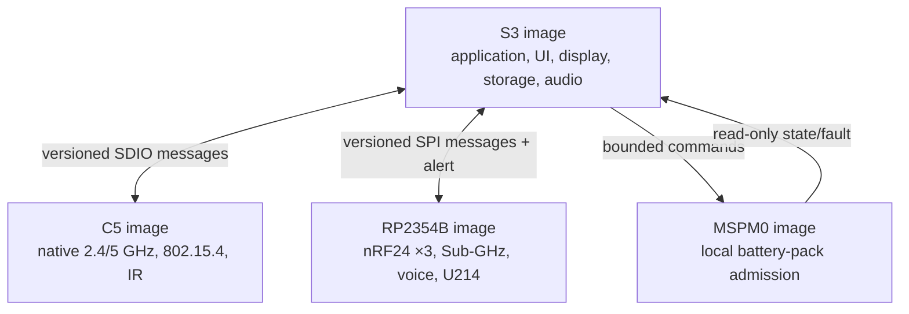

# Leshy2 firmware

[Русский](README.ru.md) · [Hardware](https://github.com/anton-vinogradov/esp32-leshy2)

The firmware turns Leshy2 radio paths into one field instrument: it renders the
menu and waterfall, controls receive and transmit, records data, manages
expansion and preserves a safe state through faults. This documentation
describes the resulting product and its implementation.

## User capabilities

- Fast navigation through D-pad, `OK`, `BACK`, `OPT`, `F1`, `F2`, encoder,
  touch, `PTT`, `STOP` and `RE-ARM`.
- A continuously scrolling spectrum waterfall and path indicators, updating
  only the changed display regions.
- Receive profiles, scanning, supported-protocol decoding and recording of RF
  events, audio and metadata to microSD.
- Full mixed operation of three nRF24 radios: `3R`, `1T2R`, `2T1R` and `3T`
  without software disabling a neighboring receiver.
- 2.4/5-GHz Wi-Fi, BLE, ESP-NOW, IEEE 802.15.4, Sub-GHz, broadcast RX,
  VHF/UHF voice, IR and attached LoRa/GNSS modules.
- Import, export and backup of owner profiles; a locally paired phone may supply
  occasional long-form text.

## Three functional levels

1. **Normal mode** — ordinary receive, diagnostics, maintenance and lawful
   communications.
2. **Laboratory** — passive, defensive and constrained research tools.
3. **Laboratory → Controlled Zone** — potentially dangerous active functions.
   Every entry shows a fresh mandatory banner; each action requires separate
   arming and an authorized target or isolated environment.

Firmware cannot override hardware `STOP`, derive permission from detected
transmission or restore old arming after reset, recovery, profile change or a
fault.

## Four-domain runtime

Hard real-time reactions execute at the physical path owner. Inter-processor
messages are typed and versioned; link loss revokes the lease and moves the
dependent function to a safe state. Display, storage and radio avoid long
cross-subsystem blocking operations.

## Update and owner control

Images are signed, target-bound and installed with rollback. Signatures protect
against package substitution without closing the device: owners can build from
source, use their own keys and recover each controller through an independent
physical interface. Irreversible lockdown is not enabled by default.

## Documentation

- [Firmware architecture and subsystem behavior](docs/architecture.md)
- [Hardware architecture](https://github.com/anton-vinogradov/esp32-leshy2/blob/main/docs/hardware.md)
- [Safety model](https://github.com/anton-vinogradov/esp32-leshy2/blob/main/docs/safety.md)
