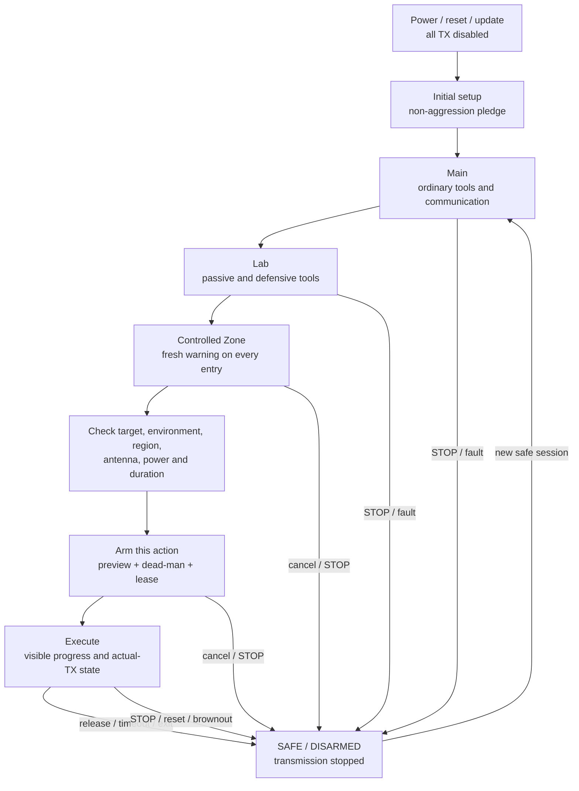

# Leshy2 Firmware

> **Target firmware site.** This page describes the finished Leshy2 behavior:
> its interface, radio services, safety, data, updates and recovery. Engineering
> history and open validation work live in separate documents.

- [Русская версия](README.ru.md)
- [Hardware target product](https://github.com/anton-vinogradov/esp32-leshy2)
- [Current engineering state](docs/status/current-state.md)
- [Engineering decisions and evidence](https://github.com/anton-vinogradov/esp32-leshy2/tree/main/docs/review)

## Finished-software intent

The firmware turns Leshy2 into an autonomous all-in-one instrument for
communication, observation, diagnostics and authorized research into wireless
and contact systems. Every core workflow is available on the device: a phone or
computer may assist with text entry and export, but never becomes the required
control surface.

Hardware reachability does not imply permission to transmit. Firmware always
binds an action to a region, antenna, power, target, duration, functional level
and the current physical STOP state.

## Three functional levels

1. **Main** — everyday tools, reception, diagnostics, navigation, maintenance
   and legitimate communications.
2. **Lab** — passive, defensive and bounded security-research tools.
3. **Lab → Controlled Zone** — dangerous active/disruptive tools. Every entry
   requires a fresh non-suppressible warning; every action separately checks
   authorized target and/or isolated/conducted environment requirements.

Leaving the level, lock, timeout, reset, watchdog, update, STOP or loss of a
required accessory invalidates every affected arm and lease. Initial setup also
requires explicit acceptance of the non-aggression pledge.

## How the finished software works

## User interface

- The home screen shows the active signal group, profile, antenna,
  channel/frequency, recording, power and safety state.
- Menus and critical warnings respond within `100 ms`; dirty/tiled waterfall
  updates yield to radio, audio and storage service.
- Any visual frame loss is reported explicitly and never implies loss of raw
  radio or audio data.
- Commanded TX, measured current, radio-reported state and independent
  actual-TX evidence are displayed separately. `Unknown` remains visible.
- Long-form text may come from a locally paired phone. Preview and consequences
  remain on Leshy2; the phone cannot accept the pledge, enter Controlled Zone
  or authorize TX and destructive actions.

## Radio services

- Every physical radio owner locally enforces timing, queues, timestamps,
  timeouts, TX leases and safe-off. Inter-processor communication carries
  commands and data rather than becoming remote raw GPIO.
- Three nRF24 paths retain independent PTX/PRX in every simultaneous
  `3R/1T2R/2T1R/3T` mix without automatic peer standby.
- Only one qualified top-level signal group is active at a time; unused
  interfaces enter a verified quiet state.
- 2.4/5 GHz Wi-Fi, BLE, ESP-NOW, IEEE 802.15.4, packet Sub-GHz, analog voice,
  broadcast reception, IR and external GNSS/LoRa/NFC use separate profiles,
  permissions and result evidence.
- iButton/1-Wire separates ordinary use of owned devices, Lab reading and
  individually armed Controlled-Zone emulation/write; attaching the adapter
  authorizes nothing by itself.
- M5 Unit and U214 Cap accessories are profile-managed. If an external raw-SDR
  or RF-analysis module needs high-throughput transport, its profile defines
  that transport rather than relabelling a low-rate command link.
- Changing an antenna, regional profile, frequency profile or accessory clears
  TX arm. Unknown or incompatible identity denies transmission.

## Data and privacy

- Every record carries time, source, profile, frequency/channel, antenna,
  quality, gaps and applicable calibration metadata.
- Raw capture stays separate from decoded and derived results; reprocessing
  never rewrites the original.
- Imported files, scripts and captures remain inert until a tool is explicitly
  selected, checked and armed.
- Secrets, credential data and third-party recordings have explicit storage
  scope, lifetime, export policy and secure-deletion behavior.
- Missing GNSS, IMU or accessory metadata is marked unavailable and never
  replaced by an inference.
- A qualified external IMU may record raw acceleration/gyro, pitch/roll and
  short-term relative rotation. Without an indexed mount it is never described
  as absolute heading or RF bearing.

## STOP and safe state

- Every transmitter starts disabled after power, reset, brownout, watchdog or
  update. Previous target, power, payload, session and lease are not restored.
- Physical STOP dominates UI, IPC, storage and a hung compute domain. Releasing
  STOP does not re-arm the device; a separate fresh physical RE-ARM starts a
  new TX-off boot of every compute domain.
- Eight source-specific hardware observations cover the two native radios,
  three nRF paths, packet Sub-GHz, analog voice and optical IR. A separate
  wired aggregate and red indicator do not depend on firmware; missing or
  inconsistent evidence is shown as `Unknown`, never silently treated as safe.
- Leaving a tool or level, lock, timeout, link loss, accessory removal and
  profile error immediately invalidate affected TX permissions.
- The two replaceable 18650 cells are reported separately and as a supervised
  pair. A mismatch, removed cell, contact fault or incomplete battery identity
  blocks operation/charging and cannot be overridden in software.
- Ordinary UI effects may be muted, but active TX, STOP failure, critical
  battery and other unsafe states cannot be hidden.

## Updates and recovery

- Every installable image has a signed manifest with hardware/profile identity,
  protocol range, hash, rollback index and migration rules.
- Normal update validates target and signature before activation, supports A/B
  rollback and never arms TX after restart.
- Every programmable domain can be independently flashed, recovered and
  diagnosed without a healthy application image or peer processor.
- The owner retains offline/reproducible build and signing tools. Owner firmware
  remains installable through an explicit recovery workflow; irreversible
  lockdown is not the standard mode.

## Software boundary

Firmware does not promise 6 GHz/Wi-Fi 6E, generic USB host, personal FIDO/U2F,
an integrated keyboard or onboard-IMU functions. BadUSB/DuckyScript is only an
optional Controlled-Zone tool over the existing USB device path; it never
autoruns and cannot block delivery of the radio/key product core.

## Architecture contract

The finished device may use multiple signed images. Event types, manifests,
package formats and test vectors are shared, while physical radio ownership,
local deadlines and independent recovery paths remain explicit.

## Project documentation

- [Current firmware engineering state](docs/status/current-state.md)
- [Firmware architecture inputs](docs/architecture/README.md)
- [Hardware target product](https://github.com/anton-vinogradov/esp32-leshy2)
- [Complete requirements, decisions and evidence ledger](https://github.com/anton-vinogradov/esp32-leshy2/tree/main/docs/review)
