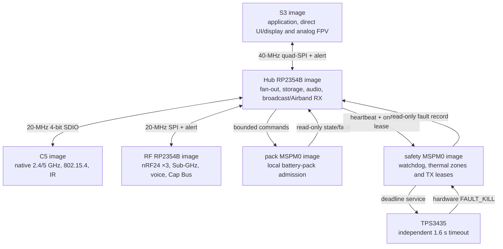

# Leshy2 firmware

[Русский](README.ru.md) · [Hardware](https://github.com/anton-vinogradov/esp32-leshy2)

> **Firmware status: F1-R2.4 — portable-core closure review is current.** The R1
> F0–F4 work remains regression evidence, but its five-domain topology is no
> longer current. Follow the [firmware roadmap](docs/roadmap.md).

## Firmware roadmap and current position

This block stays on the firmware landing page through firmware release.
Detailed exit criteria and the explicit intersections with the separate
[hardware roadmap](https://github.com/anton-vinogradov/esp32-leshy2/blob/main/docs/roadmap.md)
are kept in the [firmware roadmap](docs/roadmap.md).

| Stage | Status | Result |
|---|---|---|
| F0 · Product contracts | ✅ **Reviewed:** [F0-R2 result](docs/f0-product-contracts-report.md) | six domains, identities, independent rollback, S3-last update and honest execution gates |
| **F1 · Portable cores** | **▶️ Current: F1-R2.4**; R1 [report retained](docs/f1-portable-cores-report.md) | all R2 behavior implemented and reviewed; run integrated closure and publish the F1-R2 report |
| F2 · Target projects and build system | ⏳ R1 [report retained](docs/f2-target-build-system-report.md); waiting for F1-R2 | six production-SDK projects and a reproducible six-image matrix |
| F3 · Boot, memory and emulation | ⏳ R1 [report retained](docs/f3-boot-memory-emulation-report.md); waiting for F2-R2 | requalified six-target memory, boot, emulator and physical gates |
| F4 · IPC and scheduling | ⏳ R1 work paused; waiting for F3-R2 | Hub-centered transports, typed messages, credits and priority isolation |
| F5 · BSP and drivers | ⏳ Waiting for F4 and current R2 schematic | all device, control, sensor and power-state drivers |
| F6 · UI, display, storage and audio | ⏳ Waiting for F5 | responsive menu/waterfall, recording, audio and fault viewer |
| F7 · Radio, IR and expansion | ⏳ Waiting for F5/F6 | receive/TX profiles, full 3×nRF24 operation and quiet inactive paths |
| F8 · Functional levels and safety UX | ⏳ Waiting for F7 | Normal, Laboratory and Controlled Zone workflows |
| F9 · Signed update and recovery | ⏳ Waiting for F1/F3 | owner-controlled six-target bundle, rollback and physical recovery |
| F10 · HIL and system qualification | 🔒 Waiting for F4–F9 and hardware H7 | prototype fault, RF, power, thermal and endurance evidence |
| F11 · Firmware release | 🔒 Waiting for F10 and hardware H8 | reproducible signed images, installer, recovery kit and release tag |

Every completed top-level `F*` phase receives a separate result report linked
from this table; internal substeps only move the exact marker.

**Firmware is at F1-R2.4.** The [reviewed F0-R2 result](docs/f0-product-contracts-report.md)
closes the contract foundation without claiming an implemented target. The generated
[`h0_r2_hardware_contract.json`](config/h0_r2_hardware_contract.json) binds the
firmware repository to the reviewed hardware source by SHA-256. R2 has six
targets: S3, C5, RF RP, Hub RP, Pack and Safety. UI, buttons, display and analog
FPV remain direct to S3; storage, audio and `BROADCAST_RX` move to Hub RP.
The reviewed [target identity contract](config/f0_r2_target_identity_contract.json)
names six unique application images and the two protected-controller boot
images without claiming that R2 projects or builds already exist.
The reviewed [memory and rollback contract](config/f0_r2_memory_rollback_contract.json)
keeps six independent dual-slot domains: both RP2354B and both MSPM0 devices
share geometry only, never target identity, state or flash contents. No physical
rollback transition or production signature-verifier fit is claimed yet.
The reviewed [update policy](config/update_policy.json) stages all six images,
boots and commits Pack → Safety → C5 → RF RP → Hub RP → S3, persists a
power-loss-safe journal and requires a signed bridge bundle for breaking IPC
changes. Its 16.7-second RP TBYB budget remains explicitly unmeasured.
The reviewed [execution matrix](config/f0_r2_execution_gate_matrix.json) keeps
five evidence layers distinct. Only S3 has an exact official QEMU machine. S3,
C5, Pack and Safety have exact selected-module/MCU development-board paths;
Pico 2 is explicitly only a non-exact RP2350A surrogate for both RP2354B
targets. No R2 build, dev-board or Leshy2 HIL run is claimed.
Mandatory receive-only Airband uses Hub GP41/42, a fixed 112-MHz LO and the
existing Si4732 audio path. Airband TX is absent. Hardware is at `H1-R2.13`:
Hub/Airband/K331-reserve bodies have a collision-tested placement, and the
complete current exterior, mirrored inner-face, service, antenna-edge and section
views are generated. Regeneration corrected the missing independent Hub recovery
set, so S3, C5, RF RP and Hub RP each have USB, RESET/BOOT and internal DBG10.
The Airband filter has a nominal/stress feasibility audit and a 24×11-mm tuning
cell, and port/antenna kit codes are synchronized. Official AKK-hosted media
confirms the K331 application circuit, all 14 pin functions and the 24-channel
table. An AKK-branded reseller drawing corroborates 28.7×23.1 mm nominal XY;
hardware deliberately collision-checks a 30×24×4-mm reserve and still retains
1.44 mm opposing clearance against 0.70 mm required. K331 fits the reserved Hub
controls and 5-V budget; exact linear `TBS5G8MMCXA` is the thirteenth kit
antenna for the keyed `FPV RX 5.8G` MMCX, with independent Taoglas
`FXP831.09.0100C` selected as a backorder-only paper fallback. JLCPCB confirmed
that K331 is absent from Parts Library and Global Sourcing, found no direct
replacement and accepts genuine AKK modules through Consigned Parts. The one
remaining H1 blocker is an AKK-controlled production package with maximum XYZ,
land-pattern and packaging/soldering/reflow data; it also unlocks the consignment application.
Manufacturer-documented `AWM666V RX` fits the same physical and power reserve,
but remains a degraded contingency: seven 5725–5875-MHz channels instead of
K331's 24-channel 5645–5945-MHz plan, and no exact public JLCPCB result.
The full-coverage fallback search found no production replacement: controlled
`SP166RX` is 42.418×29.46 mm before height and its RF summary contradicts its
channel table, while `MM238R-MCU` fits function and space but has only
reseller-hosted evidence, no controlled current manufacturer route and only
out-of-stock/discontinued sellers. Exact JLCPCB searches return zero results
for both.
Consigned Parts approval, final Gerber/BOM/CPL DFM and optional factory function-test
review are assigned to H5/H6/H7. Assembled RF/video proof and the Taoglas
fallback stay mandatory at downstream H3/H5/H6/H8.
Live JLCPCB cards for `RichWave RTC6715` and generic `RX5808` have zero stock,
MOQ 442 and no purchasable module route; the bare RTC6715 also lacks a public
reference RF/IF application, so firmware keeps the K331 module boundary.
The exact MMCX is now registered with 3.6 mm on-board and a 3.0-mm outboard
barrel; its wave-solder tail, 4.5-mm minimum wall opening and Ø12×20-mm plug
service corridor pass the hardware coordinate audit. Received mating,
retention, final enclosure tolerance and strain remain H5 evidence.
The exact 3V3_MAIN cell
admits 3.75 A continuous / 4.25 A step across all 12 allowed signal groups;
dynamic and enclosure proof remains an H3 gate. Airband filter H3 uses bounded
pre-layout parasitics, H6 repeats routed extraction before order and H8 selects
the VNA-qualified fitted/DNP state. The current R2 mockup remains in progress
until the K331 reserve becomes a controlled fixed body; BSP, KiCad layout and order
authorization remain open.

### Current phase F1-R2 — detailed position

<!-- current-substep: F1-R2.4 -->

▶️ **`F1-R2.4` — current.** The [integrated fault
review](config/f1_r2_integrated_fault_review.json) now covers Hub loss, Pack
loss and Safety loss across the receiver, downstream domains, heartbeat,
`FAULT_KILL` and external-watchdog boundaries. Thirty-four F1 scenarios pass
normal and ASan/UBSan runs. The remaining work is one closure audit plus the
bilingual F1-R2 report. Zero R2 target builds, RF runs or physical transitions
are claimed.

<strong>Retained R1 F0–F4 evidence — not the current topology</strong>

### Historical R1 phase F4 — position when R2 reopened the architecture

<!-- historical-substep: F4.1.4 -->

**Exact marker: `F4.1.4`** — run the named S3-C5 dev-board physical gate. Four
locked S3/C5 debug/release builds pass, and exact S3 QEMU executes six
fake-SDIO traffic/fault scenarios in both configurations. Those runs prove
application behavior above the fake boundary, not SDIO signaling, throughput,
timing or C5 USB coexistence. This marker and its evidence move together in
each commit.

- `F2.0` — freeze the target/toolchain matrix.
  - ✅ `F2.0.0` — register the five targets and their flash/RAM/rollback
    contracts.
  - ✅ `F2.0.1` — reviewed exact SDK/toolchain versions, official support,
    lifecycle, license and build-host requirements; see the
    [five-image build environment](docs/toolchains.md).
  - ✅ `F2.0.2` — immutable SDK revisions, 26 verified archive records and the
    hash-locked ESP-IDF Python environment passed review.
  - ✅ `F2.0.3` — one local/CI matrix, shell-free dispatcher, fail-closed
    preflight and 26 named target artifacts passed review.
- `F2.1` — create the shared source/component tree without target pins.
  - ✅ `F2.1.0` — directories, single ownership, target-neutral portable code
    and the empty-until-F2.3 generated-source boundary passed review.
  - ✅ `F2.1.1` — strict C17/C++17, warnings-as-errors for project code,
    debug/release optimization and map-producing link policy passed review.
  - ✅ `F2.1.2` — the integrated environment, source, build-policy, H2-contract
    and 24-scenario host review passed together.
- `F2.2` — create minimal S3, C5, RP, Pack and Safety SDK projects.
  - ✅ `F2.2.0` — the S3 ESP-IDF project, portable component, production
    memory defaults and debug/release inputs passed structural review.
  - ✅ `F2.2.1` — the C5 ESP-IDF project, portable component, production
    memory defaults and debug/release inputs passed structural review.
  - ✅ `F2.2.2` — the exact RP2354B Arm-secure project, 2-MiB custom board,
    partition input and debug/release policy passed structural review.
  - ✅ `F2.2.3` — the exact Pack MSPM0C1106 project, separate boot/application
    images, memory boundaries and debug/release policy passed structural review.
  - ✅ `F2.2.4` — the exact Safety MSPM0C1106 project, separate boot/application
    images, fail-closed entry and debug/release policy passed structural review.
  - ✅ `F2.2.5` — one integrated review passed for five projects, 37 files,
    26 artifacts and 20 debug/release command plans with zero target execution.
- `F2.3` — consume the accepted generated pin/BSP contract.
  - ✅ `F2.3.0` — the immutable H2 source identity, 5 domains, 125 contacts,
    112 nets, 4 transports, 10 groups and proof-field model passed review.
  - ✅ `F2.3.1` — 11 generated C/header files preserve all 125 contacts, pass
    strict C17 syntax checks and reproduce byte-for-byte with a hashed manifest.
  - ✅ `F2.3.2` — every target consumes exactly its domain table and include
    path; no foreign table, copied BSP file or hand-authored pin was found.
  - ✅ `F2.3.3` — sibling H2, deterministic generation, strict C17 tables and
    one-owner consumption passed one integrated review.
- `F2.4` — pass debug/release builds, map files and image-size gates.
  - ✅ `F2.4.0` — locked-toolchain preflight for five targets passed review.
    - ✅ `F2.4.0.1` — exact ESP-IDF `v6.0.2`, Pico SDK/picotool `2.3.0` and TI
      MSPM0 SDK `2.11.00.07` sources and revisions passed review.
    - ✅ `F2.4.0.2` — exact S3/C5 compilers, debuggers, ULP tools, OpenOCD and
      ROM ELFs installed, recognized and passed review.
    - ✅ `F2.4.0.3` — hash-locked Python 3.12 environment and exact CMake/Ninja
      passed review; evidence is in [`config/f2_4_preflight_progress.json`](config/f2_4_preflight_progress.json).
    - ✅ `F2.4.0.4` — hash-verified native Arm GNU `15.2.Rel1` passed review for RP2354B.
    - ✅ `F2.4.0.5` — hash-verified TI Arm Clang `4.0.5.LTS` and SysConfig
      `1.28.0.4712` passed review for Pack/Safety.
    - ✅ `F2.4.0.6` — 30 exact SDK, Git, lock, compiler and input checks plus
      debug/release dispatcher preflight passed; [machine evidence](config/f2_4_preflight_review.json).
  - ✅ `F2.4.1` — S3 debug/release configure, build, ten-artifact presence and
    image-size gates passed; [machine evidence](config/f2_4_s3_build_review.json).
  - ✅ `F2.4.2` — C5 debug/release configure, build, ten-artifact presence and
    image-size gates passed; [machine evidence](config/f2_4_c5_build_review.json).
  - ✅ `F2.4.3` — RP debug/release configure, build, eight-artifact presence and
    image-size gates passed; [machine evidence](config/f2_4_rp_build_review.json).
  - ✅ `F2.4.4` — Pack debug/release configure, build, twelve-artifact presence
    and image-size gates passed; [machine evidence](config/f2_4_pack_build_review.json).
  - ✅ `F2.4.5` — Safety debug/release configure, build, twelve-artifact presence
    and image-size gates passed; [machine evidence](config/f2_4_safety_build_review.json).
  - ✅ `F2.4.6` — all 52 debug/release artifacts, 14 maps and 10 image-size
    gates passed one integrated review; [machine evidence](config/f2_4_build_review.json).
- ✅ `F2.5` — two complete clean passes produced 52/52 byte-identical
  artifacts; 24 distributable images contained no absolute workspace path.
  See the [F2 result report](docs/f2-target-build-system-report.md) and
  [machine evidence](config/f2_5_reproducibility_review.json).
- `F3.0` — freeze the runtime-evidence plan before claiming a boot.
  - ✅ `F3.0.0` — official emulator/simulator support, instruction coverage,
    boot observability and unavoidable dev-board gates
    for all five targets passed review: exact vendor QEMU exists only for S3;
    [machine matrix](config/f3_execution_capability_matrix.json).
  - ✅ `F3.0.1` — exact hash-locked QEMU archives, debug/release recipes, six
    ordered boot markers, a 30-second timeout and fail-closed result contract
    passed review; [machine plan](config/f3_runtime_plan.json).
  - ✅ `F3.0.2` — the five-target evidence matrix and one fail-closed runner
    passed review without executing a target; [machine matrix](config/f3_acceptance_matrix.json).
- ✅ `F3.1` — S3 debug and release images each passed six ordered markers in
  exact Espressif QEMU, including 8-MiB octal-PSRAM initialization and memory
  test; [debug evidence](config/f3_1_s3_debug_runtime_review.json) and
  [release evidence](config/f3_1_s3_release_runtime_review.json).
- ✅ `F3.2` — S3 debug/release each passed nine ordered markers for boot,
  self-test, retained-first-fault and failed-update RAM rollback; 24 portable
  scenarios also passed ASan/UBSan. This does not claim nonvolatile persistence
  or flash rollback; [integrated evidence](config/f3_2_runtime_review.json).
- ✅ `F3.3` — a fresh double clean-build reproduced 52/52 artifacts; ten current
  image/RAM gates and five static rollback topologies fit. S3 debug is 187,040
  bytes with 6,890,848 bytes before its maximum; zero physical rollback
  transitions are claimed. See the
  [boundary evidence](config/f3_3_boundary_review.json).
- ✅ `F3.4` — the [global F3 result](docs/f3-boot-memory-emulation-report.md)
  closes the phase with exact S3 execution, 52 reproducible artifacts and five
  explicit physical target/HIL gates.
- `F4.0` — freeze the transport execution and evidence plan.
  - ✅ `F4.0.0` — [four transports and eight exact SDK endpoint bindings reviewed](config/f4_0_transport_capability_matrix.json); QEMU proves none of their PHYs.
  - ✅ `F4.0.1` — [one fail-closed lifecycle, fixed ownership/queues, credits, duplicates, deadlines, reset and exact ESSL lock reviewed](config/f4_0_1_adapter_contract.json).
  - ✅ `F4.0.2` — [one integrated runner, six evidence classes and 37 scenarios reviewed](config/f4_0_2_acceptance_matrix.json); [baseline snapshot](config/f4_0_2_acceptance_snapshot.json) claims zero transport runs.
- `F4.1` — implement and exercise S3↔C5 SDIO.
  - ✅ `F4.1.0` — [exact offline ESSL 1.1.2 payload and single-owner S3↔C5 source boundary reviewed](config/f4_1_s3_c5_source_boundary.json); [30-file manifest](third_party/esp_serial_slave_link.vendor-lock.json).
  - ✅ `F4.1.1` — [common high-speed core reviewed](config/f4_1_1_high_speed_core_review.json): 19 ASan/UBSan scenarios; cumulative duplicate-safe bulk grants replace the unsafe absolute-credit draft.
  - ✅ `F4.1.2` — [S3 host and C5 SDIO slave endpoints reviewed](config/f4_1_2_s3_c5_endpoint_review.json): generated pins, one-bit 20-MHz SDIO, exact ESSL and two locked debug builds; zero QEMU/PHY claims.
  - ✅ `F4.1.3` — [exact builds and fake-SDIO QEMU reviewed](config/f4_1_3_s3_c5_qemu_review.json): four target builds, two S3 QEMU runs, six scenarios per run and zero PHY claims.
  - ▶️ **`F4.1.4` — current:** run and review the named S3-C5 dev-board physical gate.
- `F4.2` — implement and exercise S3↔RP SPI+alert.
- `F4.3` — implement and exercise Pack/Safety I²C mailboxes.
- `F4.4` — inject saturation, duplicate, deadline, reset and link-loss faults.
- `F4.5` — reconcile target evidence and publish the global F4 result.

F3 is reviewed at its honest evidence boundary. F4 now turns the accepted
message contracts into real target transports while preserving safety/control
priority under waterfall and bulk traffic. Each substep updates evidence, this
exact marker and both language pages in the same commit.

The firmware turns Leshy2 radio paths into one field instrument: it renders the
menu and waterfall, controls receive and transmit, records data, manages
expansion and preserves a safe state through faults. This documentation
describes the resulting product and its implementation.

## User capabilities

- Fast navigation through D-pad, `OK`, `BACK`, `OPT`, `F1`, `F2`, encoder,
  touch and `PTT`; one maintained `RUN/KILL` switch controls admission and
  physical fault recovery.
- A continuously scrolling spectrum waterfall and path indicators, updating
  only the changed display regions.
- Receive profiles, scanning, supported-protocol decoding and recording of RF
  events, audio and metadata to microSD.
- Stereo playback and external-microphone capture through a CTIA headset, with
  continuous insertion detection and an internal-microphone option for
  ordinary TRS headphones.
- Full mixed operation of three nRF24 radios: `3R`, `1T2R`, `2T1R` and `3T`
  without software disabling a neighboring receiver.
- 2.4/5-GHz Wi-Fi, BLE, ESP-NOW, IEEE 802.15.4, Sub-GHz, broadcast RX,
  VHF/UHF voice, IR, stock U214 LoRa RX/GNSS and exact evidence-qualified
  `LESHY2-LORA-CAP-01-EU868/US915` RX/TX profiles.
- Import, export and backup of owner profiles; a locally paired phone may supply
  occasional long-form text.

## Three functional levels

1. **Normal mode** — ordinary receive, diagnostics, maintenance and lawful
   communications.
2. **Laboratory** — passive, defensive and constrained research tools.
3. **Laboratory → Controlled Zone** — potentially dangerous active functions.
   Every entry shows a fresh mandatory banner; each action requires separate
   arming and an authorized target or isolated environment.

Firmware cannot override hardware `FAULT_KILL`, derive permission from detected
transmission or restore old arming after reset, recovery, profile change or a
fault. A latched fault requires a physical `KILL`→`RUN` cycle.

## Six-domain runtime

Hard real-time reactions execute at the physical path owner. Inter-processor
messages are typed and versioned; link loss revokes the lease and moves the
dependent function to a safe state. Display, storage and radio avoid long
cross-subsystem blocking operations.

On a fault, C5, RF RP and Hub RP enter their defined safe/reset states. If the UI thermal zone remains safe, S3
may run only a signed fault viewer showing the cause, measured value and limit,
action taken, event identifier and `KILL`→`RUN` instruction. If the display or
UI zone is unsafe, the screen turns off and the independent amber `FAULT` LED
remains visible.

Long operation uses a qualified USB-PD source; the product makes no battery-
autonomy or uptime-hours promise. `Settings > Safety > Full self-test` offers
24-hour, default 48-hour and explicitly warned startup-only proof intervals.
Only the local physical UI may stage a change, and it takes effect after the
next physical `KILL`→`RUN` proof. The safety controller owns the deadline;
expiry revokes leases and enters the retained fault state. This setting cannot
weaken the watchdog, thermal limits, power-fault response or TX-lease checks.

## Update and owner control

Images are signed, target-bound and installed with rollback. Signatures protect
against package substitution without closing the device: owners can build from
source, use their own keys and recover each controller through an independent
physical interface. Irreversible lockdown is not enabled by default.

## Documentation

- [Firmware roadmap and current position](docs/roadmap.md)
- [R1 build environment retained for requalification](docs/toolchains.md)
- [Firmware architecture and subsystem behavior](docs/architecture.md)
- [Flash, PSRAM and rollback layout](docs/memory.md)
- [Hardware architecture](https://github.com/anton-vinogradov/esp32-leshy2/blob/main/docs/hardware.md)
- [Safety model](https://github.com/anton-vinogradov/esp32-leshy2/blob/main/docs/safety.md)
