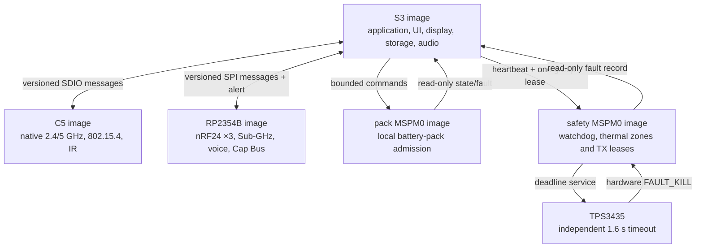

# Leshy2 firmware

[Русский](README.ru.md) · [Hardware](https://github.com/anton-vinogradov/esp32-leshy2)

> **Firmware status: F2 — target projects and reproducible builds.** F0/F1
> are reviewed; the accepted hardware H2 contract is now available to F2. Follow the
> [firmware roadmap](docs/roadmap.md).

## Firmware roadmap and current position

This block stays on the firmware landing page through firmware release.
Detailed exit criteria and the explicit intersections with the separate
[hardware roadmap](https://github.com/anton-vinogradov/esp32-leshy2/blob/main/docs/roadmap.md)
are kept in the [firmware roadmap](docs/roadmap.md).

| Stage | Status | Result |
|---|---|---|
| F0 · Product contracts | ✅ Reviewed | five domains, ownership, L2IP, memory, safety, update and HW↔FW boundary |
| F1 · Portable cores | ✅ Reviewed | 24 deterministic host scenarios plus clean ASan/UBSan |
| **F2 · Target projects and build system** | **▶️ Current boundary; H2 contract available** | reproducible ESP-IDF, Pico SDK and TI SDK projects for five targets |
| F3 · Boot, memory and emulation | ⏳ Waiting for F2 | bootable skeletons, size gates, S3 QEMU and dev-board matrix |
| F4 · IPC and scheduling | ⏳ Waiting for F3 | real transports, typed messages, credits and priority isolation |
| F5 · BSP and drivers | ⏳ Waiting for F4 and current schematic | all device, control, sensor and power-state drivers |
| F6 · UI, display, storage and audio | ⏳ Waiting for F5 | responsive menu/waterfall, recording, audio and fault viewer |
| F7 · Radio, IR and expansion | ⏳ Waiting for F5/F6 | receive/TX profiles, full 3×nRF24 operation and quiet inactive paths |
| F8 · Functional levels and safety UX | ⏳ Waiting for F7 | Normal, Laboratory and Controlled Zone workflows |
| F9 · Signed update and recovery | ⏳ Waiting for F1/F3 | owner-controlled five-target bundle, rollback and physical recovery |
| F10 · HIL and system qualification | 🔒 Waiting for F4–F9 and hardware H7 | prototype fault, RF, power, thermal and endurance evidence |
| F11 · Firmware release | 🔒 Waiting for F10 and hardware H8 | reproducible signed images, installer, recovery kit and release tag |

**Firmware is at F2.** Portable logic has evidence, but target projects,
target builds and target-emulator runs do not yet exist. The accepted hardware
H2 pin/BSP contract is available; F2 remains current because target/toolchain
work has not been completed.

### Current phase F2 — detailed position

<!-- current-substep: F2.0.1 -->

**Exact marker: `F2.0.1`** — verify and pin the supported production SDK and
toolchain version for each of the five targets. Archived choices are inputs,
not current evidence.

- `F2.0` — freeze the target/toolchain matrix.
  - ✅ `F2.0.0` — register the five targets and their flash/RAM/rollback
    contracts.
  - ▶️ **`F2.0.1` — current:** verify exact SDK/toolchain versions, official
    support, lifecycle, license and build-host requirements.
  - ⏳ `F2.0.2` — create reproducible environment manifests and dependency
    locks.
  - ⏳ `F2.0.3` — define one local/CI build matrix and canonical commands.
- ⏳ `F2.1` — create the shared source/component tree without target pins.
- ⏳ `F2.2` — create minimal S3, C5, RP, Pack and Safety SDK projects.
- ⏳ `F2.3` — consume the accepted generated pin/BSP contract after F2.0–F2.2.
- ⏳ `F2.4` — pass debug/release builds, map files and image-size gates.
- ⏳ `F2.5` — review reproducibility and advance to F3 boot/emulation.

`F2.0.1` exits only when every target names a currently supported exact
toolchain source/version and its constraints. When any substep closes, this
marker and both roadmap pages are updated in the same commit before work
advances.

The firmware turns Leshy2 radio paths into one field instrument: it renders the
menu and waterfall, controls receive and transmit, records data, manages
expansion and preserves a safe state through faults. This documentation
describes the resulting product and its implementation.

## User capabilities

- Fast navigation through D-pad, `OK`, `BACK`, `OPT`, `F1`, `F2`, encoder,
  touch and `PTT`; one maintained `RUN/KILL` switch controls admission and
  physical fault recovery.
- A continuously scrolling spectrum waterfall and path indicators, updating
  only the changed display regions.
- Receive profiles, scanning, supported-protocol decoding and recording of RF
  events, audio and metadata to microSD.
- Stereo playback and external-microphone capture through a CTIA headset, with
  continuous insertion detection and an internal-microphone option for
  ordinary TRS headphones.
- Full mixed operation of three nRF24 radios: `3R`, `1T2R`, `2T1R` and `3T`
  without software disabling a neighboring receiver.
- 2.4/5-GHz Wi-Fi, BLE, ESP-NOW, IEEE 802.15.4, Sub-GHz, broadcast RX,
  VHF/UHF voice, IR, stock U214 LoRa RX/GNSS and exact evidence-qualified
  `LESHY2-LORA-CAP-01-EU868/US915` RX/TX profiles.
- Import, export and backup of owner profiles; a locally paired phone may supply
  occasional long-form text.

## Three functional levels

1. **Normal mode** — ordinary receive, diagnostics, maintenance and lawful
   communications.
2. **Laboratory** — passive, defensive and constrained research tools.
3. **Laboratory → Controlled Zone** — potentially dangerous active functions.
   Every entry shows a fresh mandatory banner; each action requires separate
   arming and an authorized target or isolated environment.

Firmware cannot override hardware `FAULT_KILL`, derive permission from detected
transmission or restore old arming after reset, recovery, profile change or a
fault. A latched fault requires a physical `KILL`→`RUN` cycle.

## Five-domain runtime

Hard real-time reactions execute at the physical path owner. Inter-processor
messages are typed and versioned; link loss revokes the lease and moves the
dependent function to a safe state. Display, storage and radio avoid long
cross-subsystem blocking operations.

On a fault, C5 and RP stay in reset. If the UI thermal zone remains safe, S3
may run only a signed fault viewer showing the cause, measured value and limit,
action taken, event identifier and `KILL`→`RUN` instruction. If the display or
UI zone is unsafe, the screen turns off and the independent amber `FAULT` LED
remains visible.

Long operation uses a qualified USB-PD source; the product makes no battery-
autonomy or uptime-hours promise. `Settings > Safety > Full self-test` offers
24-hour, default 48-hour and explicitly warned startup-only proof intervals.
Only the local physical UI may stage a change, and it takes effect after the
next physical `KILL`→`RUN` proof. The safety controller owns the deadline;
expiry revokes leases and enters the retained fault state. This setting cannot
weaken the watchdog, thermal limits, power-fault response or TX-lease checks.

## Update and owner control

Images are signed, target-bound and installed with rollback. Signatures protect
against package substitution without closing the device: owners can build from
source, use their own keys and recover each controller through an independent
physical interface. Irreversible lockdown is not enabled by default.

## Documentation

- [Firmware roadmap and current position](docs/roadmap.md)
- [Firmware architecture and subsystem behavior](docs/architecture.md)
- [Flash, PSRAM and rollback layout](docs/memory.md)
- [Hardware architecture](https://github.com/anton-vinogradov/esp32-leshy2/blob/main/docs/hardware.md)
- [Safety model](https://github.com/anton-vinogradov/esp32-leshy2/blob/main/docs/safety.md)
