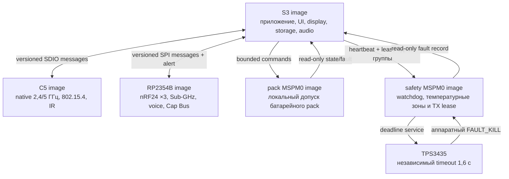

# Leshy2 — прошивка

[English](README.md) · [Аппаратная часть](https://github.com/anton-vinogradov/esp32-leshy2/blob/main/README.ru.md)

> **Статус прошивки: F2 — target-проекты и воспроизводимая сборка.** F0/F1
> прошли ревью; target/BSP-работы ожидают аппаратную границу H2. Подробности —
> в [роадмапе прошивки](docs/roadmap.ru.md).

## Роадмап прошивки и текущая позиция

Этот блок остаётся на стартовой странице прошивки до firmware release.
Подробные критерии выхода и явные пересечения с отдельным
[аппаратным роадмапом](https://github.com/anton-vinogradov/esp32-leshy2/blob/main/docs/roadmap.ru.md)
находятся в [роадмапе прошивки](docs/roadmap.ru.md).

| Этап | Статус | Результат |
|---|---|---|
| F0 · Контракты продукта | ✅ Проведено ревью | пять доменов, владельцы, L2IP, memory, safety, update и HW↔FW boundary |
| F1 · Portable cores | ✅ Проведено ревью | 24 детерминированных host-сценария и чистые ASan/UBSan |
| **F2 · Target-проекты и build system** | **▶️ Текущая граница; зависит от hardware H2** | воспроизводимые проекты ESP-IDF, Pico SDK и TI SDK для пяти target |
| F3 · Boot, память и эмуляция | ⏳ Ожидает F2 | загружаемые skeletons, size gates, S3 QEMU и dev-board matrix |
| F4 · IPC и scheduling | ⏳ Ожидает F3 | реальные transports, typed messages, credits и priority isolation |
| F5 · BSP и drivers | ⏳ Ожидает F4 и актуальную схему | все драйверы устройств, органов управления, датчиков и power states |
| F6 · UI, display, storage и audio | ⏳ Ожидает F5 | отзывчивые menu/waterfall, recording, audio и fault viewer |
| F7 · Radio, IR и expansion | ⏳ Ожидает F5/F6 | receive/TX profiles, полноценные 3×nRF24 и тихие неактивные тракты |
| F8 · Уровни функций и safety UX | ⏳ Ожидает F7 | Основной режим, Лаборатория и Контролируемая зона |
| F9 · Signed update и recovery | ⏳ Ожидает F1/F3 | управляемый владельцем bundle для пяти target, rollback и физический recovery |
| F10 · HIL и системная квалификация | 🔒 Ожидает F4–F9 и hardware H7 | prototype fault, RF, power, thermal и endurance evidence |
| F11 · Firmware release | 🔒 Ожидает F10 и hardware H8 | воспроизводимые подписанные образы, installer, recovery kit и release tag |

**Прошивка находится на F2.** У portable-логики есть evidence, но target-
проектов, target-сборок и target-emulator runs ещё нет. Реальная фиксация
pin/BSP ожидает production ECAD-контракт этапа hardware H2.

### Текущая фаза F2 — детальная позиция

<!-- current-substep: F2.0.1 -->

**Точный маркер: `F2.0.1`** — проверить и зафиксировать поддерживаемую
production-версию SDK и toolchain для каждого из пяти target. Выборы из
архивных документов служат входами, а не актуальным evidence.

- `F2.0` — зафиксировать target/toolchain matrix.
  - ✅ `F2.0.0` — зарегистрировать пять target и их flash/RAM/rollback
    contracts.
  - ▶️ **`F2.0.1` — сейчас:** проверить точные SDK/toolchain versions,
    официальную поддержку, lifecycle, license и требования к build host.
  - ⏳ `F2.0.2` — создать воспроизводимые environment manifests и dependency
    locks.
  - ⏳ `F2.0.3` — определить единую local/CI build matrix и канонические
    команды.
- ⏳ `F2.1` — создать общее дерево source/components без target pins.
- ⏳ `F2.2` — создать минимальные SDK-проекты S3, C5, RP, Pack и Safety.
- 🔒 `F2.3` — подключить генерируемый pin/BSP contract; ожидает hardware H2.
- ⏳ `F2.4` — пройти debug/release builds, map files и image-size gates.
- ⏳ `F2.5` — провести ревью воспроизводимости и перейти к F3 boot/emulation.

`F2.0.1` завершается, когда для каждого target назван актуально поддерживаемый
точный источник и version toolchain с его ограничениями. После закрытия любой
подзадачи этот маркер и обе страницы роадмапа обновляются тем же commit до
перехода дальше.

Прошивка превращает радиотракты Leshy2 в единый полевой инструмент: показывает
меню и водопад, управляет приёмом и передачей, записывает данные, обслуживает
расширения и сохраняет безопасное состояние при сбоях. Здесь описаны
возможности и устройство готового продукта.

## Пользовательские возможности

- Быстрая навигация с D-pad, `OK`, `BACK`, `OPT`, `F1`, `F2`, энкодером,
  touch и `PTT`; один фиксируемый переключатель `RUN/KILL` управляет допуском
  и физическим восстановлением после аварии.
- Бегущий спектральный водопад и индикаторы трактов с перерисовкой только
  изменившихся областей экрана.
- Профили приёма, сканирование, декодирование поддерживаемых протоколов,
  запись RF-событий, аудио и метаданных на microSD.
- Стереовоспроизведение и запись с внешнего микрофона через CTIA-гарнитуру,
  непрерывное детектирование штекера и выбор встроенного микрофона для обычных
  TRS-наушников.
- Полный смешанный режим трёх nRF24: `3R`, `1T2R`, `2T1R` и `3T` без
  программного отключения соседнего приёмника.
- Wi‑Fi 2,4/5 ГГц, BLE, ESP‑NOW, IEEE 802.15.4, Sub‑GHz, broadcast RX,
  VHF/UHF voice, IR, штатный U214 LoRa RX/GNSS и точные evidence-qualified
  RX/TX-профили `LESHY2-LORA-CAP-01-EU868/US915`.
- Импорт, экспорт и резервное копирование профилей владельца; длинный текст
  при необходимости вводится с локально сопряжённого телефона.

## Три уровня функций

1. **Основной режим** — обычный приём, диагностика, обслуживание и законная
   связь.
2. **Лаборатория** — пассивные, защитные и ограниченные исследовательские
   инструменты.
3. **Лаборатория → Контролируемая зона** — потенциально опасные active-функции.
   При каждом входе появляется новый обязательный баннер; действие требует
   отдельного вооружения и разрешённой цели или изолированной среды.

Прошивка не может обойти аппаратный `FAULT_KILL`, создать разрешение из факта
обнаруженной передачи или восстановить прежнее вооружение после reset,
recovery, смены профиля либо ошибки. После защёлкнутой аварии требуется
физический цикл `KILL`→`RUN`.

## Runtime в пяти доменах

Реакции с жёстким временем исполняются у физического владельца тракта.
Межпроцессорные сообщения типизированы и версионированы; потеря связи снимает
lease и переводит зависимую функцию в безопасное состояние. Экран, storage и
radio не блокируют друг друга длинными общими операциями.

При аварии C5 и RP остаются в reset. Если температурная зона UI безопасна, S3
может запустить только подписанный экран аварии: причина, измеренное значение и
предел, выполненное действие, идентификатор события и инструкция `KILL`→`RUN`.
Если опасен экран или сама зона UI, дисплей выключается, а независимый янтарный
светодиод `FAULT` остаётся видимым.

## Обновление и владение устройством

Образы подписаны, привязаны к target и устанавливаются с rollback. Подпись
защищает от подмены пакета, но не закрывает устройство: владелец может собрать
прошивку из исходников, использовать собственный ключ и восстановить каждый
контроллер через отдельный физический интерфейс. Необратимая блокировка не
включается по умолчанию.

## Документация

- [Роадмап прошивки и текущая позиция](docs/roadmap.ru.md)
- [Архитектура прошивки и поведение подсистем](docs/architecture.ru.md)
- [Разметка flash, PSRAM и rollback](docs/memory.ru.md)
- [Аппаратная архитектура](https://github.com/anton-vinogradov/esp32-leshy2/blob/main/docs/hardware.ru.md)
- [Модель безопасности](https://github.com/anton-vinogradov/esp32-leshy2/blob/main/docs/safety.ru.md)
