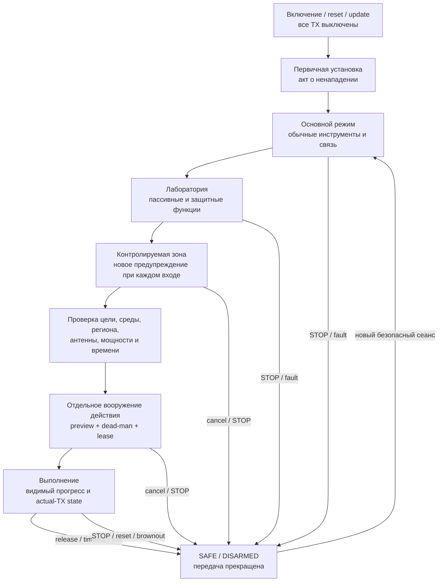

# Прошивка Leshy2

> **Целевой сайт прошивки.** Здесь описано поведение готового Leshy2: интерфейс,
> радиосервисы, безопасность, данные, обновление и восстановление. История
> разработки и открытые проверки вынесены в отдельные документы.

- [English version](README.md)
- [Целевой hardware-продукт](https://github.com/anton-vinogradov/esp32-leshy2/blob/main/README.ru.md)
- [Состояние разработки](docs/status/current-state.ru.md)
- [Инженерные решения и доказательства](https://github.com/anton-vinogradov/esp32-leshy2/tree/main/docs/review)

## Образ готового ПО

Прошивка превращает Leshy2 в автономный all-in-one инструмент связи,
наблюдения, диагностики и разрешённых исследований беспроводных и контактных
систем. Все основные сценарии доступны с самого устройства: телефон или ПК
могут помогать с вводом и экспортом, но не являются обязательным пультом.

Доступность аппаратного передатчика не означает разрешение на передачу.
Прошивка всегда связывает действие с профилем региона, антенной, мощностью,
целью, временем, уровнем функциональности и актуальным состоянием STOP.

## Три уровня функциональности

1. **Основной режим** — повседневные инструменты, приём, диагностика,
   навигация, обслуживание и законная связь.
2. **Лаборатория** — пассивные, защитные и ограниченные security-инструменты.
3. **Лаборатория → Контролируемая зона** — dangerous active/disruptive tools.
   Каждый вход требует нового неснимаемого предупреждения, а каждое действие
   отдельно проверяет authorized target и/или isolated/conducted environment.

Выход, lock, timeout, reset, watchdog, update, STOP или потеря accessory
аннулируют affected arm/lease. Первичная установка отдельно требует принятия
акта о ненападении.

## Как работает готовое ПО

## Пользовательский интерфейс

- Главный экран показывает активную группу сигналов, выбранный профиль,
  антенну, канал/частоту, состояние записи, питание и безопасность.
- Меню и критические предупреждения отвечают не позднее `100 мс`; водопад
  обновляется dirty/tiled-областями и уступает радио, аудио и записи данных.
- Полный локальный набор — направления D-pad и OK, BACK, OPT, F1, F2, энкодер
  с нажатием, отдельный PTT с удержанием, аппаратный STOP и утопленный RE-ARM.
  Ни touch, ни ввод текста с телефона не заменяют эти органы управления.
- D-pad/OK/BACK/OPT/F1/F2 и нажатие энкодера используют отдельный
  `TCA9534APWR` (`P0…P6`, candidate address `0x3F`): interrupt запускает
  сканирование 4×3; `P7` остаётся резервом локальных controls. Каждая обычная
  позиция, включая F1 и F2, имеет собственный низкотоковый переключатель
  `C&K Y78B23214FP`, а все восемь линий expander защищены отдельным keypad/GPIO
  ESD-массивом. Фазы энкодера
  независимо принимает S3 PCNT0 на
  GPIO39/GPIO47, поэтому display, storage и I²C не теряют quadrature edges.
  PTT — отдельный фильтрованный прямой вход RP GPIO21. STOP использует
  независимую нормально-замкнутую AON-цепь на `Panasonic AEQ10410`, поэтому
  устройство останавливают и нажатие, и потеря соединения; RE-ARM остаётся
  отдельным утопленным физическим органом управления.
- Display и touch удерживаются аппаратным reset до устойчивого общего
  protected logic rail. Firmware ждёт минимум `120 мс` до display Sleep Out и
  `100 мс` до работы touch, после чего последней включает PWM-подсветку.
  Integrated touch `Sitronix ST77922` имеет фиксированный I²C-адрес `0x38`;
  его active-low IRQ приходит на shared GPIO37 через raw pull-up 10 кОм и
  fixed non-inverting open-drain `SN74LVC1G07DCKR`, поэтому polarity-profile в
  firmware отсутствует.
  Latch-fault подсветки не перезапускается автоматически; потеря экрана не
  останавливает radio, запись или физический STOP.
- Любая потеря визуальных кадров учитывается явно и не означает потерю сырых
  радио- или аудиоданных.
- Сессия microSD начинается только после устойчивого обнаружения карты,
  включения изолированного питания и перевода карты в SPI mode при поднятом CS
  дисплея. Безопасное извлечение запрещает новые записи и завершает уже
  принятые данные до отключения питания. Неожиданное извлечение сообщает о
  возможной потере незаписанного хвоста и запускает проверенное восстановление,
  а не выдаётся за целую запись.
- Команда TX, измеренный ток, состояние от радио и независимое actual-TX
  evidence показываются отдельно. `Unknown` остаётся видимым.
- Длинный текст можно передать с локально сопряжённого телефона. Предпросмотр и
  последствия остаются на Leshy2; телефон не принимает pledge, не входит в
  Контролируемую зону и не подтверждает TX или разрушительные действия.

## Радиосервисы

- Каждый физический владелец радио локально обслуживает timing, очереди,
  timestamp, timeout, TX lease и safe-off. Межпроцессорная связь передаёт
  команды и данные, а не превращается в удалённый raw GPIO.
- Три nRF24 сохраняют независимые PTX/PRX и любой одновременный mix
  `3R/1T2R/2T1R/3T` без автоматического standby соседей.
- Верхний уровень одновременно активирует только одну квалифицированную группу
  сигналов; все неиспользуемые интерфейсы переводятся в тихое состояние.
- Wi-Fi 2,4/5, BLE, ESP-NOW, IEEE 802.15.4, packet Sub-GHz, analog voice,
  broadcast receiver, IR и внешние GNSS/LoRa/NFC имеют отдельные профили,
  разрешения и доказательства результата.
- iButton/1-Wire разделяет обычную работу с собственным устройством, Lab-чтение
  и отдельно вооружаемые emulation/write-действия Контролируемой зоны;
  подключение адаптера само по себе ничего не разрешает.
- M5 Unit и U214 Cap обслуживаются как профилированные аксессуары. Если внешний
  raw-SDR/RF-analysis модуль требует high-throughput transport, этот transport
  определяется его профилем и не подменяется низкоскоростным command link.
- При смене антенны, частотного профиля, аксессуара или региона TX-arm
  сбрасывается. Неизвестная или несовместимая идентичность запрещает передачу.

## Данные и приватность

- Каждая запись содержит время, источник, профиль, частоту/канал, антенну,
  качество, пропуски и применимые calibration metadata.
- Raw capture сохраняется отдельно от decoded/derived результатов; повторная
  обработка не переписывает исходник.
- Импортированные файлы, скрипты и захваты всегда инертны до явного выбора
  инструмента, проверки и вооружения.
- Секреты, credential data и записи третьих лиц получают явную область хранения,
  срок жизни, правила экспорта и безопасного удаления.
- Отсутствующие GNSS/IMU/accessory metadata помечаются недоступными и не
  подменяются догадкой.
- Квалифицированный внешний IMU может сохранить raw accel/gyro, pitch/roll и
  кратковременное относительное вращение. Без indexed mount эти данные не
  называются абсолютным курсом или RF-пеленгом.

## STOP и безопасное состояние

- Каждый transmitter стартует выключенным после power, reset, brownout,
  watchdog или update. Старые цель, мощность, payload, session и lease не
  восстанавливаются.
- Физический STOP доминирует над UI, IPC, storage и зависшим вычислительным
  доменом. Отпускание STOP не выполняет re-arm; только отдельный новый
  физический RE-ARM запускает все вычислительные домены в TX-off состоянии.
- Восемь раздельных аппаратных наблюдений покрывают два native-radio, три nRF,
  packet Sub-GHz, analog voice и optical IR. Отдельные проводной агрегат и
  красный индикатор не зависят от firmware; отсутствующее или противоречивое
  evidence показывается как `Unknown`, а не считается безопасным.
- Выход из инструмента или уровня, lock, timeout, потеря связи, удаление
  аксессуара и ошибка профиля немедленно инвалидируют связанные TX-разрешения.
- Контролируемая батарея 2S показывает две заменяемые exact
  `XTAR 18650 4000mAh` защищённого button-top типа отдельно и как одну
  обязательную пару (nominal `28,8 Вт·ч`). Опасное сочетание, извлечение любой
  ячейки, ошибка контакта или неполная battery identity блокируют работу от
  батареи и зарядку и не могут быть обойдены программно. Отдельный fail-closed
  admission controller принимает решение до того, как потребуется application
  processor, и имеет независимые пути прошивки и восстановления. Глубоко
  разряженная банка отклоняется: в устройстве нет команды zero-volt/
  prequalification recovery, а любые исследования восстановления требуют
  отдельной изолированной оснастки Контролируемой зоны. Перед допуском общий
  диагностический тракт прикладывает примерно 0,57-0,88 А не дольше 50 мс и
  сравнивает обе ячейки; один non-retriggerable аппаратный канал не позволяет
  растянуть импульс, а второй запрещает любой повтор минимум на 350 мс даже
  при зависшей firmware. Штатная программа ждёт минимум 10 секунд. Factory acceptance также
  бракует импульс таймера короче 25 мс, сохраняя окно фильтрованного loaded
  sample. Этот screen не выдаётся за
  полную проверку под нагрузкой.
- Поддерживаются exact `XTAR 18650 4000mAh` защищённого button-top типа в
  поляризованном `Keystone 1048P`; raw flat-top не поддерживаются, как и
  USB-equipped варианты. Штатный заряд не превышает 2 А и запрещён вне
  консервативного разрешённого температурного окна, исходно `0…45 °C`.
  Оба cell-temperature канала и независимый температурный канал зарядника
  должны быть валидны. Firmware не определяет подлинность банки по двум
  контактам и не заменяет оторвавшийся датчик температуры расчётной оценкой.
- USB-C только принимает питание: firmware допускает fallback 5 В, 9 В/3 А
  или 15 В/2 А до 30 Вт, показывает реальный contract и load-aware предел
  заряда и никогда не включает 20 В, PPS, source, power-bank или charger OTG.
- Native USB2 Full-Speed data S3 (12 Мбит/с) и обе конфигурационные линии
  Type-C имеют автоматическую аппаратную защиту от short-to-VBUS/ESD. Ошибка
  порта закрывает USB session до безопасного физического восстановления и
  re-enumeration; Alt Mode не поддерживается.
- При питании только от сырого USB PD-контроллер входит в аппаратный SafeMode
  и загружает отдельную EEPROM без S3. Защищённый тракт VBUS и заряд остаются
  выключены до появления валидной policy; отсутствующий или повреждённый образ
  требует независимых recovery-площадок, а не разрешающего software fallback.
- Работа системы всегда приоритетнее заряда. Исходный admission-бюджет считает
  доступными только 85% согласованной входной мощности, резервирует большее из
  заявленной нагрузки сценария и измеренной нагрузки с запасом, а батарее
  отдаёт лишь остаток. При отсутствии достоверных данных о мощности, input
  current limiting, перегреве или power fault заряд снижается до нуля.
- Always-on безопасность, вычислительные 3,3 В, голосовые 4,0 В и защищённые
  5,0 В аксессуара являются раздельными фиксированными шинами. Неиспользуемые
  ветви nRF, CC1101, накопителя, codec и receiver отключаются, разряжаются и
  проверяются как тихие; software не может выбрать другое напряжение или
  обойти аппаратную ошибку питания.
- Выход каждого внутреннего преобразователя проходит независимую отсечку
  перенапряжения, тока и короткого замыкания до любого потребителя. Runtime
  доверяет только power-good защищённой стороны. После устойчивой ошибки
  main требуется полное снятие источника. Always-on отсечка может выполнять
  ограниченные аппаратные попытки восстановления, но firmware не может их
  ускорить или запустить вычислители до устойчиво исправного питания.
- Допущенный источник напрямую запускает always-on шину. Её power-good и порог
  supervisor 3,07 В должны одновременно удерживаться, прежде чем delayed
  hardware POR включит основную шину 3,3 В; firmware не может обойти стартовый
  порядок или удержать вычислители при brownout always-on шины.
- Power-good голосовой шины и аксессуара аппаратно квалифицируется её enable:
  намеренно выключенная шина штатна, а включённая шина, не ставшая исправной
  за ограниченное стартовое окно, закрывается с ошибкой.
- Ограничение тока аксессуара действует немедленно при запуске, а внешняя
  ёмкость допускается управляемым фронтом напряжения. Порт поддерживает
  `1,25 А` постоянно и один ограниченный импульс `2,0 А` только после запуска;
  transient timer не считается бюджетом запуска или постоянного тока.
- Ошибка питания внешнего аксессуара защёлкивает защищённый порт выключенным.
  После устранения причины требуется явно начать новый сеанс; firmware не
  запускает automatic power-retry loop для неисправного аксессуара.
- Обычные интерфейсные эффекты можно приглушить, но active-TX, STOP failure,
  critical battery и другое опасное состояние скрыть нельзя.

## Обновление и восстановление

- Каждый устанавливаемый image имеет подписанный manifest с hardware/profile
  identity, protocol range, hash, rollback index и правилами migration.
- Нормальное обновление проверяет target и подпись до активации, поддерживает
  A/B rollback и никогда не вооружает TX после перезапуска.
- Каждый программируемый домен можно независимо прошить, восстановить и
  диагностировать без исправной основной прошивки или соседнего процессора.
- Образ PD policy является версионированным воспроизводимым артефактом с
  подписью владельца. Полевое обновление пишет неактивный регион EEPROM и
  сохраняет rollback; отдельные factory/recovery pads восстанавливают пустую
  или повреждённую микросхему без S3 после того, как current-limited raw-VBUS
  fixture подтвердит бездействие шины контроллера.
- Владелец сохраняет offline/reproducible build и signing tools. Установка
  собственной прошивки остаётся возможной через явный recovery workflow;
  irreversible lockdown не является стандартным режимом.

## Границы ПО

Прошивка не обещает 6 ГГц/Wi-Fi 6E, generic USB host, персональный FIDO/U2F,
встроенную клавиатуру или функции встроенного IMU. BadUSB/DuckyScript — только
необязательный инструмент Контролируемой зоны поверх существующего USB
device-пути; он не запускается автоматически и не блокирует выпуск radio/key
ядра продукта.

## Архитектурный контракт

Готовое устройство может использовать несколько подписанных images. Общие
типы событий, manifest, package format и test vectors едины, но физическое
владение радио, локальные deadlines и независимые recovery paths не скрываются
за общей абстракцией.

## Документация проекта

- [Текущее состояние разработки прошивки](docs/status/current-state.ru.md)
- [Архитектурные входы прошивки](docs/architecture/README.md)
- [Целевое описание аппаратной части](https://github.com/anton-vinogradov/esp32-leshy2/blob/main/README.ru.md)
- [Полный журнал требований, решений и проверок](https://github.com/anton-vinogradov/esp32-leshy2/tree/main/docs/review)
