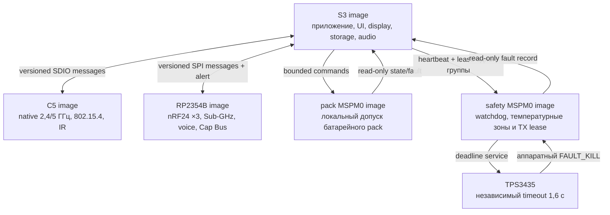

# Leshy2 — прошивка

[English](README.md) · [Аппаратная часть](https://github.com/anton-vinogradov/esp32-leshy2/blob/main/README.ru.md)

> **Статус прошивки: F4 — IPC и scheduling.** F0–F3 прошли ревью;
> [итог F3](docs/f3-boot-memory-emulation-report.ru.md) фиксирует точное исполнение S3 в QEMU и честные физические gates. Подробности —
> в [роадмапе прошивки](docs/roadmap.ru.md).

## Роадмап прошивки и текущая позиция

Этот блок остаётся на стартовой странице прошивки до firmware release.
Подробные критерии выхода и явные пересечения с отдельным
[аппаратным роадмапом](https://github.com/anton-vinogradov/esp32-leshy2/blob/main/docs/roadmap.ru.md)
находятся в [роадмапе прошивки](docs/roadmap.ru.md).

| Этап | Статус | Результат |
|---|---|---|
| F0 · Контракты продукта | ✅ Проведено ревью | пять доменов, владельцы, L2IP, memory, safety, update и HW↔FW boundary |
| F1 · Portable cores | ✅ Проведено ревью | [Итог F1: 24/24 host-сценария и чистые ASan/UBSan](docs/f1-portable-cores-report.ru.md) |
| F2 · Target-проекты и build system | ✅ [Проведено ревью](docs/f2-target-build-system-report.ru.md) | пять production-SDK projects; 52/52 artifacts воспроизводятся побайтно |
| F3 · Boot, память и эмуляция | ✅ [Проведено ревью](docs/f3-boot-memory-emulation-report.ru.md) | точный S3 debug/release QEMU; 52/52 воспроизводимых artifacts; явные физические gates |
| **F4 · IPC и scheduling** | **▶️ Текущая граница** | реальные transports, typed messages, credits и priority isolation |
| F5 · BSP и drivers | ⏳ Ожидает F4 и актуальную схему | все драйверы устройств, органов управления, датчиков и power states |
| F6 · UI, display, storage и audio | ⏳ Ожидает F5 | отзывчивые menu/waterfall, recording, audio и fault viewer |
| F7 · Radio, IR и expansion | ⏳ Ожидает F5/F6 | receive/TX profiles, полноценные 3×nRF24 и тихие неактивные тракты |
| F8 · Уровни функций и safety UX | ⏳ Ожидает F7 | Основной режим, Лаборатория и Контролируемая зона |
| F9 · Signed update и recovery | ⏳ Ожидает F1/F3 | управляемый владельцем bundle для пяти target, rollback и физический recovery |
| F10 · HIL и системная квалификация | 🔒 Ожидает F4–F9 и hardware H7 | prototype fault, RF, power, thermal и endurance evidence |
| F11 · Firmware release | 🔒 Ожидает F10 и hardware H8 | воспроизводимые подписанные образы, installer, recovery kit и release tag |

Каждая завершённая глобальная фаза `F*` получает отдельный итоговый отчёт,
связанный с этой таблицей; внутренние подэтапы меняют только точный маркер.

**Прошивка находится на F4.** Синхронизированный hardware H2 BSP остаётся
источником pins. Hardware H2/H3 теперь используют независимые `SA818S-V` и
`SA818S-U`, локальный one-hot selector и не расходуют новый MCU/M1 contact.
Hardware H4 проведён по существующему пакету F3; железо сейчас на `H5.0.3-R1`:
dual-SA818S residual/source reviews готовы, evidence-корзина из 33 строк стоит
`$286.43`, а все 210 строк BOM / 1052 установки имеют точные маршруты.
Информационный запрос JLCPCB без заказа успешно отправлен 26 августа 2026 года;
открыты срок pre-order SA818S-V и ответы фабрики по J4-F/J4-P, а аппаратный gate
`H5-EVR07` готов отклонить неполный или отрицательный ответ. Необязательное право
Parts API отклонено без указанной причины, поэтому активным остаётся ручной
evidence-путь; информационный запрос в поддержку успешно отправлен 26 августа
2026 года и ожидает ответа. Аппаратный `H5-EVR08` сохраняет PCBWay как
подготовленный, но не опрошенный резерв полной сборки, а Seeed — как второй
источник PCBA. Прежнее H5 evidence на
основе SA518 отменено. Закупка, quote/reservation, layout и fabrication
заблокированы.
F3 прошла ревью: S3 debug/release загружается и
исполняет 8-МиБ octal-PSRAM и изолированные fault paths в точном QEMU; все 52
target artifacts воспроизводятся. Периферия и boot четырёх non-S3 targets
остаются названными физическими gates, а не emulator claims.

### Текущая фаза F4 — детальная позиция

<!-- current-substep: F4.1.3 -->

**Точный маркер: `F4.1.3`** — выполнить точную target matrix S3/C5 и S3 QEMU
над fake-SDIO boundary. Проведённые endpoints используют сгенерированные
контакты H2, однобитный SDIO 20 МГц, точный offline ESSL 1.1.2 и по восемь
512-байтных DMA-ячеек C5 в каждом направлении. Debug-образы S3 и C5
компилируются и линкуются; QEMU fake-SDIO и физический SDIO пока не заявлены.
Маркер и evidence меняются вместе в каждом commit.

- `F2.0` — зафиксировать target/toolchain matrix.
  - ✅ `F2.0.0` — зарегистрировать пять target и их flash/RAM/rollback
    contracts.
  - ✅ `F2.0.1` — проведено ревью точных SDK/toolchain versions, официальной
    поддержки, lifecycle, license и требований к build host; результат — на
    странице [среды сборки пяти образов](docs/toolchains.ru.md).
  - ✅ `F2.0.2` — неизменяемые SDK revisions, 26 проверяемых записей архивов и
    ESP-IDF Python environment с hash-lock прошли ревью.
  - ✅ `F2.0.3` — единая local/CI matrix, shell-free dispatcher, fail-closed
    preflight и 26 названных target artifacts прошли ревью.
- `F2.1` — создать общее дерево source/components без target pins.
  - ✅ `F2.1.0` — каталоги, единоличное владение, target-neutral portable code
    и пустая до F2.3 граница generated sources прошли ревью.
  - ✅ `F2.1.1` — строгие C17/C++17, warnings-as-errors для project code,
    debug/release optimization и link policy с map-файлом прошли ревью.
  - ✅ `F2.1.2` — единым прогоном прошли environment, source, build-policy,
    H2-contract и 24 host-сценария.
- `F2.2` — создать минимальные SDK-проекты S3, C5, RP, Pack и Safety.
  - ✅ `F2.2.0` — S3 ESP-IDF project, portable component, production memory
    defaults и debug/release inputs прошли структурное ревью.
  - ✅ `F2.2.1` — C5 ESP-IDF project, portable component, production memory
    defaults и debug/release inputs прошли структурное ревью.
  - ✅ `F2.2.2` — точный RP2354B Arm-secure project, custom board на 2 МиБ,
    partition input и debug/release policy прошли структурное ревью.
  - ✅ `F2.2.3` — точный Pack MSPM0C1106 project, раздельные boot/application
    images, memory boundaries и debug/release policy прошли структурное ревью.
  - ✅ `F2.2.4` — точный Safety MSPM0C1106 project, раздельные boot/application
    images, fail-closed entry и debug/release policy прошли структурное ревью.
  - ✅ `F2.2.5` — единое ревью прошло для пяти projects, 35 файлов,
    26 artifacts и 20 debug/release command plans без target execution.
- `F2.3` — подключить принятый генерируемый pin/BSP contract.
  - ✅ `F2.3.0` — неизменяемая H2 source identity, 5 domains, 125 contacts,
    112 nets, 4 transports, 10 groups и модель proof fields прошли ревью.
  - ✅ `F2.3.1` — 11 generated C/header files сохраняют все 125 contacts,
    проходят строгий C17 syntax-check и побайтно воспроизводятся по manifest.
  - ✅ `F2.3.2` — каждый target потребляет ровно свою domain table и include
    path; чужих таблиц, BSP-копий и ручных pins не найдено.
  - ✅ `F2.3.3` — sibling H2, детерминированная генерация, строгие C17 tables и
    one-owner consumption прошли единое ревью.
- `F2.4` — пройти debug/release builds, map files и image-size gates.
  - ✅ `F2.4.0` — locked-toolchain preflight пяти targets прошёл ревью.
    - ✅ `F2.4.0.1` — точные sources/revisions ESP-IDF `v6.0.2`, Pico
      SDK/picotool `2.3.0` и TI MSPM0 SDK `2.11.00.07` прошли ревью.
    - ✅ `F2.4.0.2` — установлены и распознаны ESP-IDF tool manager точные
      S3/C5 compilers, debuggers, ULP tools, OpenOCD и ROM ELFs прошли ревью.
    - ✅ `F2.4.0.3` — hash-locked Python 3.12 environment и точные CMake/Ninja
      прошли ревью; evidence — [`config/f2_4_preflight_progress.json`](config/f2_4_preflight_progress.json).
    - ✅ `F2.4.0.4` — hash-verified native Arm GNU `15.2.Rel1` прошёл ревью для RP2354B.
    - ✅ `F2.4.0.5` — hash-verified TI Arm Clang `4.0.5.LTS` и SysConfig
      `1.28.0.4712` прошли ревью для Pack/Safety.
    - ✅ `F2.4.0.6` — прошли 30 точных проверок SDK, Git, lock, compiler и
      обязательных входов плюс debug/release dispatcher preflight; [машинный evidence](config/f2_4_preflight_review.json).
  - ✅ `F2.4.1` — S3 debug/release configure, build, наличие десяти artifacts
    и image-size gates прошли ревью; [машинный evidence](config/f2_4_s3_build_review.json).
  - ✅ `F2.4.2` — C5 debug/release configure, build, наличие десяти artifacts
    и image-size gates прошли ревью; [машинный evidence](config/f2_4_c5_build_review.json).
  - ✅ `F2.4.3` — RP debug/release configure, build, наличие восьми artifacts
    и image-size gates прошли ревью; [машинный evidence](config/f2_4_rp_build_review.json).
  - ✅ `F2.4.4` — Pack debug/release configure, build, наличие двенадцати
    artifacts и image-size gates прошли ревью; [машинный evidence](config/f2_4_pack_build_review.json).
  - ✅ `F2.4.5` — Safety debug/release configure, build, наличие двенадцати
    artifacts и image-size gates прошли ревью; [машинный evidence](config/f2_4_safety_build_review.json).
  - ✅ `F2.4.6` — все 52 debug/release artifacts, 14 maps и 10 image-size gates
    прошли единое ревью; [машинный evidence](config/f2_4_build_review.json).
- ✅ `F2.5` — два полных чистых прохода дали 52/52 побайтно идентичных
  artifacts; в 24 распространяемых образах нет абсолютного workspace path.
  См. [итоговый отчёт F2](docs/f2-target-build-system-report.ru.md) и
  [машинный evidence](config/f2_5_reproducibility_review.json).
- `F3.0` — зафиксировать runtime-evidence plan до заявления о boot.
  - ✅ `F3.0.0` — официальная поддержка emulator/simulator, instruction
    coverage, наблюдаемость boot и неизбежные dev-board gates всех пяти targets
    прошли ревью: точный vendor QEMU есть только для S3;
    [машинная матрица](config/f3_execution_capability_matrix.json).
  - ✅ `F3.0.1` — точные hash-locked QEMU archives, debug/release recipes,
    шесть последовательных boot markers, 30-секундный timeout и fail-closed
    result contract прошли ревью; [машинный план](config/f3_runtime_plan.json).
  - ✅ `F3.0.2` — матрица evidence пяти targets и единый fail-closed runner
    прошли ревью без запуска target; [машинная матрица](config/f3_acceptance_matrix.json).
- ✅ `F3.1` — S3 debug и release images прошли по шесть последовательных
  markers в точном Espressif QEMU, включая инициализацию и memory test 8-МиБ
  octal PSRAM; [debug evidence](config/f3_1_s3_debug_runtime_review.json) и
  [release evidence](config/f3_1_s3_release_runtime_review.json).
- ✅ `F3.2` — S3 debug/release прошли по девять markers для boot, self-test,
  retained-first-fault и failed-update RAM rollback; ещё 24 portable-сценария
  прошли ASan/UBSan. Nonvolatile persistence и flash rollback этим не заявлены;
  [сводный evidence](config/f3_2_runtime_review.json).
- ✅ `F3.3` — новый двойной clean-build воспроизвёл 52/52 artifacts; десять
  актуальных image/RAM gates и пять статических rollback topologies помещаются.
  S3 debug занимает 182 736 байт с запасом 6 895 152 байт до maximum; физических
  rollback transitions заявлено ноль. См.
  [boundary evidence](config/f3_3_boundary_review.json).
- ✅ `F3.4` — [глобальный итог F3](docs/f3-boot-memory-emulation-report.ru.md)
  закрывает фазу точным S3 execution, 52 воспроизводимыми artifacts и пятью
  явными физическими target/HIL gates.
- `F4.0` — зафиксировать план исполнения и evidence transports.
  - ✅ `F4.0.0` — [проведены четыре transport и восемь точных SDK endpoint bindings](config/f4_0_transport_capability_matrix.json); QEMU не исполняет ни один их PHY.
  - ✅ `F4.0.1` — [проведены единый fail-closed lifecycle, фиксированные ownership/queues, credits, duplicates, deadlines, reset и точный ESSL lock](config/f4_0_1_adapter_contract.json).
  - ✅ `F4.0.2` — [проведены единый runner, шесть классов evidence и 37 сценариев](config/f4_0_2_acceptance_matrix.json); [baseline snapshot](config/f4_0_2_acceptance_snapshot.json) заявляет ноль transport runs.
- `F4.1` — реализовать и исполнить SDIO S3↔C5.
  - ✅ `F4.1.0` — [проведены точный offline payload ESSL 1.1.2 и single-owner source boundary S3↔C5](config/f4_1_s3_c5_source_boundary.json); [manifest 30 файлов](third_party/esp_serial_slave_link.vendor-lock.json).
  - ✅ `F4.1.1` — [проведён общий high-speed core](config/f4_1_1_high_speed_core_review.json): 19 сценариев ASan/UBSan; unsafe absolute-credit draft заменён накопительными duplicate-safe grants.
  - ✅ `F4.1.2` — [проведены endpoints S3 host и C5 SDIO slave](config/f4_1_2_s3_c5_endpoint_review.json): generated pins, однобитный SDIO 20 МГц, точный ESSL и две locked debug builds; QEMU/PHY claims — ноль.
  - ▶️ **`F4.1.3` — сейчас:** выполнить exact target builds и S3 QEMU над fake SDIO boundary.
  - `F4.1.4` — выполнить и провести ревью физического dev-board gate S3-C5.
- `F4.2` — реализовать и исполнить SPI+alert S3↔RP.
- `F4.3` — реализовать и исполнить I²C mailboxes Pack/Safety.
- `F4.4` — внедрить saturation, duplicate, deadline, reset и link-loss faults.
- `F4.5` — свести target evidence и опубликовать глобальный итог F4.

F3 прошла ревью на честной границе evidence. Теперь F4 превращает принятые
message contracts в реальные target transports, сохраняя приоритет
safety/control под waterfall и bulk traffic. Каждый подэтап обновляет evidence,
точный маркер и обе языковые страницы в одном commit.

Прошивка превращает радиотракты Leshy2 в единый полевой инструмент: показывает
меню и водопад, управляет приёмом и передачей, записывает данные, обслуживает
расширения и сохраняет безопасное состояние при сбоях. Здесь описаны
возможности и устройство готового продукта.

## Пользовательские возможности

- Быстрая навигация с D-pad, `OK`, `BACK`, `OPT`, `F1`, `F2`, энкодером,
  touch и `PTT`; один фиксируемый переключатель `RUN/KILL` управляет допуском
  и физическим восстановлением после аварии.
- Бегущий спектральный водопад и индикаторы трактов с перерисовкой только
  изменившихся областей экрана.
- Профили приёма, сканирование, декодирование поддерживаемых протоколов,
  запись RF-событий, аудио и метаданных на microSD.
- Стереовоспроизведение и запись с внешнего микрофона через CTIA-гарнитуру,
  непрерывное детектирование штекера и выбор встроенного микрофона для обычных
  TRS-наушников.
- Полный смешанный режим трёх nRF24: `3R`, `1T2R`, `2T1R` и `3T` без
  программного отключения соседнего приёмника.
- Wi‑Fi 2,4/5 ГГц, BLE, ESP‑NOW, IEEE 802.15.4, Sub‑GHz, broadcast RX,
  VHF/UHF voice, IR, штатный U214 LoRa RX/GNSS и точные evidence-qualified
  RX/TX-профили `LESHY2-LORA-CAP-01-EU868/US915`.
- Импорт, экспорт и резервное копирование профилей владельца; длинный текст
  при необходимости вводится с локально сопряжённого телефона.

## Три уровня функций

1. **Основной режим** — обычный приём, диагностика, обслуживание и законная
   связь.
2. **Лаборатория** — пассивные, защитные и ограниченные исследовательские
   инструменты.
3. **Лаборатория → Контролируемая зона** — потенциально опасные active-функции.
   При каждом входе появляется новый обязательный баннер; действие требует
   отдельного вооружения и разрешённой цели или изолированной среды.

Прошивка не может обойти аппаратный `FAULT_KILL`, создать разрешение из факта
обнаруженной передачи или восстановить прежнее вооружение после reset,
recovery, смены профиля либо ошибки. После защёлкнутой аварии требуется
физический цикл `KILL`→`RUN`.

## Runtime в пяти доменах

Реакции с жёстким временем исполняются у физического владельца тракта.
Межпроцессорные сообщения типизированы и версионированы; потеря связи снимает
lease и переводит зависимую функцию в безопасное состояние. Экран, storage и
radio не блокируют друг друга длинными общими операциями.

При аварии C5 и RP остаются в reset. Если температурная зона UI безопасна, S3
может запустить только подписанный экран аварии: причина, измеренное значение и
предел, выполненное действие, идентификатор события и инструкция `KILL`→`RUN`.
Если опасен экран или сама зона UI, дисплей выключается, а независимый янтарный
светодиод `FAULT` остаётся видимым.

Для долгой работы используется квалифицированный источник USB-PD; обещаний
времени работы от батарей или uptime в часах продукт не даёт. В `Настройки →
Безопасность → Полная самопроверка` доступны интервалы 24 часа, 48 часов по
умолчанию и режим «только при запуске» с явным предупреждением. Изменение можно
подготовить только с локального физического UI, а действует оно после следующей
физической проверки `KILL`→`RUN`. Deadline принадлежит safety controller:
просрочка снимает leases и переводит устройство в сохранённое аварийное
состояние. Настройка не ослабляет watchdog, температурные пределы, реакцию на
power fault или контроль TX leases.

## Обновление и владение устройством

Образы подписаны, привязаны к target и устанавливаются с rollback. Подпись
защищает от подмены пакета, но не закрывает устройство: владелец может собрать
прошивку из исходников, использовать собственный ключ и восстановить каждый
контроллер через отдельный физический интерфейс. Необратимая блокировка не
включается по умолчанию.

## Документация

- [Роадмап прошивки и текущая позиция](docs/roadmap.ru.md)
- [Среда сборки всех пяти образов](docs/toolchains.ru.md)
- [Архитектура прошивки и поведение подсистем](docs/architecture.ru.md)
- [Разметка flash, PSRAM и rollback](docs/memory.ru.md)
- [Аппаратная архитектура](https://github.com/anton-vinogradov/esp32-leshy2/blob/main/docs/hardware.ru.md)
- [Модель безопасности](https://github.com/anton-vinogradov/esp32-leshy2/blob/main/docs/safety.ru.md)
