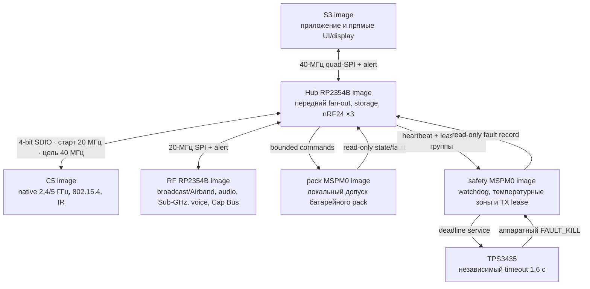

# Leshy2 — прошивка

[English](README.md) · [Аппаратная часть](https://github.com/anton-vinogradov/esp32-leshy2/blob/main/README.ru.md)

> **Статус прошивки: F2-R2.5 — следующая квалификация воспроизводимости.** Работа
> F0–F4 для R1 сохранена как regression evidence, но её топология из пяти
> доменов больше не является текущей. Подробности — в
> [роадмапе прошивки](docs/roadmap.ru.md).

## Роадмап прошивки и текущая позиция

Этот блок остаётся на стартовой странице прошивки до firmware release.
Подробные критерии выхода и явные пересечения с отдельным
[аппаратным роадмапом](https://github.com/anton-vinogradov/esp32-leshy2/blob/main/docs/roadmap.ru.md)
находятся в [роадмапе прошивки](docs/roadmap.ru.md).

| Этап | Статус | Результат |
|---|---|---|
| F0 · Контракты продукта | ✅ **Проведено ревью:** [итог F0-R2](docs/f0-product-contracts-report.ru.md) | шесть доменов, identities, независимый rollback, S3-last update и честные execution gates |
| F1 · Portable cores | ✅ **Проведено ревью:** [итог F1-R2](docs/f1-portable-cores-report.ru.md) | 34 сценария проходят normal и ASan/UBSan; six-domain update, Airband заднего RP и integrated faults |
| **F2 · Target-проекты и build system** | **▶️ Сейчас: F2-R2.5**; [F2-R2.4](config/f2_r2_build_qualification.json) сохраняет 12 чистых сборок прежнего входа; обновлённые источники и path policy ожидают двух новых чистых проходов. [Отчёт R1 сохранён](docs/f2-target-build-system-report.ru.md) | доказать побайтное равенство всех 60 artifacts и опубликовать двуязычный итог F2-R2 |
| F3 · Boot, память и эмуляция | ⏳ [Отчёт R1 сохранён](docs/f3-boot-memory-emulation-report.ru.md); ожидает F2-R2 | повторная квалификация шести targets, emulator и физических gates |
| F4 · IPC и scheduling | ⏳ Работа R1 приостановлена; ожидает F3-R2 | Hub-centered transports, typed messages, credits и priority isolation |
| F5 · BSP и drivers | ⏳ Ожидает F4 и актуальную схему R2 | все драйверы устройств, органов управления, датчиков и power states |
| F6 · UI, display, storage и audio | ⏳ Ожидает F5 | отзывчивые menu/waterfall, recording, audio и fault viewer |
| F7 · Radio, IR и expansion | ⏳ Ожидает F5/F6 | receive/TX profiles, полноценные 3×nRF24 и тихие неактивные тракты |
| F8 · Уровни функций и safety UX | ⏳ Ожидает F7 | Основной режим, Лаборатория и Контролируемая зона |
| F9 · Signed update и recovery | ⏳ Ожидает F1/F3 | управляемый владельцем bundle для шести targets, rollback и физический recovery |
| **F-PO · Допуск первого экземпляра** | 🔒 [Запланирован и заблокирован](config/first_spin_preorder_gate.json) до актуальных H2/H6 и диагностического evidence | воспроизводимые образы шести доменов, S3 QEMU, host/fake-HAL, доступные dev-board прогоны, recovery bundle и сценарий первого включения |
| F10 · HIL и системная квалификация | 🔒 Ожидает F4–F9 и hardware H7 | prototype fault, RF, power, thermal и endurance evidence |
| F11 · Firmware release | 🔒 Ожидает F10 и hardware H8 | воспроизводимые подписанные образы, installer, recovery kit и release tag |

Каждая завершённая глобальная фаза `F*` получает отдельный итоговый отчёт,
связанный с этой таблицей; внутренние подэтапы меняют только точный маркер.

Заказать можно будет **ровно одного** полностью собранного `R2-EVT1`, только
когда [gate F-PO](config/first_spin_preorder_gate.json) связан с финальными
hash H2/H6 и закрыты все семь диагностических evidence `FPO1`–`FPO7`. Routed
release candidate H6 становится неизменяемым order release только после
закрытия этого gate. Полная реализация пользовательских функций F6–F8 для этого
не обязательна, но предзаказный диагностический срез драйверов F5 должен
покрывать каждого установленного endpoint из точного H2 manifest: поведение
present/missing в fake-HAL и smoke evidence на каждом доступном target
dev-board path. Остальной обязательный пакет — воспроизводимые диагностические
образы всех шести доменов, S3 QEMU, комплект flash/recovery и пошаговый
безопасный bring-up. Фабричный powered Function Test необязателен и
рассматривается только если в итоговой смете он
почти бесплатен. Фабрика детерминированно изготавливает и собирает единственный
экземпляр, включая точный серийный дисплей; первое полное включение выполняет
владелец после доставки по проверенному сценарию.

**Прошивка находится на F2-R2.5.** [Проведённое ревью F0-R2](docs/f0-product-contracts-report.ru.md)
закрывает контрактную основу, не заявляя реализованные targets. Сгенерированный
[`h0_r2_hardware_contract.json`](config/h0_r2_hardware_contract.json) связывает
репозиторий прошивки по SHA-256 с функциональным source, точным C5 service mux
и точной рабочей распиновкой двух RP. В R2 шесть
targets: S3, C5, RF RP, Hub RP, Pack и Safety. UI, кнопки и display остаются
локальными на передней плате. Hub RP владеет microSD и всеми тремя nRF24;
задний RF RP — CC1101, voice, audio, `BROADCAST_RX`, M5 и
ровно один подписанный профиль Cap U214/U219.
Сгенерированные [`hardware_bsp_contract.json`](config/hardware_bsp_contract.json) и
[`hardware_integration_contract.json`](config/hardware_integration_contract.json)
теперь отражают текущую native-границу R2.
[Gate authority R2/H2](config/r2_h2_sync_gate.json) открыт для шести доменов,
обоих `SC1512-A4`, точных RP-карт H1-R2.31 и точной M1 из H0-R2.
Рабочий BSP содержит все 48 GPIO каждого RP и шесть фиксированных C5 SDIO contacts.
Эта проверка входной authority не закрывает текущие электрические, компоновочные
и сборочные gates H6, а также target runtime, emulator или HIL.
[Структура target projects](config/f2_r2_target_projects.json), прошедшая ревью,
задаёт шесть production-SDK roots, шесть уникальных application images и два
boot images защитных контроллеров. RF RP и Hub RP имеют разные Pico SDK trees,
entry sources и image identities. Связанный hash
[BSP R2](config/f2_r2_bsp_generation.json) генерирует шесть детерминированных
domain descriptors, и [каждый привязан](config/f2_r2_bsp_consumption.json) ровно
к одному SDK project. Атомарная [квалификация F2-R2.4](config/f2_r2_build_qualification.json)
зафиксировала 12 успешных configure/build jobs, 60 artifacts, 16 maps и 16
пройденных size gates для входного commit `c8e349b` и matrix `354f1a37a0a9…`.
Обновление источников интерфейсов 8 сентября удаляет устаревший контакт 6
аудиоразъёма и уточняет происхождение точных корпусов; GPIO/API и все 13
сгенерированных C/H-файлов BSP не изменились. Настоящий результат 12 jobs сохранён
для своих закоммиченных входов. Последующее обновление привязки footprint `1048P`
только по полярности и build path maps требует новой квалификации: прежний evidence
не переименован в свежий. Оставшаяся механическая неопределённость держателя
не меняет GPIO/API прошивки.
Этот прогон доказывает для своих входов компиляцию, линковку и статическую
помещаемость образов, но не boot, peripheral execution, воспроизводимость,
эмуляцию или физическое железо.
[Контракт memory и rollback](config/f0_r2_memory_rollback_contract.json),
прошедший ревью, сохраняет шесть независимых dual-slot доменов: оба RP2354B и
оба MSPM0 имеют общую только геометрию, но не target identity, state или flash.
Физические rollback transitions и помещаемость production verifier подписи
пока не заявлены.
[Политика update](config/update_policy.json), прошедшая ревью, staging всех
шести images, загружает и подтверждает Pack → Safety → C5 → RF RP → Hub RP →
S3, сохраняет power-loss-safe journal и требует подписанный bridge bundle для
breaking IPC changes. Budget окна RP TBYB 16,7 с явно ещё не измерен.
[Execution matrix](config/f0_r2_execution_gate_matrix.json), прошедшая ревью,
не смешивает пять слоёв evidence. Только S3 имеет точную официальную QEMU
machine. Для S3, C5, Pack и Safety есть dev-board paths с точным выбранным
module/MCU; Pico 2 явно остаётся лишь неточным surrogate RP2350A для обоих
targets RP2354B. Ни один R2 build, dev-board или Leshy2 HIL run не заявлен.
[Итог F1-R2](docs/f1-portable-cores-report.ru.md), проведённый ревью, добавляет
независимые update state RF-RP/Hub-RP, пять receive-only states Airband заднего RP и
integrated faults Hub/Pack/Safety. Его 34 сценария проходят normal и ASan/UBSan
host runs; это portable evidence, а не target build.
Численные результаты H3 ниже относятся к сохранённым аналитическим моделям.
Проверка условий запуска текущего питания вновь открыта; эти результаты не
означают приёмку установленной ячейки питания (см. текущий электрический срез ниже).

Обязательный receive-only Airband использует GP35/36 заднего RP, фиксированный LO
112 МГц и существующий audio path Si4732. Airband TX отсутствует. Физическое
железо завершило `H1-R2.39`, принято и прошло ревью; H2 прошло ревью как
`H2-R2.1.5`, весь DC/source-workstream H3-R2.1 проведён ревью, H3-R2.2.1
проверил 14 сценариев запуска, останова, сброса и восстановления, а H3-R2.2.2 —
7 316 переходов USB/pack/DPM/brownout/source-loss без небезопасного допуска или
автоматического перезапуска. H3-R2.2.3/.4 затем провёл ревью пяти запусков
защищённых шин, четырёх load-step envelope и десяти watchdog/fault-display cases
без аналитических failures или автоматического перезапуска. Точные firmware-контракты
[последовательностей](config/h3_r2_transition_contract.json) и
[handover](config/h3_r2_handover_contract.json) и
[watchdog/fault-display](config/h3_r2_inrush_watchdog_contract.json) импортированы
fail-closed. [Аналоговый результат H3-R2.3](https://github.com/anton-vinogradov/esp32-leshy2/blob/main/docs/analog-electrical-verification.ru.md)
и [цифровой результат H3-R2.4](https://github.com/anton-vinogradov/esp32-leshy2/blob/main/docs/digital-electrical-verification.ru.md),
а также [RF-результат H3-R2.5](https://github.com/anton-vinogradov/esp32-leshy2/blob/main/docs/rf-electrical-verification.ru.md)
и [thermal/fault-результат H3-R2.6](https://github.com/anton-vinogradov/esp32-leshy2/blob/main/docs/thermal-fault-electrical-verification.ru.md)
и [глобальный итог H3-R2](https://github.com/anton-vinogradov/esp32-leshy2/blob/main/docs/h3-r2-acceptance.ru.md)
проведены ревью; точные [RF/coexistence](config/h3_r2_rf_coexistence.json),
[thermal/fault](config/h3_r2_thermal_fault.json) и [H3 acceptance](config/h3_r2_acceptance.json)
контракты импортированы fail-closed. Сохранённая диагностика H4 нашла назначенный
пробел 38 BSP-строк C5/Pack/Safety; исправление восстановило 173/173 controller-строк H2,
все 12 target-сборок повторно квалифицированы. [Глобальный итог H4-R2](https://github.com/anton-vinogradov/esp32-leshy2/blob/main/docs/h4-r2-acceptance.ru.md)
проведён ревью без противоречий. [Актуальный итог маршрутов H5-R2](https://github.com/anton-vinogradov/esp32-leshy2/blob/main/docs/h5-r2-current-route.ru.md)
контролирует все 249 закупаемых групп / 1 216 изделий без неназначенных маршрутов и с одним явным order-time sourcing gate `WBC16-1TLC`. Текущая аппаратная точка — `H6.0.3-R1`: размещение и разводка двух плат 80 × 150 мм повторно проверяются после исходных исправлений. [Актуальный аппаратный срез](https://github.com/anton-vinogradov/esp32-leshy2/blob/main/docs/h6-r2-current-routing.ru.md) содержит текущие числа меди, связность, DRC и изображения; прежние результаты не подтверждают текущую готовность. H3-R2.1.2
[Текущее размещение точных footprints H6](https://github.com/anton-vinogradov/esp32-leshy2/blob/main/docs/h6-r2-exact-placement.ru.md)
материализует обе нативные шестислойные платы и размещает все 1 208 экземпляров
без жёстких коллизий. [Механический стек H6](https://github.com/anton-vinogradov/esp32-leshy2/blob/main/docs/h6-r2-mechanical-stack.ru.md)
теперь фиксирует 20-мм нейлоновые винты M2.5, захваченные гайки, 11-мм упоры и
независимые захваты PCB без несущей роли M1. H6.0.1 — историческая 2D-проверка; текущая физическая сборка вновь открыта. Прежний
[срез трассировки H6.0.2](https://github.com/anton-vinogradov/esp32-leshy2/blob/main/docs/h6-r2-routing-policy.ru.md)
сохранён как историческое свидетельство, а не текущая готовность 80-мм плат;
актуальные результаты разводки находятся в указанном выше срезе H6.0.3.
H3-R2.1.2 провёл ревью явной привязки 623 устанавливаемых питаемых экземпляров — 607
прямых и 16 косвенных — и шести внешних нагрузок, а H3-R2.1.3 — 224 проходящих профилей четырёх шин с минимальным запасом тока 30,560% и температуры кристалла 24,706 °C.
H3-R2.1.4 проводит ревью всех 75 source/pack-строк и безопасно допускает все
2 266 состояний; максимальный ток pack — 3,516 А, заряд всегда уступает системной нагрузке. H3-R2.1.5 сводит все 617 установленных/внешних нагрузок, 224 rail-профиля и 2 266 состояний в 15 проходящих проверках. Точная фиксация входов
`H3-R2.0.1`, реестр происхождения параметров/моделей `H3-R2.0.2`, контракт
методов `H3-R2.0.3` и реестр 2 266 разрешённых power states `H3-R2.1.1` проведены ревью, а точной импортированной pin/config authority
остаётся прошедший ревью артефакт `H1-R2.31`: сгенерированы locality-first размещение двух плат,
согласованные внешние и прямые внутренние стороны после переворота плат и сервисный доступ.
Физический реестр из 226 тел включает все восемь точных TX-детекторов, пять
обязательных coupler и восемь ограниченных локальных evidence-островов;
принятые смена корпуса AD8314 и точная упаковочная версия Hirose U.FL снижают стоимость железа, не меняя видимые прошивке сети или поведение. Решение по стоимости от 2026-08-30 сохраняет все текущие группы топ-20 и постоянно закрепляет отдельные
`ANT-433-CW-QW-SMA` за SUB-GHz и UHF VOICE; прошивка не должна считать эти антенные нагрузки вручную разделяемым ресурсом.
S3 сохраняет прямой i8080-8 ровно 20 МГц к точному `ER-TFT035IPS-6` + `ER-TPC035-6`,
обычные UI, энкодер и USB; после замыкания reset/service-трактов резервом остаются 6 GPIO. M1 имеет
точную карту 80 контактов, 9 настоящих NC-резервов, latched `FAULT_KILL`
лицевого индикатора на контакте 35, отдельный S3 fault-UI reset на контакте 36 и независимую
механическую разгрузку. У S3, C5, RF RP и Hub RP есть собственные USB,
RESET/BOOT и внутренний DBG10. Экран физически ориентирован шлейфом к антенному
торцу; F5/F6 должны развернуть ориентацию памяти ILI9488 и touch-координаты FT6236 на
180°. Это обязательное целевое поведение, а не заявление об уже реализованном
драйвере. На внешней шелкографии стабильно указаны роли UI
и RF/power PCB, `R2-EVT1` и `REV A`; изменяемый рабочий маркер `H1-R2.xx`
остаётся только в документации. Фильтр Airband получил nominal/stress-аудит и
ячейку настройки 24×11 мм, а порты и антенны — совпадающие коды. Бортовой
аналоговый видеоприёмник, декодер, разъём и все firmware-контракты удалены:
после PCBA нет скрытого активного модуля или пайки владельцем. Принятое требование
3V3_MAIN остаётся 3,75 А continuous / 4,25 А step во всех 12 разрешённых
группах сигналов; установленное ограничение тока пока не обеспечивает этот envelope.
Электрическая, динамическая проверка текущей ячейки и проверка в корпусе остаются
открыты. Для фильтра Airband H3 использует bounded pre-layout-паразитики, H6
повторяет routed extraction до заказа, а H8 выбирает VNA-qualified fitted/DNP-state.
Полный мокап R2 проходит structural body/courtyard audit и принят 2026-08-30.
Аппаратный `H2-R2.0.1` провёл ревью live-route `FSUSB42MUX/C11355`, а
`H2-R2.0.2` — точной реализации service-VBUS detector/latch/release. Текущий
`H2-R2.0.3` провёл ревью точной powered-off-Ioff-границы
`TCA9803DGKR/C2687966` для Pack/Safety. `H2-R2.1.1` провёл ревью двух
native-проектов, 22 sheets, шести владельцев доменов, 251 точной component-group
и 1 218 позиций. `H2-R2.1.2` закрыл exact identities для 245 board groups,
шести non-PCBA groups и 1 616 логических контактов. `H2-R2.1.3`
материализовал 1 208 устанавливаемых позиций и 4 305 физических pins
в двух native-проектах KiCad. Подключены 4 070 физических pins,
235 явно не подключены; используются 788 глобальных канонических / 822 локальных для плат nets;
оба проекта проходят KiCad ERC с нулём ошибок и предупреждений при текущей библиотеке passive-выводов.
Это не доказывает наличие источников у всех шин или отсутствие конфликтующих выходов;
такая аппаратная проверка остаётся обязательной до производственного выпуска.
Проверка физических выводов 7 сентября исправила три распиновки компонентов и вернула
питание QSPI обоим RP2354: подключены 4 070 физических pins; шесть доменов прошивки,
назначения GPIO контроллеров и транспортные API не изменились. На
расширенном [электрическом ревью](https://github.com/anton-vinogradov/esp32-leshy2/blob/main/docs/h6-r2-electrical-semantics.ru.md)
также исправлены исходные определения TPS3839, TPD2EUSB30A, B3S и FH34.
Обновлённые контракты H2/H3 не меняют сгенерированный код BSP, управление
дисплеем или транспортные API; типизированный ERC и физическая сборка
остаются аппаратными условиями выпуска.
Текущий срез также исправляет точные корпуса интерфейсов и их физическую
ориентацию; устаревший неиспользуемый контакт 6 аудиоразъёма удалён без изменения
подключённых endpoints, GPIO, API или сгенерированного кода BSP. Прежние
исправления RF-footprints и меток NC5 сохранены. Привязанный к native audit питания имеет статус
`review_required`: R67 равен 1,65 кОм, а модель защиты H3 предполагает 1,18 кОм;
она ссылается на TPS564252 вместо установленного TPS566231P. У main PGTH нет
гарантированного запаса срабатывания при нижнем напряжении шины, а сопротивление
AON eFuse ограничено по неверному условию RILIM. Детали питания не менялись.
Синхронизация H3 сохраняет аналитическую область проверки, но не закрывает
эти находки и не доказывает запуск под питанием. На
`H2-R2.1.4` сведены шесть доменов, 173 строки контроллеров, 34 межпроектные и
227 межлистовых nets; firmware sync gate результата `H2-R2.1.5` открыт.
H3 фиксирует эти входы. [Ревью интерфейсов настоящих PCB](https://github.com/anton-vinogradov/esp32-leshy2/blob/main/docs/h6-r2-interface-review.ru.md)
вновь открыло ориентацию разъёмов, сочленение и обязательные вырезы; отсутствие коллизий и чистый DRC не подтверждают готовность сборки.
Эти механические исправления и шелкография не меняют границу GPIO/API прошивки.
Продолжение ревью отделяет концепт H1 из 223 тел от текущей геометрии native PCB.
Нумерация логических контактов Cap пока не подтверждена относительно физического
вида сочленения Samtec; ни один вариант карты не выбран и не применён. Выбранные
позиции органов управления/портов native PCB исправлены; точное крепление
держателя/энкодера и акустический доступ остаются открытыми. Исправления в плоскости
не доказывают готовность сборки и не меняют сохранённый логический контракт прошивки.
Размещение H6 и разводка исправляются и повторно квалифицируются на платах 80 × 150 мм; routed release candidate ещё не готов.
Проверка byte reproducibility R2 и разрешение заказа остаются открыты.

### Текущая фаза F2-R2 — детальная позиция

<!-- current-substep: F2-R2.5 -->

▶️ **`F2-R2.5` — сейчас; новые прогоны ожидаются.** Сохранённая атомарная
[квалификация F2-R2.4](config/f2_r2_build_qualification.json) запустила locked
[shell-free dispatcher](tools/build_f2_r2_targets.py) для всех шести SDK
projects в debug и release. Текущие inputs — прошедшие ревью
[план R2](config/f2_r2_target_rebaseline.json),
[matrix](config/f2_r2_build_matrix.json),
[project roots](config/f2_r2_target_projects.json),
[владение BSP](config/f2_r2_bsp_consumption.json) и
[build policy](config/f2_r2_build_policy.json). Все 12 configure/build jobs прошли; все 60 named
artifacts и 16 maps были проверены, а все 16 size gates прошли без warnings
для входного commit `c8e349b` и его прежней matrix `354f1a37a0a9…`.
Эти файлы сохранены, но не квалифицируют обновлённые текущие входы.
Отдельный [runner воспроизводимости R2](tools/review_f2_r2_reproducibility.py)
сохранит существующие build-каталоги и выполнит два настоящих чистых прохода
по 12 jobs на одном новом input commit и его точном Git timestamp. Он сравнивает
все 60 artifacts, включая ELF/debug и все 16 maps, и отклоняет обнаруженные
абсолютные пути исходников. Явный шаг публикации maps заменяет только точный
префикс каталога checkout, сохраняет исходные SDK maps и проверяет неизменность
всех остальных байтов. См. [процедуру запуска и проверки](docs/roadmap.ru.md#r2-reproducibility-procedure).
Точные границы S3, C5,
двух RP и Pack/Safety не изменились. Target boot, peripheral, emulator,
development-board и physical runs не выполнялись, а byte reproducibility ещё не
доказана. F2-R2.5 должен выполнить два чистых прохода, побайтно сравнить
каждый объявленный artifact и опубликовать двуязычный итог F2-R2 только при
успешном сравнении.
Точный маркер и его evidence меняются вместе в каждом commit.

Подключение компонента PSRAM исправлено отдельно для S3 и C5. На input
`4a00887` прошли один чистый S3 DEBUG configure и одна сборка: octal PSRAM
на 80 МГц с ECC включена в конфигурации, код её инициализации слинкован
([ограниченный receipt](config/f2_r2_s3_psram_probe.json)). Текущий исходник C5
теперь требует `esp_psram` и проверяет собственный контракт: flash 8 МиБ,
quad PSRAM, 40 МГц, ECC выключен; свежие configure и сборка C5 пока не выполнены.
Это не доказывает runtime-инициализацию памяти или доступный объём. Сохранённое
подтверждение двенадцати сборок не менялось; квалификация всей текущей матрицы
и побайтовая воспроизводимость остаются открытыми.

<strong>Сохранённое evidence F0–F4 R1 — не текущая топология</strong>

### Историческая фаза F4 R1 — позиция на момент открытия R2

<!-- historical-substep: F4.1.4 -->

**Последний R1-маркер: `F4.1.4` (отменён R2).** Запланированный физический
dev-board gate прямого S3-C5 не выполнялся. Четыре locked debug/release builds S3/C5 проходят, а точный S3 QEMU
исполняет шесть fake-SDIO traffic/fault сценариев в обеих конфигурациях. Эти
прогоны доказывают поведение приложения над fake boundary, но не SDIO signal,
throughput, timing или сосуществование с C5 USB. Маркер и evidence меняются
вместе в каждом commit.

- `F2.0` — зафиксировать target/toolchain matrix.
  - ✅ `F2.0.0` — зарегистрировать пять target и их flash/RAM/rollback
    contracts.
  - ✅ `F2.0.1` — проведено ревью точных SDK/toolchain versions, официальной
    поддержки, lifecycle, license и требований к build host; результат — на
    странице [среды сборки пяти образов](docs/toolchains.ru.md).
  - ✅ `F2.0.2` — неизменяемые SDK revisions, 26 проверяемых записей архивов и
    ESP-IDF Python environment с hash-lock прошли ревью.
  - ✅ `F2.0.3` — единая local/CI matrix, shell-free dispatcher, fail-closed
    preflight и 26 названных target artifacts прошли ревью.
- `F2.1` — создать общее дерево source/components без target pins.
  - ✅ `F2.1.0` — каталоги, единоличное владение, target-neutral portable code
    и пустая до F2.3 граница generated sources прошли ревью.
  - ✅ `F2.1.1` — строгие C17/C++17, warnings-as-errors для project code,
    debug/release optimization и link policy с map-файлом прошли ревью.
  - ✅ `F2.1.2` — единым прогоном прошли environment, source, build-policy,
    H2-contract и 24 host-сценария.
- `F2.2` — создать минимальные SDK-проекты S3, C5, RP, Pack и Safety.
  - ✅ `F2.2.0` — S3 ESP-IDF project, portable component, production memory
    defaults и debug/release inputs прошли структурное ревью.
  - ✅ `F2.2.1` — C5 ESP-IDF project, portable component, production memory
    defaults и debug/release inputs прошли структурное ревью.
  - ✅ `F2.2.2` — точный RP2354B Arm-secure project, custom board на 2 МиБ,
    partition input и debug/release policy прошли структурное ревью.
  - ✅ `F2.2.3` — точный Pack MSPM0C1106 project, раздельные boot/application
    images, memory boundaries и debug/release policy прошли структурное ревью.
  - ✅ `F2.2.4` — точный Safety MSPM0C1106 project, раздельные boot/application
    images, fail-closed entry и debug/release policy прошли структурное ревью.
  - ✅ `F2.2.5` — единое ревью прошло для пяти projects, 37 файлов,
    26 artifacts и 20 debug/release command plans без target execution.
- `F2.3` — подключить принятый генерируемый pin/BSP contract.
  - ✅ `F2.3.0` — неизменяемая H2 source identity, 5 domains, 125 contacts,
    112 nets, 4 transports, 10 groups и модель proof fields прошли ревью.
  - ✅ `F2.3.1` — 11 generated C/header files сохраняют все 125 contacts,
    проходят строгий C17 syntax-check и побайтно воспроизводятся по manifest.
  - ✅ `F2.3.2` — каждый target потребляет ровно свою domain table и include
    path; чужих таблиц, BSP-копий и ручных pins не найдено.
  - ✅ `F2.3.3` — sibling H2, детерминированная генерация, строгие C17 tables и
    one-owner consumption прошли единое ревью.
- `F2.4` — пройти debug/release builds, map files и image-size gates.
  - ✅ `F2.4.0` — locked-toolchain preflight пяти targets прошёл ревью.
    - ✅ `F2.4.0.1` — точные sources/revisions ESP-IDF `v6.0.2`, Pico
      SDK/picotool `2.3.0` и TI MSPM0 SDK `2.11.00.07` прошли ревью.
    - ✅ `F2.4.0.2` — установлены и распознаны ESP-IDF tool manager точные
      S3/C5 compilers, debuggers, ULP tools, OpenOCD и ROM ELFs прошли ревью.
    - ✅ `F2.4.0.3` — hash-locked Python 3.12 environment и точные CMake/Ninja
      прошли ревью; evidence — [`config/f2_4_preflight_progress.json`](config/f2_4_preflight_progress.json).
    - ✅ `F2.4.0.4` — hash-verified native Arm GNU `15.2.Rel1` прошёл ревью для RP2354B.
    - ✅ `F2.4.0.5` — hash-verified TI Arm Clang `4.0.5.LTS` и SysConfig
      `1.28.0.4712` прошли ревью для Pack/Safety.
    - ✅ `F2.4.0.6` — прошли 30 точных проверок SDK, Git, lock, compiler и
      обязательных входов плюс debug/release dispatcher preflight; [машинный evidence](config/f2_4_preflight_review.json).
  - ✅ `F2.4.1` — S3 debug/release configure, build, наличие десяти artifacts
    и image-size gates прошли ревью; [машинный evidence](config/f2_4_s3_build_review.json).
  - ✅ `F2.4.2` — C5 debug/release configure, build, наличие десяти artifacts
    и image-size gates прошли ревью; [машинный evidence](config/f2_4_c5_build_review.json).
  - ✅ `F2.4.3` — RP debug/release configure, build, наличие восьми artifacts
    и image-size gates прошли ревью; [машинный evidence](config/f2_4_rp_build_review.json).
  - ✅ `F2.4.4` — Pack debug/release configure, build, наличие двенадцати
    artifacts и image-size gates прошли ревью; [машинный evidence](config/f2_4_pack_build_review.json).
  - ✅ `F2.4.5` — Safety debug/release configure, build, наличие двенадцати
    artifacts и image-size gates прошли ревью; [машинный evidence](config/f2_4_safety_build_review.json).
  - ✅ `F2.4.6` — все 52 debug/release artifacts, 14 maps и 10 image-size gates
    прошли единое ревью; [машинный evidence](config/f2_4_build_review.json).
- ✅ `F2.5` — два полных чистых прохода дали 52/52 побайтно идентичных
  artifacts; в 24 распространяемых образах нет абсолютного workspace path.
  См. [итоговый отчёт F2](docs/f2-target-build-system-report.ru.md) и
  [машинный evidence](config/f2_5_reproducibility_review.json).
- `F3.0` — зафиксировать runtime-evidence plan до заявления о boot.
  - ✅ `F3.0.0` — официальная поддержка emulator/simulator, instruction
    coverage, наблюдаемость boot и неизбежные dev-board gates всех пяти targets
    прошли ревью: точный vendor QEMU есть только для S3;
    [машинная матрица](config/f3_execution_capability_matrix.json).
  - ✅ `F3.0.1` — точные hash-locked QEMU archives, debug/release recipes,
    шесть последовательных boot markers, 30-секундный timeout и fail-closed
    result contract прошли ревью; [машинный план](config/f3_runtime_plan.json).
  - ✅ `F3.0.2` — матрица evidence пяти targets и единый fail-closed runner
    прошли ревью без запуска target; [машинная матрица](config/f3_acceptance_matrix.json).
- ✅ `F3.1` — S3 debug и release images прошли по шесть последовательных
  markers в точном Espressif QEMU, включая инициализацию и memory test 8-МиБ
  octal PSRAM; [debug evidence](config/f3_1_s3_debug_runtime_review.json) и
  [release evidence](config/f3_1_s3_release_runtime_review.json).
- ✅ `F3.2` — S3 debug/release прошли по девять markers для boot, self-test,
  retained-first-fault и failed-update RAM rollback; ещё 24 portable-сценария
  прошли ASan/UBSan. Nonvolatile persistence и flash rollback этим не заявлены;
  [сводный evidence](config/f3_2_runtime_review.json).
- ✅ `F3.3` — новый двойной clean-build воспроизвёл 52/52 artifacts; десять
  актуальных image/RAM gates и пять статических rollback topologies помещаются.
  S3 debug занимает 187 040 байт с запасом 6 890 848 байт до maximum; физических
  rollback transitions заявлено ноль. См.
  [boundary evidence](config/f3_3_boundary_review.json).
- ✅ `F3.4` — [глобальный итог F3](docs/f3-boot-memory-emulation-report.ru.md)
  закрывает фазу точным S3 execution, 52 воспроизводимыми artifacts и пятью
  явными физическими target/HIL gates.
- `F4.0` — зафиксировать план исполнения и evidence transports.
  - ✅ `F4.0.0` — [проведены четыре transport и восемь точных SDK endpoint bindings](config/f4_0_transport_capability_matrix.json); QEMU не исполняет ни один их PHY.
  - ✅ `F4.0.1` — [проведены единый fail-closed lifecycle, фиксированные ownership/queues, credits, duplicates, deadlines, reset и точный ESSL lock](config/f4_0_1_adapter_contract.json).
  - ✅ `F4.0.2` — [проведены единый runner, шесть классов evidence и 37 сценариев](config/f4_0_2_acceptance_matrix.json); [baseline snapshot](config/f4_0_2_acceptance_snapshot.json) заявляет ноль transport runs.
- `F4.1` — реализовать и исполнить SDIO S3↔C5.
  - ✅ `F4.1.0` — [проведены точный offline payload ESSL 1.1.2 и single-owner source boundary S3↔C5](config/f4_1_s3_c5_source_boundary.json); [manifest 30 файлов](third_party/esp_serial_slave_link.vendor-lock.json).
  - ✅ `F4.1.1` — [проведён общий high-speed core](config/f4_1_1_high_speed_core_review.json): 19 сценариев ASan/UBSan; unsafe absolute-credit draft заменён накопительными duplicate-safe grants.
  - ✅ `F4.1.2` — [проведены endpoints S3 host и C5 SDIO slave](config/f4_1_2_s3_c5_endpoint_review.json): generated pins, однобитный SDIO 20 МГц, точный ESSL и две locked debug builds; QEMU/PHY claims — ноль.
  - ✅ `F4.1.3` — [проведены exact builds и fake-SDIO QEMU](config/f4_1_3_s3_c5_qemu_review.json): четыре target builds, два S3 QEMU runs, по шесть сценариев и ноль PHY claims.
  - ⛔ `F4.1.4` — не выполнен; заменён R2-трактом Hub↔C5 4-bit.
- `F4.2` — реализовать и исполнить SPI+alert S3↔RP.
- `F4.3` — реализовать и исполнить I²C mailboxes Pack/Safety.
- `F4.4` — внедрить saturation, duplicate, deadline, reset и link-loss faults.
- `F4.5` — свести target evidence и опубликовать глобальный итог F4.

F3 прошла ревью на честной границе evidence. Теперь F4 превращает принятые
message contracts в реальные target transports, сохраняя приоритет
safety/control под waterfall и bulk traffic. Каждый подэтап обновляет evidence,
точный маркер и обе языковые страницы в одном commit.

Прошивка превращает радиотракты Leshy2 в единый полевой инструмент: показывает
меню и водопад, управляет приёмом и передачей, записывает данные, обслуживает
расширения и сохраняет безопасное состояние при сбоях. Здесь описаны
возможности и устройство готового продукта.

## Пользовательские возможности

- Быстрая навигация с D-pad, `OK`, `BACK`, `OPT`, `F1`, `F2`, энкодером,
  touch и `PTT`; один фиксируемый переключатель `RUN/KILL` управляет допуском
  и физическим восстановлением после аварии.
- Бегущий спектральный водопад и индикаторы трактов с перерисовкой только
  изменившихся областей экрана.
- Профили приёма, сканирование, декодирование поддерживаемых протоколов,
  запись RF-событий, аудио и метаданных на microSD.
- Стереовоспроизведение и запись с внешнего микрофона через CTIA-гарнитуру,
  непрерывное детектирование штекера и выбор встроенного микрофона для обычных
  TRS-наушников.
- Полный смешанный режим трёх nRF24: `3R`, `1T2R`, `2T1R` и `3T` без
  программного отключения соседнего приёмника.
- Wi‑Fi 2,4/5 ГГц, BLE, ESP‑NOW, IEEE 802.15.4, Sub‑GHz, broadcast RX,
  VHF/UHF voice, IR, штатный U214 LoRa RX/GNSS и точные evidence-qualified
  RX/TX-профили `LESHY2-LORA-CAP-01-EU868/US915`.
- Опциональный подписанный профиль U219: CC1101 жёстко ограничен RX, а NFC —
  чтением в reader/poller. Поле 13,56 МГц остаётся выключенным, пока независимый
  детектор `EV_N9` не пройдёт VNA и HIL.
- Импорт, экспорт и резервное копирование профилей владельца; длинный текст
  при необходимости вводится с локально сопряжённого телефона.

## Три уровня функций

1. **Основной режим** — обычный приём, диагностика, обслуживание и законная
   связь.
2. **Лаборатория** — пассивные, защитные и ограниченные исследовательские
   инструменты.
3. **Лаборатория → Контролируемая зона** — потенциально опасные active-функции.
   При каждом входе появляется новый обязательный баннер; действие требует
   отдельного вооружения и разрешённой цели или изолированной среды.

Прошивка не может обойти аппаратный `FAULT_KILL`, создать разрешение из факта
обнаруженной передачи или восстановить прежнее вооружение после reset,
recovery, смены профиля либо ошибки. После защёлкнутой аварии требуется
физический цикл `KILL`→`RUN`.

## Runtime в шести доменах

Реакции с жёстким временем исполняются у физического владельца тракта.
Межпроцессорные сообщения типизированы и версионированы; потеря связи снимает
lease и переводит зависимую функцию в безопасное состояние. Экран, storage и
radio не блокируют друг друга длинными общими операциями.

При аварии C5, RF RP и Hub RP переходят в заданные safe/reset states. Если температурная зона UI безопасна, S3
может запустить только подписанный экран аварии: причина, измеренное значение и
предел, выполненное действие, идентификатор события и инструкция `KILL`→`RUN`.
Если опасен экран или сама зона UI, дисплей выключается, а независимый янтарный
светодиод `FAULT` остаётся видимым.

Для долгой работы используется квалифицированный источник USB-PD; обещаний
времени работы от батарей или uptime в часах продукт не даёт. В `Настройки →
Безопасность → Полная самопроверка` доступны интервалы 24 часа, 48 часов по
умолчанию и режим «только при запуске» с явным предупреждением. Изменение можно
подготовить только с локального физического UI, а действует оно после следующей
физической проверки `KILL`→`RUN`. Deadline принадлежит safety controller:
просрочка снимает leases и переводит устройство в сохранённое аварийное
состояние. Настройка не ослабляет watchdog, температурные пределы, реакцию на
power fault или контроль TX leases.

## Обновление и владение устройством

Образы подписаны, привязаны к target и устанавливаются с rollback. Подпись
защищает от подмены пакета, но не закрывает устройство: владелец может собрать
прошивку из исходников, использовать собственный ключ и восстановить каждый
контроллер через отдельный физический интерфейс. Необратимая блокировка не
включается по умолчанию.

## Документация

- [Роадмап прошивки и текущая позиция](docs/roadmap.ru.md)
- [Среда сборки R1, сохранённая для повторной квалификации](docs/toolchains.ru.md)
- [Архитектура прошивки и поведение подсистем](docs/architecture.ru.md)
- [Разметка flash, PSRAM и rollback](docs/memory.ru.md)
- [Аппаратная архитектура](https://github.com/anton-vinogradov/esp32-leshy2/blob/main/docs/hardware.ru.md)
- [Модель безопасности](https://github.com/anton-vinogradov/esp32-leshy2/blob/main/docs/safety.ru.md)
