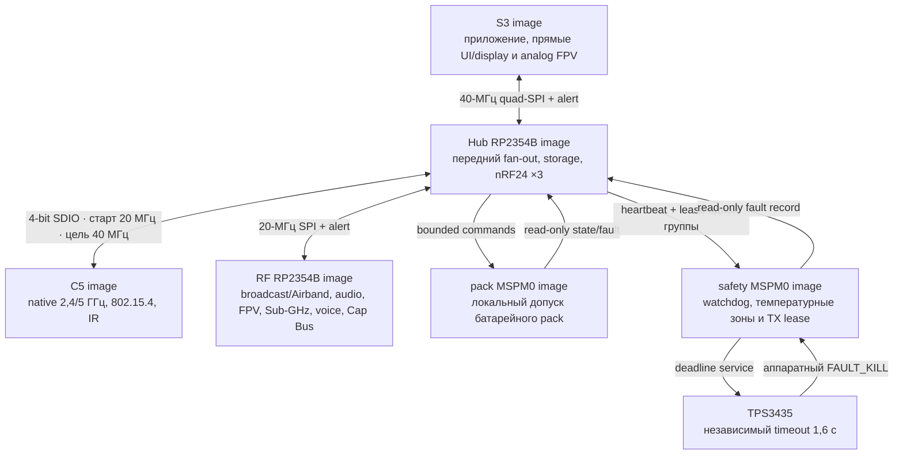

# Leshy2 — прошивка

[English](README.md) · [Аппаратная часть](https://github.com/anton-vinogradov/esp32-leshy2/blob/main/README.ru.md)

> **Статус прошивки: F2-R2.4 — следующая квалификация target builds.** Работа
> F0–F4 для R1 сохранена как regression evidence, но её топология из пяти
> доменов больше не является текущей. Подробности — в
> [роадмапе прошивки](docs/roadmap.ru.md).

## Роадмап прошивки и текущая позиция

Этот блок остаётся на стартовой странице прошивки до firmware release.
Подробные критерии выхода и явные пересечения с отдельным
[аппаратным роадмапом](https://github.com/anton-vinogradov/esp32-leshy2/blob/main/docs/roadmap.ru.md)
находятся в [роадмапе прошивки](docs/roadmap.ru.md).

| Этап | Статус | Результат |
|---|---|---|
| F0 · Контракты продукта | ✅ **Проведено ревью:** [итог F0-R2](docs/f0-product-contracts-report.ru.md) | шесть доменов, identities, независимый rollback, S3-last update и честные execution gates |
| F1 · Portable cores | ✅ **Проведено ревью:** [итог F1-R2](docs/f1-portable-cores-report.ru.md) | 34 сценария проходят normal и ASan/UBSan; six-domain update, Airband заднего RP и integrated faults |
| **F2 · Target-проекты и build system** | **▶️ Сейчас: F2-R2.4**; [план](config/f2_r2_target_rebaseline.json), [matrix](config/f2_r2_build_matrix.json), [шесть project roots](config/f2_r2_target_projects.json) и [владение generated BSP](config/f2_r2_bsp_consumption.json) R2 проведены ревью, [отчёт R1 сохранён](docs/f2-target-build-system-report.ru.md) | квалифицировать 12 locked debug/release configurations, artifacts, maps и size gates |
| F3 · Boot, память и эмуляция | ⏳ [Отчёт R1 сохранён](docs/f3-boot-memory-emulation-report.ru.md); ожидает F2-R2 | повторная квалификация шести targets, emulator и физических gates |
| F4 · IPC и scheduling | ⏳ Работа R1 приостановлена; ожидает F3-R2 | Hub-centered transports, typed messages, credits и priority isolation |
| F5 · BSP и drivers | ⏳ Ожидает F4 и актуальную схему R2 | все драйверы устройств, органов управления, датчиков и power states |
| F6 · UI, display, storage и audio | ⏳ Ожидает F5 | отзывчивые menu/waterfall, recording, audio и fault viewer |
| F7 · Radio, IR и expansion | ⏳ Ожидает F5/F6 | receive/TX profiles, полноценные 3×nRF24 и тихие неактивные тракты |
| F8 · Уровни функций и safety UX | ⏳ Ожидает F7 | Основной режим, Лаборатория и Контролируемая зона |
| F9 · Signed update и recovery | ⏳ Ожидает F1/F3 | управляемый владельцем bundle для шести targets, rollback и физический recovery |
| F10 · HIL и системная квалификация | 🔒 Ожидает F4–F9 и hardware H7 | prototype fault, RF, power, thermal и endurance evidence |
| F11 · Firmware release | 🔒 Ожидает F10 и hardware H8 | воспроизводимые подписанные образы, installer, recovery kit и release tag |

Каждая завершённая глобальная фаза `F*` получает отдельный итоговый отчёт,
связанный с этой таблицей; внутренние подэтапы меняют только точный маркер.

**Прошивка находится на F2-R2.4.** [Проведённое ревью F0-R2](docs/f0-product-contracts-report.ru.md)
закрывает контрактную основу, не заявляя реализованные targets. Сгенерированный
[`h0_r2_hardware_contract.json`](config/h0_r2_hardware_contract.json) связывает
репозиторий прошивки по SHA-256 с функциональным source, точным C5 service mux
и точной рабочей распиновкой двух RP. В R2 шесть
targets: S3, C5, RF RP, Hub RP, Pack и Safety. UI, кнопки, display и декодер
TVP5150 остаются локальными на передней плате. Hub RP владеет microSD и всеми
тремя nRF24; задний RF RP — CC1101, voice, audio, `BROADCAST_RX`, FPV, M5 и
ровно один подписанный профиль Cap U214/U219.
Сохранённые [`hardware_bsp_contract.json`](config/hardware_bsp_contract.json) и
[`hardware_integration_contract.json`](config/hardware_integration_contract.json)
явно помечены как исторический single-RP import R1 и не могут авторизовать R2.
[Gate authority R2/H2](config/r2_h2_sync_gate.json) остаётся fail-closed, пока
новый export H2 не содержит шесть доменов, оба `SC1512-A4`, точные RP-карты
H1-R2.31 и точную M1 из H0-R2. Рабочий BSP уже содержит все 48 GPIO каждого
RP и шесть фиксированных C5 SDIO contacts, но это pre-H2 authority, а не
закрытие ECAD, target-build, emulator или HIL.
[Структура target projects](config/f2_r2_target_projects.json), прошедшая ревью,
задаёт шесть production-SDK roots, шесть уникальных application images и два
boot images защитных контроллеров. RF RP и Hub RP имеют разные Pico SDK trees,
entry sources и image identities. Связанный hash
[BSP R2](config/f2_r2_bsp_generation.json) генерирует шесть детерминированных
domain descriptors, и [каждый привязан](config/f2_r2_bsp_consumption.json) ровно
к одному SDK project. R2 target configure и build пока не заявлены.
[Контракт memory и rollback](config/f0_r2_memory_rollback_contract.json),
прошедший ревью, сохраняет шесть независимых dual-slot доменов: оба RP2354B и
оба MSPM0 имеют общую только геометрию, но не target identity, state или flash.
Физические rollback transitions и помещаемость production verifier подписи
пока не заявлены.
[Политика update](config/update_policy.json), прошедшая ревью, staging всех
шести images, загружает и подтверждает Pack → Safety → C5 → RF RP → Hub RP →
S3, сохраняет power-loss-safe journal и требует подписанный bridge bundle для
breaking IPC changes. Budget окна RP TBYB 16,7 с явно ещё не измерен.
[Execution matrix](config/f0_r2_execution_gate_matrix.json), прошедшая ревью,
не смешивает пять слоёв evidence. Только S3 имеет точную официальную QEMU
machine. Для S3, C5, Pack и Safety есть dev-board paths с точным выбранным
module/MCU; Pico 2 явно остаётся лишь неточным surrogate RP2350A для обоих
targets RP2354B. Ни один R2 build, dev-board или Leshy2 HIL run не заявлен.
[Итог F1-R2](docs/f1-portable-cores-report.ru.md), проведённый ревью, добавляет
независимые update state RF-RP/Hub-RP, пять receive-only states Airband заднего RP и
integrated faults Hub/Pack/Safety. Его 34 сценария проходят normal и ASan/UBSan
host runs; это portable evidence, а не target build.
Обязательный receive-only Airband использует GP35/36 заднего RP, фиксированный LO
112 МГц и существующий audio path Si4732. Airband TX отсутствует. Железо
находится на `H1-R2.31`: сгенерированы locality-first размещение двух плат,
согласованные внешние и прямые внутренние стороны после переворота плат, сервисный доступ и проверка
вертикального FPV-разъёма. S3 сохраняет прямые i8080-8 32 МГц, camera RX,
обычные UI, энкодер и USB; M1 имеет точную карту 80 контактов, 14 NC-резервов и отдельную
механическую разгрузку. У S3, C5, RF RP и Hub RP есть собственные USB,
RESET/BOOT и внутренний DBG10. Экран физически ориентирован шлейфом к антенному
торцу; F5/F6 должны развернуть ориентацию памяти ST77922 и touch-координаты на
180°. Это обязательное целевое поведение, а не заявление об уже реализованном
драйвере. На внешней шелкографии стабильно указаны роли UI
и RF/power PCB, `R2-EVT1` и `REV A`; изменяемый рабочий маркер `H1-R2.xx`
остаётся только в документации. Фильтр Airband получил nominal/stress-аудит и
ячейку настройки 24×11 мм, а порты и антенны — совпадающие коды. Официальные
материалы на сайте AKK подтверждают схему включения K331, функции всех 14
контактов и таблицу 24 каналов. Официальный manual Sinopine SP331RX контролирует
номинал 28,7×23,1 мм, шаг контактов 2,54 мм и краевой отступ 1,4 мм совпадающего
семейства 331RX; аппаратный дизайн принимает двойную взаимоисключающую
post-PCBA-посадку в резерве 30×24×8 мм и сохраняет 1,05 мм встречного зазора
при требовании 0,70 мм после переноса C5 DBG10. K331
вписывается в зарезервированные GPIO заднего RP и 5-В бюджет; точная линейная
`TBS5G8MMCXA` выбрана для ключованного MMCX
`FPV RX 5.8G`, а независимая Taoglas `FXP831.09.0100C` выбрана как бумажный
резерв с текущим backorder. JLCPCB подтвердила отсутствие K331 в Parts Library
и Global Sourcing и не нашла прямой замены. Обычный PCBA BOM не содержит
приёмника: после reflow устанавливается ровно один модуль. Основной K331
использует толерантную 14-pad посадку; контролируемый производителем `AWM666V RX`
имеет точную вложенную посадку как урезанный семиканальный fallback. Выбранная
50-омная ветвь замыкается у запуска MMCX, неиспользуемая изолирована там же —
без U.FL, кабеля или live stub. Фактический корпус, ручная пайка, Z и прочность
относятся к H5/H7; Consigned Parts и последующий пакет AKK/Sinopine могут только упростить footprint.
Поиск полнофункционального fallback не дал production-замены: контролируемый
`SP166RX` имеет 42,418×29,46 мм ещё без высоты, а его RF-summary противоречит
таблице каналов; `MM238R-MCU` подходит функционально и по размерам, но имеет
только документ продавца, не имеет контролируемого текущего маршрута
производителя и найден лишь отсутствующим/снятым с продажи. Точные поиски
JLCPCB дали ноль результатов для обоих.
Необязательный Consigned Parts approval, финальный DFM по Gerber/BOM/CPL и дополнительный
фабричный function test назначены H5/H6/H7. Доказательство собранного
RF/video-тракта и запасная Taoglas остаются обязательными у
последующих H3/H5/H6/H8. Живые карточки `RichWave RTC6715` и безродного
`RX5808` имеют нулевой склад, MOQ 442 и не дают доступного module route;
у голого RTC6715 также нет публичного reference RF/IF application, поэтому
firmware сохраняет модульную границу K331. Точный вертикальный SMT-разъём
Molex `73415-2063` (`C588480`) расположен на задней стороне под равномерным
рядом из пяти SMA. Корпус оставляет 2,07 мм до SMA;
контролируемый угловой штекер — 2,40 мм до SMA и 4,80 мм до U214, не задевает
крепёж, а хвост не входит в межплатный просвет. Ø12 — только временная
H5-проверка доступа пальцев.
Стыковка полученных деталей, удержание, финальный допуск корпуса и strain
остаются evidence H5. Точная ячейка
3V3_MAIN допускает 3,75 А continuous / 4,25 А step во всех 12 разрешённых
группах сигналов; динамическое доказательство и проверка в корпусе остаются
gate H3. Для фильтра Airband H3 использует bounded pre-layout-паразитики, H6
повторяет routed extraction до заказа, а H8 выбирает VNA-qualified fitted/DNP-state.
Текущий мокап R2 проходит structural body/courtyard audit, но сохраняет четыре
явных H1-блокера: регистр прежних Cap-корпусов, MPN/courtyards вспомогательных
пассивов U219, геометрию NFC pickup и swept volume установленной антенны. После
их закрытия ещё требуется явное принятие полного внешнего вида, прямых внутренних сторон и разрезов;
Квалификация target builds R2, KiCad layout и разрешение заказа остаются открыты.

### Текущая фаза F2-R2 — детальная позиция

<!-- current-substep: F2-R2.4 -->

▶️ **`F2-R2.4` — сейчас.** [F2-R2.3](config/f2_r2_bsp_generation.json)
генерирует шесть детерминированных descriptors H1-R2.31, а
[one-owner проверка](config/f2_r2_bsp_consumption.json) связала каждый с одним
из шести SDK projects. Модель сохраняет точные pins S3, обе точные 48-GPIO
карты RP, шесть официальных фиксированных C5 SDIO contacts и identity-only
границы Pack/Safety; неопубликованный pin не придуман. C5 стартует на 20 МГц,
целится в 40 МГц, а floor 7,5 МБ/с можно принять только на 40 МГц. Service USB
принадлежит always-on аппаратной защёлке, а не firmware policy. Старый BSP пяти доменов
остаётся историческим и больше не является активным R2 input.
[Строгая policy R2](config/f2_r2_build_policy.json) теперь охватывает generated
tree R2 и изолированные build roots, а
[shell-free dispatcher](tools/build_f2_r2_targets.py) формирует все 24 argv-вызова
configure/build и публикует evidence только после успешной полной проверки 12
jobs, artifacts, maps и size gates. Подготовка выполнила ноль R2 configure/build,
artifact verification и target execution; квалификация остаётся следующей.
Точный маркер и его evidence меняются вместе в каждом commit.

<strong>Сохранённое evidence F0–F4 R1 — не текущая топология</strong>

### Историческая фаза F4 R1 — позиция на момент открытия R2

<!-- historical-substep: F4.1.4 -->

**Последний R1-маркер: `F4.1.4` (отменён R2).** Запланированный физический
dev-board gate прямого S3-C5 не выполнялся. Четыре locked debug/release builds S3/C5 проходят, а точный S3 QEMU
исполняет шесть fake-SDIO traffic/fault сценариев в обеих конфигурациях. Эти
прогоны доказывают поведение приложения над fake boundary, но не SDIO signal,
throughput, timing или сосуществование с C5 USB. Маркер и evidence меняются
вместе в каждом commit.

- `F2.0` — зафиксировать target/toolchain matrix.
  - ✅ `F2.0.0` — зарегистрировать пять target и их flash/RAM/rollback
    contracts.
  - ✅ `F2.0.1` — проведено ревью точных SDK/toolchain versions, официальной
    поддержки, lifecycle, license и требований к build host; результат — на
    странице [среды сборки пяти образов](docs/toolchains.ru.md).
  - ✅ `F2.0.2` — неизменяемые SDK revisions, 26 проверяемых записей архивов и
    ESP-IDF Python environment с hash-lock прошли ревью.
  - ✅ `F2.0.3` — единая local/CI matrix, shell-free dispatcher, fail-closed
    preflight и 26 названных target artifacts прошли ревью.
- `F2.1` — создать общее дерево source/components без target pins.
  - ✅ `F2.1.0` — каталоги, единоличное владение, target-neutral portable code
    и пустая до F2.3 граница generated sources прошли ревью.
  - ✅ `F2.1.1` — строгие C17/C++17, warnings-as-errors для project code,
    debug/release optimization и link policy с map-файлом прошли ревью.
  - ✅ `F2.1.2` — единым прогоном прошли environment, source, build-policy,
    H2-contract и 24 host-сценария.
- `F2.2` — создать минимальные SDK-проекты S3, C5, RP, Pack и Safety.
  - ✅ `F2.2.0` — S3 ESP-IDF project, portable component, production memory
    defaults и debug/release inputs прошли структурное ревью.
  - ✅ `F2.2.1` — C5 ESP-IDF project, portable component, production memory
    defaults и debug/release inputs прошли структурное ревью.
  - ✅ `F2.2.2` — точный RP2354B Arm-secure project, custom board на 2 МиБ,
    partition input и debug/release policy прошли структурное ревью.
  - ✅ `F2.2.3` — точный Pack MSPM0C1106 project, раздельные boot/application
    images, memory boundaries и debug/release policy прошли структурное ревью.
  - ✅ `F2.2.4` — точный Safety MSPM0C1106 project, раздельные boot/application
    images, fail-closed entry и debug/release policy прошли структурное ревью.
  - ✅ `F2.2.5` — единое ревью прошло для пяти projects, 37 файлов,
    26 artifacts и 20 debug/release command plans без target execution.
- `F2.3` — подключить принятый генерируемый pin/BSP contract.
  - ✅ `F2.3.0` — неизменяемая H2 source identity, 5 domains, 125 contacts,
    112 nets, 4 transports, 10 groups и модель proof fields прошли ревью.
  - ✅ `F2.3.1` — 11 generated C/header files сохраняют все 125 contacts,
    проходят строгий C17 syntax-check и побайтно воспроизводятся по manifest.
  - ✅ `F2.3.2` — каждый target потребляет ровно свою domain table и include
    path; чужих таблиц, BSP-копий и ручных pins не найдено.
  - ✅ `F2.3.3` — sibling H2, детерминированная генерация, строгие C17 tables и
    one-owner consumption прошли единое ревью.
- `F2.4` — пройти debug/release builds, map files и image-size gates.
  - ✅ `F2.4.0` — locked-toolchain preflight пяти targets прошёл ревью.
    - ✅ `F2.4.0.1` — точные sources/revisions ESP-IDF `v6.0.2`, Pico
      SDK/picotool `2.3.0` и TI MSPM0 SDK `2.11.00.07` прошли ревью.
    - ✅ `F2.4.0.2` — установлены и распознаны ESP-IDF tool manager точные
      S3/C5 compilers, debuggers, ULP tools, OpenOCD и ROM ELFs прошли ревью.
    - ✅ `F2.4.0.3` — hash-locked Python 3.12 environment и точные CMake/Ninja
      прошли ревью; evidence — [`config/f2_4_preflight_progress.json`](config/f2_4_preflight_progress.json).
    - ✅ `F2.4.0.4` — hash-verified native Arm GNU `15.2.Rel1` прошёл ревью для RP2354B.
    - ✅ `F2.4.0.5` — hash-verified TI Arm Clang `4.0.5.LTS` и SysConfig
      `1.28.0.4712` прошли ревью для Pack/Safety.
    - ✅ `F2.4.0.6` — прошли 30 точных проверок SDK, Git, lock, compiler и
      обязательных входов плюс debug/release dispatcher preflight; [машинный evidence](config/f2_4_preflight_review.json).
  - ✅ `F2.4.1` — S3 debug/release configure, build, наличие десяти artifacts
    и image-size gates прошли ревью; [машинный evidence](config/f2_4_s3_build_review.json).
  - ✅ `F2.4.2` — C5 debug/release configure, build, наличие десяти artifacts
    и image-size gates прошли ревью; [машинный evidence](config/f2_4_c5_build_review.json).
  - ✅ `F2.4.3` — RP debug/release configure, build, наличие восьми artifacts
    и image-size gates прошли ревью; [машинный evidence](config/f2_4_rp_build_review.json).
  - ✅ `F2.4.4` — Pack debug/release configure, build, наличие двенадцати
    artifacts и image-size gates прошли ревью; [машинный evidence](config/f2_4_pack_build_review.json).
  - ✅ `F2.4.5` — Safety debug/release configure, build, наличие двенадцати
    artifacts и image-size gates прошли ревью; [машинный evidence](config/f2_4_safety_build_review.json).
  - ✅ `F2.4.6` — все 52 debug/release artifacts, 14 maps и 10 image-size gates
    прошли единое ревью; [машинный evidence](config/f2_4_build_review.json).
- ✅ `F2.5` — два полных чистых прохода дали 52/52 побайтно идентичных
  artifacts; в 24 распространяемых образах нет абсолютного workspace path.
  См. [итоговый отчёт F2](docs/f2-target-build-system-report.ru.md) и
  [машинный evidence](config/f2_5_reproducibility_review.json).
- `F3.0` — зафиксировать runtime-evidence plan до заявления о boot.
  - ✅ `F3.0.0` — официальная поддержка emulator/simulator, instruction
    coverage, наблюдаемость boot и неизбежные dev-board gates всех пяти targets
    прошли ревью: точный vendor QEMU есть только для S3;
    [машинная матрица](config/f3_execution_capability_matrix.json).
  - ✅ `F3.0.1` — точные hash-locked QEMU archives, debug/release recipes,
    шесть последовательных boot markers, 30-секундный timeout и fail-closed
    result contract прошли ревью; [машинный план](config/f3_runtime_plan.json).
  - ✅ `F3.0.2` — матрица evidence пяти targets и единый fail-closed runner
    прошли ревью без запуска target; [машинная матрица](config/f3_acceptance_matrix.json).
- ✅ `F3.1` — S3 debug и release images прошли по шесть последовательных
  markers в точном Espressif QEMU, включая инициализацию и memory test 8-МиБ
  octal PSRAM; [debug evidence](config/f3_1_s3_debug_runtime_review.json) и
  [release evidence](config/f3_1_s3_release_runtime_review.json).
- ✅ `F3.2` — S3 debug/release прошли по девять markers для boot, self-test,
  retained-first-fault и failed-update RAM rollback; ещё 24 portable-сценария
  прошли ASan/UBSan. Nonvolatile persistence и flash rollback этим не заявлены;
  [сводный evidence](config/f3_2_runtime_review.json).
- ✅ `F3.3` — новый двойной clean-build воспроизвёл 52/52 artifacts; десять
  актуальных image/RAM gates и пять статических rollback topologies помещаются.
  S3 debug занимает 187 040 байт с запасом 6 890 848 байт до maximum; физических
  rollback transitions заявлено ноль. См.
  [boundary evidence](config/f3_3_boundary_review.json).
- ✅ `F3.4` — [глобальный итог F3](docs/f3-boot-memory-emulation-report.ru.md)
  закрывает фазу точным S3 execution, 52 воспроизводимыми artifacts и пятью
  явными физическими target/HIL gates.
- `F4.0` — зафиксировать план исполнения и evidence transports.
  - ✅ `F4.0.0` — [проведены четыре transport и восемь точных SDK endpoint bindings](config/f4_0_transport_capability_matrix.json); QEMU не исполняет ни один их PHY.
  - ✅ `F4.0.1` — [проведены единый fail-closed lifecycle, фиксированные ownership/queues, credits, duplicates, deadlines, reset и точный ESSL lock](config/f4_0_1_adapter_contract.json).
  - ✅ `F4.0.2` — [проведены единый runner, шесть классов evidence и 37 сценариев](config/f4_0_2_acceptance_matrix.json); [baseline snapshot](config/f4_0_2_acceptance_snapshot.json) заявляет ноль transport runs.
- `F4.1` — реализовать и исполнить SDIO S3↔C5.
  - ✅ `F4.1.0` — [проведены точный offline payload ESSL 1.1.2 и single-owner source boundary S3↔C5](config/f4_1_s3_c5_source_boundary.json); [manifest 30 файлов](third_party/esp_serial_slave_link.vendor-lock.json).
  - ✅ `F4.1.1` — [проведён общий high-speed core](config/f4_1_1_high_speed_core_review.json): 19 сценариев ASan/UBSan; unsafe absolute-credit draft заменён накопительными duplicate-safe grants.
  - ✅ `F4.1.2` — [проведены endpoints S3 host и C5 SDIO slave](config/f4_1_2_s3_c5_endpoint_review.json): generated pins, однобитный SDIO 20 МГц, точный ESSL и две locked debug builds; QEMU/PHY claims — ноль.
  - ✅ `F4.1.3` — [проведены exact builds и fake-SDIO QEMU](config/f4_1_3_s3_c5_qemu_review.json): четыре target builds, два S3 QEMU runs, по шесть сценариев и ноль PHY claims.
  - ⛔ `F4.1.4` — не выполнен; заменён R2-трактом Hub↔C5 4-bit.
- `F4.2` — реализовать и исполнить SPI+alert S3↔RP.
- `F4.3` — реализовать и исполнить I²C mailboxes Pack/Safety.
- `F4.4` — внедрить saturation, duplicate, deadline, reset и link-loss faults.
- `F4.5` — свести target evidence и опубликовать глобальный итог F4.

F3 прошла ревью на честной границе evidence. Теперь F4 превращает принятые
message contracts в реальные target transports, сохраняя приоритет
safety/control под waterfall и bulk traffic. Каждый подэтап обновляет evidence,
точный маркер и обе языковые страницы в одном commit.

Прошивка превращает радиотракты Leshy2 в единый полевой инструмент: показывает
меню и водопад, управляет приёмом и передачей, записывает данные, обслуживает
расширения и сохраняет безопасное состояние при сбоях. Здесь описаны
возможности и устройство готового продукта.

## Пользовательские возможности

- Быстрая навигация с D-pad, `OK`, `BACK`, `OPT`, `F1`, `F2`, энкодером,
  touch и `PTT`; один фиксируемый переключатель `RUN/KILL` управляет допуском
  и физическим восстановлением после аварии.
- Бегущий спектральный водопад и индикаторы трактов с перерисовкой только
  изменившихся областей экрана.
- Профили приёма, сканирование, декодирование поддерживаемых протоколов,
  запись RF-событий, аудио и метаданных на microSD.
- Стереовоспроизведение и запись с внешнего микрофона через CTIA-гарнитуру,
  непрерывное детектирование штекера и выбор встроенного микрофона для обычных
  TRS-наушников.
- Полный смешанный режим трёх nRF24: `3R`, `1T2R`, `2T1R` и `3T` без
  программного отключения соседнего приёмника.
- Wi‑Fi 2,4/5 ГГц, BLE, ESP‑NOW, IEEE 802.15.4, Sub‑GHz, broadcast RX,
  VHF/UHF voice, IR, штатный U214 LoRa RX/GNSS и точные evidence-qualified
  RX/TX-профили `LESHY2-LORA-CAP-01-EU868/US915`.
- Опциональный подписанный профиль U219: CC1101 жёстко ограничен RX, а NFC —
  чтением в reader/poller. Поле 13,56 МГц остаётся выключенным, пока независимый
  детектор `EV_N9` не пройдёт VNA и HIL.
- Импорт, экспорт и резервное копирование профилей владельца; длинный текст
  при необходимости вводится с локально сопряжённого телефона.

## Три уровня функций

1. **Основной режим** — обычный приём, диагностика, обслуживание и законная
   связь.
2. **Лаборатория** — пассивные, защитные и ограниченные исследовательские
   инструменты.
3. **Лаборатория → Контролируемая зона** — потенциально опасные active-функции.
   При каждом входе появляется новый обязательный баннер; действие требует
   отдельного вооружения и разрешённой цели или изолированной среды.

Прошивка не может обойти аппаратный `FAULT_KILL`, создать разрешение из факта
обнаруженной передачи или восстановить прежнее вооружение после reset,
recovery, смены профиля либо ошибки. После защёлкнутой аварии требуется
физический цикл `KILL`→`RUN`.

## Runtime в шести доменах

Реакции с жёстким временем исполняются у физического владельца тракта.
Межпроцессорные сообщения типизированы и версионированы; потеря связи снимает
lease и переводит зависимую функцию в безопасное состояние. Экран, storage и
radio не блокируют друг друга длинными общими операциями.

При аварии C5, RF RP и Hub RP переходят в заданные safe/reset states. Если температурная зона UI безопасна, S3
может запустить только подписанный экран аварии: причина, измеренное значение и
предел, выполненное действие, идентификатор события и инструкция `KILL`→`RUN`.
Если опасен экран или сама зона UI, дисплей выключается, а независимый янтарный
светодиод `FAULT` остаётся видимым.

Для долгой работы используется квалифицированный источник USB-PD; обещаний
времени работы от батарей или uptime в часах продукт не даёт. В `Настройки →
Безопасность → Полная самопроверка` доступны интервалы 24 часа, 48 часов по
умолчанию и режим «только при запуске» с явным предупреждением. Изменение можно
подготовить только с локального физического UI, а действует оно после следующей
физической проверки `KILL`→`RUN`. Deadline принадлежит safety controller:
просрочка снимает leases и переводит устройство в сохранённое аварийное
состояние. Настройка не ослабляет watchdog, температурные пределы, реакцию на
power fault или контроль TX leases.

## Обновление и владение устройством

Образы подписаны, привязаны к target и устанавливаются с rollback. Подпись
защищает от подмены пакета, но не закрывает устройство: владелец может собрать
прошивку из исходников, использовать собственный ключ и восстановить каждый
контроллер через отдельный физический интерфейс. Необратимая блокировка не
включается по умолчанию.

## Документация

- [Роадмап прошивки и текущая позиция](docs/roadmap.ru.md)
- [Среда сборки R1, сохранённая для повторной квалификации](docs/toolchains.ru.md)
- [Архитектура прошивки и поведение подсистем](docs/architecture.ru.md)
- [Разметка flash, PSRAM и rollback](docs/memory.ru.md)
- [Аппаратная архитектура](https://github.com/anton-vinogradov/esp32-leshy2/blob/main/docs/hardware.ru.md)
- [Модель безопасности](https://github.com/anton-vinogradov/esp32-leshy2/blob/main/docs/safety.ru.md)
