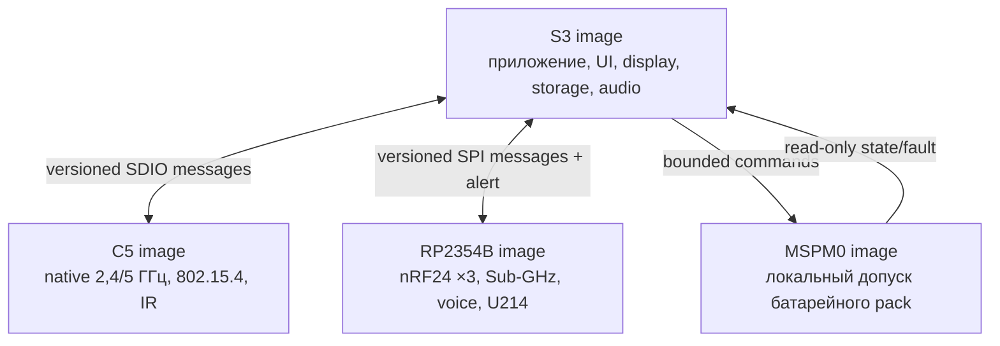

# Leshy2 — прошивка

[English](README.md) · [Аппаратная часть](https://github.com/anton-vinogradov/esp32-leshy2/blob/main/README.ru.md)

Прошивка превращает радиотракты Leshy2 в единый полевой инструмент: показывает
меню и водопад, управляет приёмом и передачей, записывает данные, обслуживает
расширения и сохраняет безопасное состояние при сбоях. Здесь описаны
возможности и устройство готового продукта.

## Пользовательские возможности

- Быстрая навигация с D-pad, `OK`, `BACK`, `OPT`, `F1`, `F2`, энкодером,
  touch, `PTT`, `STOP` и `RE‑ARM`.
- Бегущий спектральный водопад и индикаторы трактов с перерисовкой только
  изменившихся областей экрана.
- Профили приёма, сканирование, декодирование поддерживаемых протоколов,
  запись RF-событий, аудио и метаданных на microSD.
- Полный смешанный режим трёх nRF24: `3R`, `1T2R`, `2T1R` и `3T` без
  программного отключения соседнего приёмника.
- Wi‑Fi 2,4/5 ГГц, BLE, ESP‑NOW, IEEE 802.15.4, Sub‑GHz, broadcast RX,
  VHF/UHF voice, IR и подключаемые LoRa/GNSS-модули.
- Импорт, экспорт и резервное копирование профилей владельца; длинный текст
  при необходимости вводится с локально сопряжённого телефона.

## Три уровня функций

1. **Основной режим** — обычный приём, диагностика, обслуживание и законная
   связь.
2. **Лаборатория** — пассивные, защитные и ограниченные исследовательские
   инструменты.
3. **Лаборатория → Контролируемая зона** — потенциально опасные active-функции.
   При каждом входе появляется новый обязательный баннер; действие требует
   отдельного вооружения и разрешённой цели или изолированной среды.

Прошивка не может обойти аппаратный `STOP`, создать разрешение из факта
обнаруженной передачи или восстановить прежнее вооружение после reset,
recovery, смены профиля либо ошибки.

## Runtime в четырёх доменах

Реакции с жёстким временем исполняются у физического владельца тракта.
Межпроцессорные сообщения типизированы и версионированы; потеря связи снимает
lease и переводит зависимую функцию в безопасное состояние. Экран, storage и
radio не блокируют друг друга длинными общими операциями.

## Обновление и владение устройством

Образы подписаны, привязаны к target и устанавливаются с rollback. Подпись
защищает от подмены пакета, но не закрывает устройство: владелец может собрать
прошивку из исходников, использовать собственный ключ и восстановить каждый
контроллер через отдельный физический интерфейс. Необратимая блокировка не
включается по умолчанию.

## Документация

- [Архитектура прошивки и поведение подсистем](docs/architecture.ru.md)
- [Аппаратная архитектура](https://github.com/anton-vinogradov/esp32-leshy2/blob/main/docs/hardware.ru.md)
- [Модель безопасности](https://github.com/anton-vinogradov/esp32-leshy2/blob/main/docs/safety.ru.md)
