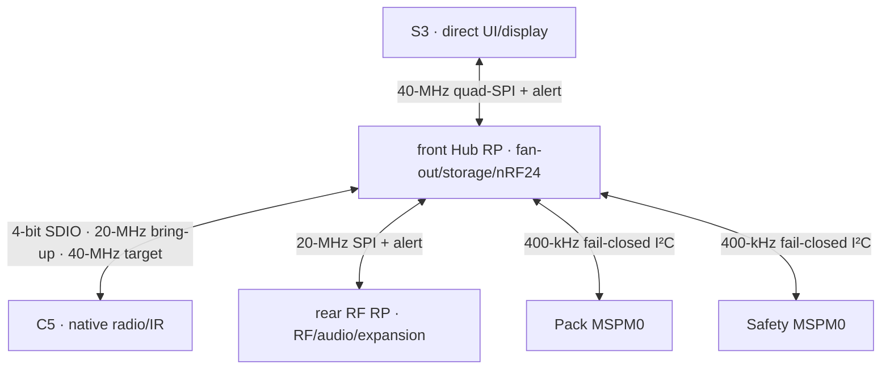

# Leshy2 firmware architecture

[Home](../README.md) · [Русский](architecture.ru.md) · [Hardware](https://github.com/anton-vinogradov/esp32-leshy2/blob/main/docs/hardware.md)

## Current R2 runtime boundary

The machine projection in
[`config/h0_r2_hardware_contract.json`](../config/h0_r2_hardware_contract.json)
is generated from four hash-bound hardware sources: functional H0-R2, the
exact C5 service mux, the exact H1-R2.31 dual-RP working map and the accepted
U214/U219 Cap profile boundary.
It is the current firmware input; the R1 contract below is regression evidence.
The retained H2.0.3 BSP and integration JSON files are explicitly historical
single-RP imports and are forbidden as R2 authority. The
[machine R2/H2 gate](../config/r2_h2_sync_gate.json) stays closed until a new
hardware export carries six domains, both RP instances, both exact RP maps and
the exact H0 M1 map. The imported maps are pre-H2 working authority; they do
not claim ECAD, target execution or HIL closure.

| Image | Physical owner | Current R2 responsibility |
|---|---|---|
| S3 | `ESP32-S3-WROOM-1U-N16R8` | application, direct UI/touch/encoder/USB and direct 24-MHz i8080-8 TX to `ER-TFT035IPS-6` + `ER-TPC035-6` |
| C5 | `ESP32-C5-WROOM-1U-N8R8` | native 2.4/5-GHz Wi-Fi, IEEE 802.15.4 and IR |
| RF RP · rear | `SC1512-A4` | CC1101, VHF/UHF voice, FM/AM/SW/LW/Airband, audio, M5 and exactly one signed U214/U219 Cap profile |
| Hub RP · front | second `SC1512-A4` | S3/C5/rear-RP fan-out, microSD and three complete concurrent nRF24 paths |
| Pack | `MSPM0C1106SDGS20R` | cell admission and protected shutdown |
| Safety | second `MSPM0C1106SDGS20R` | watchdog, thermal supervision, TX evidence/leases and `FAULT_KILL` |

The S3-Hub link carries control and selected data, never display pixels.
Hub-local microSD and three nRF24 islands do not contend
with the display; rear audio uses bounded full-duplex transport below 0.4 MB/s.
Button edges terminate on the S3-local
`TCA9539PWR`; encoder A/B remain direct PCNT inputs. The first visible response
target remains 20 ms under qualified concurrent load.

The H1-R2.36 physical orientation points the display flex toward the antenna edge;
the S3 display/touch driver therefore applies one 180-degree transform to both
ILI9488 memory addressing and FT6236 touch coordinates. Normal display traffic
uses i8080-8; ordinary 4-wire serial is a recovery strap, not QSPI.
The exact M1 map defines all 80 contacts: 24 live signals, 14 main-power, 2 AON,
24 returns and 16 NC reserves. M1 is electrical/alignment-only; enclosure stops,
anti-shear datums and PCB capture carry impact and bending loads.

`BROADCAST_RX` is rear-RP-owned and mutually exclusive with other top-level signal
groups. Airband AM maps 118–137 MHz to Si4732's 6–25-MHz FMI range using a
fixed 112-MHz low-side LO. Rear RP GP35 is fail-low `AIR_RX_EN`; GP36 selects direct
FM/SW or converted Airband and resets to direct FM/SW. Included behavior is AM
voice, 25/8.33-kHz plans, scan/banks, recording, activity history and downstream
ACARS 2400 decode. Airband TX, VDL2, wideband spectrum capture and certified
VOR/ILS are not claimed.

Pack state and the Safety heartbeat/lease/fault mailboxes use dedicated front-Hub
GP42/43 I²C1. The required powered-off-Ioff boundary and separate
`3V3_MAIN`/AON pull-up domains remain an H2 gate, so an AON mailbox cannot
back-power a watchdog-shut-down Hub. Safety still owns watchdog service and asynchronous `FAULT_KILL`;
an IPC hop cannot create permission or suppress a local fault. The complete
[F0-R2 contract foundation is reviewed](f0-product-contracts-report.md);
the [F1-R2 portable behavior is also reviewed](f1-portable-cores-report.md).
F2-R2 now rebaselines the six target projects and generated BSP boundary.

## Current R2 transports

`L2IP v1` remains the typed application contract; the R2 physical owners and
routes are now Hub-centered.

| Link | Physical transport | Wire unit | Required behaviour |
|---|---|---|---|
| S3↔Hub RP | dedicated 40-MHz four-data-line half-duplex link + alert | bounded DMA cell | ≥14 MB/s qualified payload; UI/display remain S3-local |
| Hub RP↔C5 | native 4-bit SDIO: 20-MHz bring-up, 40-MHz target | up to one 512-byte packet | ≥7.5 MB/s payload is accepted only at 40 MHz; reset/recovery and priority are HIL gates |
| Hub RP↔RF RP | dedicated 20-MHz full-duplex SPI + alert | one full-duplex 512-byte DMA cell | ≥1.5 MB/s payload, ≤250 µs alert-to-read and ≤2 ms control RTT |
| Hub RP↔Pack/Safety | dedicated fail-closed 400-kHz I²C | bounded command/status mailboxes | Hub cannot grant battery admission or override local watchdog/`FAULT_KILL` |

The C5 link uses Espressif's FIFO/register/interrupt slave transport. The exact
module lot must contain **ESP32-C5 revision v1.2 or later**. GPIO7–10 are direct;
GPIO13/14 pass through a fail-safe hardware-owned mux between runtime DAT3/DAT2
and data-only service USB. Service VBUS asynchronously seizes ownership, holds
Hub reset/high-Z and uses break-before-make switching; firmware cannot override
that latch. The Hub-RF link uses RP2354B hardware SPI1 slave DMA. These are
working pre-H2 targets, not implemented or physically qualified links.

## Optional U214/U219 Cap profiles

The rear Cap Bus accepts exactly one signed profile at a time. Reset, an
unknown identity or a failed signature keeps the protected branch off, external
I/O isolated, contact 8 low and contact 10 in its U214-safe input state. A
profile change always repeats a full shutdown and identity check; it is not a
hot in-place reinterpretation of the pins. The machine contract is
[`config/u219_cap_policy.json`](../config/u219_cap_policy.json).

The stock U214 behavior is unchanged: contact 8 is `LORA_RST_N`, contact 10 is
the `BUSY` input, SPI uses mode 0, and the stock module remains receive/GNSS-only.
The shared Cap I²C route is exact rather than inferred from the old reserve map:
contact 3 is SCL and reaches rear RF RP GP31 as `CAP_I2C_SCL`; contact 4 is SDA
and reaches GP30 as `CAP_I2C_SDA`, both through the existing `TCA4307DGKR`.
Contact 9 reaches the profile-neutral `CAP_IRQ` on GP13: U214 DIO1 is active
high, while U219 `NFC_IRQ` polarity remains a received-unit HIL gate.
Contact 7 remains unassigned/ambiguous and gives firmware no usable signal.
The optional U219 profile first preloads contact 10 high behind disabled I/O,
powers the protected branch with contact 8 still fail-low, connects I/O only
after power-good, and raises contact 8 `POWER_EN` last. U219 shares one SPI bus:
CC1101 uses mode 0 and ST25R3916 uses the official M5 mode-1/10-MHz contract;
both chip selects are high before the mode changes.

U219 CC1101 is hard RX-only. Every raw transaction crosses an allowlist that
rejects `SFSTXON`, `STX`, PATABLE/TX-FIFO writes, `MCSM0.PIN_CTRL_EN=1` and
post-RX `FSTXON/TX` states. NFC exposes poll/read only; write and card emulation
are absent from the accepted policy. Its intentional 13.56-MHz reader field is
a separate `U219_NFC` signal group: active-low `EV_N9_U219_NFC` on evidence
register P12 also reaches `ANY_TX_AON_N` and must match a bounded physical-field
lease. The compile gate defaults to zero and no target defines it, so field
generation remains disabled until a real U219, final enclosure, VNA tuning and
HIL fault/latency/range tests close the hardware gate. Host tests prove only the
state machine, command firewall and fail-closed gate—not target, RF or HIL
operation. M5Unit-NFC and RadioLib are MIT reference candidates; neither an ST
driver nor either library is integrated yet.

<strong>Retained R1 architecture — not the current physical topology</strong>

## Historical R1 runtime domains

| Image | Physical owner | Local responsibilities | Independent recovery |
|---|---|---|---|
| S3 | `ESP32-S3-WROOM-1U-N16R8` | Application, menu, display, microSD, audio, BLE/Wi-Fi | Product USB, UART0, RESET, BOOT |
| C5 | `ESP32-C5-WROOM-1U-N8R8` | Native 2.4/5 GHz, IEEE 802.15.4, IR | Data-only USB, UART0, RESET, BOOT |
| RP | `SC1512-A4` (RP2354B) | nRF24 ×3, CC1101, SA818S-V/U selection, Cap Bus | Data-only USB, SWD, RUN, USB_BOOT |
| Pack | `MSPM0C1106SDGS20R` | Two-cell admission and local fail-closed power state | NRST, SWD, UART1 and isolated fixture power |
| Safety | second `MSPM0C1106SDGS20R` | Heartbeats, TX leases, three thermal zones, physical TX evidence and retained fault record | NRST, SWD, UART1 and isolated fixture power |

S3 coordinates the user scenario but does not replace local owners. C5 and RP
meet radio deadlines locally, revoke TX when a lease disappears and report
actual path state. The pack controller exposes only bounded read-only state and
fault information to S3; S3 cannot command it to accept an unsafe cell pair.
The safety controller is independent of the pack controller, owns the private
TX-evidence bus and is the only device allowed to service the external
`TPS3435CAKAGDDFR` 1.6-second timeout watchdog.

## Inter-processor messages

`L2IP v1` gives the two high-rate links one typed application contract. Its
32-byte header carries source, target, message and correlation IDs, protocol
version, payload length, receipt-relative deadline and separate CRC-32C values
for header and payload. State-changing requests are duplicate-safe. Completion
means a typed result proving the reached local state, never just a successful
bus transfer or queue insertion.

| Link | Physical transport | Wire unit | Required behaviour |
|---|---|---|---|
| S3↔C5 | dedicated 1-bit SDIO at 20 MHz | up to one 512-byte packet | ≥1.5 MB/s payload, ≤2 ms control RTT, ≤70% admitted occupancy |
| S3↔RP | dedicated 20-MHz SPI3 plus `RP_ALERT_N` | one full-duplex 512-byte DMA cell | ≥1.5 MB/s payload, ≤250 µs alert-to-read and ≤2 ms control RTT |
| S3↔Pack | `SYS_I2C` target `0x2A` | 32-byte command, 64-byte read-only status | S3 cannot command battery admission; update writes require physical KILL |
| S3↔Safety | `SYS_I2C` target `0x2B` | 32-byte command, 64-byte read-only status | only session heartbeat, one bounded group lease and KILL-only update are writable |

The historical C5 link used Espressif's FIFO/register/interrupt slave transport.
The R1 module lot required **ESP32-C5 revision v1.0 or later** because revision
v0.1 did not support SDIO. Its four selected wires left GPIO13/14 to native
recovery USB. The historical RP link used RP2354B SPI1 slave DMA; S3 clocked a
side-effect-free `NOP` whenever only upstream data was pending.
[Espressif SDIO slave](https://docs.espressif.com/projects/esp-idf/en/latest/esp32c5/api-reference/peripherals/sdio_slave.html) ·
[C5 hardware requirement](https://docs.espressif.com/projects/esp-hardware-design-guidelines/en/latest/esp32c5/schematic-checklist.html) ·
[RP SPI/DMA API](https://www.raspberrypi.com/documentation/pico-sdk/hardware.html)

Safety, control, interactive, telemetry and bulk queues have decreasing
priority. Bulk is credit-controlled and cannot borrow safety/control buffers;
stale waterfall telemetry may be dropped with an explicit sequence gap. A
link reset, corrupt frame, incompatible schema or expired deadline revokes the
local TX lease. C5 and RP therefore stop locally even if S3 can no longer send
a stop command.

S3 publishes a safety heartbeat every 50 ms; a 200-ms gap is a fault. A TX
lease lasts at most 100 ms and is renewed no slower than every 40 ms. The
safety loop runs within 5 ms and unexpected physical evidence is faulted
within 10 ms. Only a healthy safety loop services the independent 1.6-second
watchdog. Exact layouts, message IDs, mailbox fields, update messages and test
vectors are machine-readable in
[`config/interdomain_protocol.json`](../config/interdomain_protocol.json).
This historical R1 controller, transport, pin, signal-group, safety-timing and
LoRa-profile boundary is retained only as regression evidence in
[`config/hardware_integration_contract.json`](../config/hardware_integration_contract.json).
It is explicitly forbidden as an R2 authority.

## Scheduling and quiet states

One top-level signal group is active at a time. The nRF24 group itself is the
exception: all three radios operate concurrently in every required RX/TX mix.
Broadcast reception is represented explicitly as the receive-only
`BROADCAST_RX` group; it never hides under `NONE` merely because it has no TX
evidence bit. `NONE` means every signal interface is quiet.
A group transition is transactional:

1. stop accepting new work and finish the bounded current transfer;
2. revoke TX and wait for absence of actual-TX evidence;
3. disable the old group's interface, power and output drivers;
4. verify discharge and quiet state;
5. power the new group, verify identity and only then grant a lease.

Display i8080 DMA, microSD sessions and inter-processor links use bounded quanta.
They do not hold CPU or bus resources long enough to miss a radio deadline.

## User interface

- The main model is a menu, status bar and tool workspace.
- The waterfall appends one new row or column and scrolls the visible region;
  menus and indicators update only dirty rectangles.
- The first local response appears within 100 ms even during radio, audio or
  storage activity.
- The encoder uses hardware PCNT; the key matrix is interrupt-driven rather
  than continuously polled.
- `PTT` is a separate held voice-TX request. The maintained `RUN/KILL` switch
  is asynchronous and always dominates. Only a physical `KILL`→`RUN` edge can
  clear a releasable fault; software cannot repeat or synthesize it.

## Radio and IR

Each radio service exposes scan/receive, constrained transmit, identity,
profile configuration, actual-TX evidence, fault and quiet state. The regional
profile defines available bands and conservative power; maximum power is never
the default.

The three nRF24 radios have independent queues, SPI resources, IRQs and
evidence. Their group scheduler coordinates them without turning mixed mode
into a sequential simulation. The IR service concurrently receives a
demodulated 38-kHz stream and measures a 30–60-kHz carrier; transmit requires
hardware `RUN_PERMIT` qualification and optical evidence.

## Storage, audio and expansion

- microSD power exists only for an active session. Clean eject drains writes
  and unmounts first; unexpected removal marks the missing tail as incomplete.
- The audio graph explicitly selects microphone or radio RX for capture and
  speaker or a CTIA headset for playback. The `SJ-43504-SMT-TR` tip switch
  reaches detect-only `slow_io.P02`: high means absent, while low or an
  unreadable state immediately silences the speaker. Firmware never drives
  this line.
- Dedicated `TCA9534APWR` P0 at collision-free I²C address `0x39` selects the
  headset microphone low or the internal microphone high. Its input/reset
  state is physically pulled to the internal microphone. Stable insertion
  defaults to the headset microphone; a user may retain the internal
  microphone for an ordinary TRS headphone plug. Removal restores the reset
  default before speaker playback can resume. P1–P7 are pulled, interrupt-
  capable local reserves rather than floating pins.
- A dedicated `TCA9534A` at `0x3A` selects VHF or UHF. Hardware one-hot PD and
  three `TMUX1136` paths keep UART, PTT/AUDIO_ON and AFOUT/MIC_IN on the same
  selected SA818S module. PTT is never inferred from audio samples or
  microphone choice; `SA818S-CE` may replace only UHF after qualification and
  then firmware disables 470–480 MHz.
- The Cap Bus and M5 Unit use independent `OFF → STARTING → IDENTIFY → ACTIVE →
  STOPPING` states and a latch-off fault. An unknown module profile never gains
  power or dangerous commands automatically.
- The built-in S3, C5, nRF24, CC1101, voice and IR transmit paths have physical
  evidence. The stock U214 remains receive/GNSS-only because contact 5 is
  `5V_OUT`, not RF proof. Exact signed `LESHY2-LORA-CAP-01-EU868` and
  `LESHY2-LORA-CAP-01-US915` profiles use `NiceRF LoRa1262-868/915`, a
  `24AA02UIDT-I/OT` identity anchor and the same contact as open-drain
  `EXT_TX_EVIDENCE_N`. Their TX lease exists only after the regional frequency
  profile, UID binding, final external RF feed and 10–18-ms bit-8 pulse have
  passed qualification. Identity never substitutes for authorization or live
  evidence. Generic M5 Unit TX still requires its own physical evidence profile.
- A phone acts only as local text input and data exchange; it cannot confirm a
  Controlled-Zone action.

## Safety and update

A potentially dangerous function requires the appropriate UI level, an
authorized target/profile, preview, separate arming and a time-bounded lease.
Evidence confirms execution but never creates permission.

### Unattended safety and fault display

- No battery-autonomy or uptime-hours claim is made. Extended operation uses a
  qualified USB-PD source; 24 and 48 hours are F10 validation durations.
- `Settings > Safety > Full self-test` selects every 24 hours, every 48 hours
  by default, or warned startup-only proof. `Check now` remains available.
- Only the local physical UI may stage this setting, and it becomes active only
  after the next physical `KILL`→`RUN` proof. It cannot alter watchdog,
  thermal, power-fault or TX-lease enforcement.
- The safety MSPM0 owns the monotonic active-session deadline. At expiry it
  revokes leases, requests quiet, retains `FAULT_PLANE_PROOF_DUE`, asserts the
  fault request and requires physical `KILL`→`RUN` recovery.
- S3 publishes a bounded heartbeat and one short-lived lease naming the active
  signal group. The safety controller independently compares that lease with
  `ANY_TX_AON_N` and nine used bits of the 16-bit `TCA9535PWR` evidence register
  at private address `0x20`.
- The safety controller services the TPS3435 deadline only while its own loop,
  the S3 heartbeat, the active lease, power-fault input and three NTC channels
  are healthy. TPS3435 timeout or any controller fault asynchronously latches
  `FAULT_KILL`.
- The retained record contains primary source, affected zone or signal group,
  measured value, limit, evidence mask, rail state and monotonic event ID.
- C5 and RP remain reset after a fault. S3 may enter a signed, read-only
  fault-viewer image only while the UI/display thermal zone and main rail are
  safe. The screen states the cause, what was disabled and that the operator
  must move `RUN` to `KILL` before attempting restart.
- UI/display overtemperature or unsafe display power turns the screen off. The
  AON amber `FAULT` LED and retained record remain; automatic restart is never
  permitted.

The user installs one bundle, not five unrelated files. Its signed manifest
binds every image to the product, hardware range, physical target, build ID and
compatible inter-domain protocol range. The updater accepts either a release
root or a locally enrolled owner root.

Installation requires physical `RUN=KILL`, quiet TX evidence and qualified
stable power. All inactive images are written and read back before any target
is activated. Pack, Safety, C5 and RP then perform their local pending boot and
self-test while the old S3 remains coordinator; S3 activates last. A target
failure restores its local last-known-good image, and a failed bundle returns
already advanced peers to the compatible previous set.

The mechanism is deliberately open. Irreversible secure-boot, anti-rollback
and debug locks are not enabled by default. Signatures reject substituted
normal update packages; they do not take physical recovery away from the
owner. USB/UART/SWD recovery may replace all images and keys, but cannot bypass
`RUN/KILL`, the independent watchdog or `FAULT_KILL`.

The exact flash, RAM, slot, update and recovery contracts for all five images
are documented in the [memory contract](memory.md).

