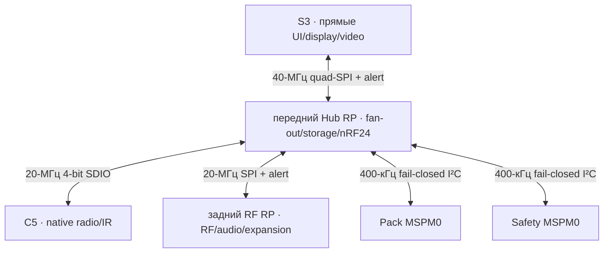

# Архитектура прошивки Leshy2

[На главную](../README.ru.md) · [English](architecture.md) · [Аппаратная часть](https://github.com/anton-vinogradov/esp32-leshy2/blob/main/docs/hardware.ru.md)

## Текущая runtime-граница R2

Machine projection
[`config/h0_r2_hardware_contract.json`](../config/h0_r2_hardware_contract.json)
генерируется из принятого аппаратного source H0-R2 и фиксирует его SHA-256.
Это текущий вход прошивки; контракт R1 ниже сохранён как regression evidence.

| Образ | Физический владелец | Текущая ответственность R2 |
|---|---|---|
| S3 | `ESP32-S3-WROOM-1U-N16R8` | приложение, прямые UI/touch/encoder/USB, прямой i8080-8 TX 32 МГц и независимый camera RX analog FPV |
| C5 | `ESP32-C5-WROOM-1U-N8R8` | native Wi-Fi 2,4/5 ГГц, IEEE 802.15.4 и IR |
| RF RP · задний | `SC1512-A4` | CC1101, VHF/UHF voice, FM/AM/SW/LW/Airband, audio, FPV, M5 и U214/LoRa Cap |
| Hub RP · передний | второй `SC1512-A4` | fan-out S3/C5/заднего RP, microSD и три полных одновременных nRF24 |
| Pack | `MSPM0C1106SDGS20R` | допуск элементов и защищённое выключение |
| Safety | второй `MSPM0C1106SDGS20R` | watchdog, thermal supervision, TX evidence/leases и `FAULT_KILL` |

Связь S3-Hub переносит команды и выбранные данные, но никогда не пиксели
display или кадры analog video. Локальные для Hub microSD и три nRF24 не спорят
с экраном; заднее audio использует bounded full-duplex transport менее 0,4 МБ/с.
Кнопки заканчиваются на локальном для S3 `TCA9539PWR`; A/B энкодера
остаются прямыми входами PCNT. Цель первого видимого отклика — 20 мс под
квалифицированной одновременной нагрузкой.

Display и camera одновременно используют раздельные узлы LCD TX и camera RX.
В H1-R2.25 шлейф экрана физически направлен к антенному торцу, поэтому S3-драйвер
display/touch применяет единый разворот на 180° и к адресации памяти ST77922,
и к touch-координатам.
Точная карта M1 определяет все 80 контактов: 25 сигналов, 14 main-power, 2 AON,
25 возвратов и 14 NC-резервов. M1 выполняет только электрическую функцию и совмещение;
ударную и изгибающую нагрузку несут упоры корпуса, anti-shear datums и захваты PCB.

`BROADCAST_RX` принадлежит заднему RP и взаимоисключается с остальными верхнеуровневыми
группами. Airband AM переносит 118–137 МГц в FMI-диапазон Si4732 6–25 МГц
фиксированным low-side LO 112 МГц. GP35 заднего RP — fail-low `AIR_RX_EN`; GP36 выбирает
direct FM/SW или converted Airband и после reset остаётся в direct FM/SW.
Включены AM voice, сетки 25/8,33 кГц, scan/banks, recording, activity history и
последующий ACARS 2400 decode. Airband TX, VDL2, wideband spectrum capture и
сертифицированные VOR/ILS не заявляются.

Состояние Pack и mailboxes heartbeat/lease/fault Safety используют выделенную
I²C переднего Hub GP43/44. Safety по-прежнему локально владеет watchdog и асинхронным
`FAULT_KILL`: IPC-hop не может создать разрешение или подавить fault. Полная
[контрактная основа F0-R2 проведена ревью](f0-product-contracts-report.ru.md);
[portable behavior F1-R2 также проведено ревью](f1-portable-cores-report.ru.md).
Теперь F2-R2 переводит на R2 шесть target projects и generated BSP boundary.

<strong>Сохранённая архитектура R1 — не текущая физическая топология</strong>

## Исторические runtime-домены R1

| Image | Физический владелец | Локальные задачи | Независимое восстановление |
|---|---|---|---|
| S3 | `ESP32-S3-WROOM-1U-N16R8` | Приложение, меню, display, microSD, audio, BLE/Wi‑Fi | Product USB, UART0, RESET, BOOT |
| C5 | `ESP32-C5-WROOM-1U-N8R8` | Native 2,4/5 ГГц, IEEE 802.15.4, IR | Data-only USB, UART0, RESET, BOOT |
| RP | `SC1512-A4` (RP2354B) | nRF24 ×3, CC1101, выбор SA818S-V/U, Cap Bus | Data-only USB, SWD, RUN, USB_BOOT |
| Pack | `MSPM0C1106SDGS20R` | Допуск двух ячеек и локальный fail-closed power state | NRST, SWD, UART1 и изолированное fixture-питание |
| Safety | второй `MSPM0C1106SDGS20R` | Heartbeat, TX lease, три температурные зоны, физическое TX evidence и сохранённый fault record | NRST, SWD, UART1 и изолированное fixture-питание |

S3 координирует пользовательский сценарий, но не подменяет локальных
владельцев. C5 и RP самостоятельно соблюдают радио-deadline, снимают TX при
пропаже lease и подтверждают фактическое состояние тракта. Pack controller
публикует S3 только ограниченное read-only состояние и fault; S3 не может
приказать ему принять опасную батарейную пару.
Safety controller независим от pack controller, владеет приватной шиной
TX-evidence и единолично обслуживает внешний timeout-watchdog
`TPS3435CAKAGDDFR` на 1,6 с.

## Межпроцессорные сообщения

`L2IP v1` задаёт единый типизированный прикладной контракт для двух быстрых
каналов. 32-байтный заголовок содержит source, target, ID сообщения и ответа,
версию протокола, длину payload, deadline от момента полного приёма и отдельные
CRC-32C заголовка и payload. Повтор state-changing запроса безопасен. Успех —
это типизированный результат с достигнутым локальным состоянием, а не удачная
транзакция шины или постановка команды в очередь.

| Канал | Физический транспорт | Единица передачи | Обязательный результат |
|---|---|---|---|
| S3↔C5 | отдельный 1-bit SDIO на 20 МГц | пакет до 512 байт | ≥1,5 МБ/с payload, control RTT ≤2 мс, занятость ≤70% |
| S3↔RP | отдельный 20-МГц SPI3 + `RP_ALERT_N` | один full-duplex 512-байтный DMA-cell | ≥1,5 МБ/с payload, alert-to-read ≤250 мкс и control RTT ≤2 мс |
| S3↔Pack | target `SYS_I2C` `0x2A` | команда 32 байта, read-only status 64 байта | S3 не управляет допуском ячеек; update-запись только в физическом KILL |
| S3↔Safety | target `SYS_I2C` `0x2B` | команда 32 байта, read-only status 64 байта | записываются только heartbeat сессии, одна ограниченная lease группы и KILL-only update |

Канал C5 использует штатный Espressif FIFO/register/interrupt transport. В
реальном модуле должен быть **ESP32-C5 revision v1.0 или новее**: Espressif
прямо указывает, что SDIO не поддерживается revision v0.1. Четыре выбранные
линии сохраняют GPIO13/14 для native recovery USB. Канал RP использует SPI1
slave DMA RP2354B; когда нужны только исходящие данные RP, S3 тактирует
не имеющий side effect `NOP`.
[SDIO slave Espressif](https://docs.espressif.com/projects/esp-idf/en/latest/esp32c5/api-reference/peripherals/sdio_slave.html) ·
[требование к C5](https://docs.espressif.com/projects/esp-hardware-design-guidelines/en/latest/esp32c5/schematic-checklist.html) ·
[SPI/DMA API RP](https://www.raspberrypi.com/documentation/pico-sdk/hardware.html)

Очереди safety, control, interactive, telemetry и bulk имеют убывающий
приоритет. Bulk идёт по credit и не занимает safety/control buffers; устаревшие
данные водопада можно отбросить с явным пропуском sequence. Reset канала,
повреждённый frame, несовместимая schema или истёкший deadline снимают локальную
TX lease. Поэтому C5 и RP выключают передачу сами, даже если S3 уже не может
послать stop.

S3 публикует safety heartbeat каждые 50 мс; разрыв 200 мс становится fault.
TX lease живёт не более 100 мс и обновляется не реже чем каждые 40 мс. Цикл
safety занимает до 5 мс, а неожиданное физическое evidence становится fault не
позднее 10 мс. Независимый watchdog на 1,6 с обслуживается только исправным
safety-циклом. Точные layout, ID сообщений, поля mailbox, update-команды и
набор проверок находятся в машинном контракте
[`config/interdomain_protocol.json`](../config/interdomain_protocol.json).
Сквозная граница контроллеров, транспортов, контактов, сигнальных групп,
safety timing и LoRa-профилей зафиксирована в
[`config/hardware_integration_contract.json`](../config/hardware_integration_contract.json).

## Планировщик и тихие состояния

В один момент активна одна верхнеуровневая сигнальная группа. Исключение — сама
группа nRF24, где три радио одновременно работают в любом обязательном
RX/TX-сочетании. Вещательный приём явно представлен receive-only группой
`BROADCAST_RX`: отсутствие TX-evidence не позволяет прятать её в состоянии
`NONE`. `NONE` означает, что все сигнальные интерфейсы находятся в quiet-state.
Переключение группы выполняется транзакцией:

1. запретить новые операции и завершить ограниченный текущий transfer;
2. снять TX и дождаться отсутствия actual-TX evidence;
3. отключить интерфейс, питание и выходные драйверы старой группы;
4. проверить разряд и quiet-state;
5. включить новую группу, проверить identity и только затем выдать lease.

Display i8080 DMA, microSD session и межпроцессорные каналы имеют ограниченные
кванты. Они не удерживают CPU или bus на время, способное сорвать radio-deadline.

## Интерфейс пользователя

- Основная модель — меню, status bar и рабочая область инструмента.
- Водопад рисуется добавлением одной новой строки/колонки и сдвигом видимой
  области; меню и индикаторы обновляют только dirty rectangles.
- Первый локальный отклик отображается не позднее 100 мс даже во время radio,
  audio или storage activity.
- Энкодер обрабатывается аппаратным PCNT; кнопочная матрица — по interrupt,
  без постоянного polling.
- `PTT` — отдельный удерживаемый запрос voice TX. Фиксируемый `RUN/KILL`
  асинхронен и всегда имеет приоритет. Только физический фронт `KILL`→`RUN`
  может снять допускающую восстановление аварию; прошивка не может его
  повторить или синтезировать.

## Радио и IR

Каждый radio service предоставляет scan/receive, ограниченную передачу,
identity, конфигурацию профиля, actual-TX evidence, fault и quiet-state.
Региональный профиль определяет доступные диапазоны и консервативную мощность;
максимум никогда не становится default.

Три nRF24 имеют независимые очереди, SPI resources, IRQ и evidence. Общий
group scheduler синхронизирует их, не превращая mixed mode в последовательную
имитацию. IR service параллельно принимает демодулированный 38-кГц stream и
измеряет carrier 30–60 кГц; передача требует аппаратного `RUN_PERMIT` и
оптического подтверждения.

## Storage, audio и расширения

- microSD включается на время session. Clean eject сначала завершает запись и
  unmount; неожиданное извлечение отмечает оборванный хвост как неполный.
- Audio graph явно выбирает microphone или radio RX для capture и speaker либо
  CTIA-гарнитуру для playback. Внутренний контакт tip разъёма
  `SJ-43504-SMT-TR` приходит на detect-only `slow_io.P02`: высокий уровень
  означает отсутствие штекера, а низкий или нечитаемое состояние немедленно
  отключает динамик. Прошивка никогда не переводит эту линию в выход.
- Выделенный P0 `TCA9534APWR` на свободном I²C-адресе `0x39` выбирает низким
  уровнем гарнитурный микрофон, высоким — встроенный. В input/reset состоянии
  физическая подтяжка выбирает встроенный микрофон. После стабильной вставки
  по умолчанию используется гарнитурный микрофон; для обычных TRS-наушников
  пользователь может сохранить встроенный. При извлечении сначала
  восстанавливается reset-default и лишь затем разрешается динамик. P1–P7
  остаются подтянутыми interrupt-capable локальными резервами, а не висящими
  входами.
- Выделенный `TCA9534A` по адресу `0x3A` выбирает VHF или UHF. Аппаратный
  one-hot PD и три `TMUX1136` удерживают UART, PTT/AUDIO_ON и AFOUT/MIC_IN на
  одном выбранном SA818S. PTT не выводится из audio samples или выбора
  микрофона; `SA818S-CE` может заменить только UHF после квалификации, и тогда
  firmware запрещает 470–480 МГц.
- Cap Bus и M5 Unit имеют независимые состояния `OFF → STARTING → IDENTIFY →
  ACTIVE → STOPPING` и latch-off fault. Неизвестный module profile не получает
  питание или опасные команды автоматически.
- Встроенные TX-тракты S3, C5, nRF24, CC1101, voice и IR имеют физическое
  evidence. Штатный U214 остаётся только RX/GNSS: контакт 5 у него — `5V_OUT`,
  а не доказательство RF. Точные подписанные профили
  `LESHY2-LORA-CAP-01-EU868` и `LESHY2-LORA-CAP-01-US915` используют
  `NiceRF LoRa1262-868/915`, якорь идентичности `24AA02UIDT-I/OT` и тот же
  контакт как open-drain `EXT_TX_EVIDENCE_N`. Их TX lease появляется только
  после квалификации регионального диапазона, привязки UID, конечного внешнего
  RF-тракта и 10–18-мс импульса бита 8. Идентичность не заменяет разрешение или
  live evidence. Для TX через универсальный M5 Unit по-прежнему нужен
  собственный профиль physical evidence.
- Телефон используется только как локальный text input и обмен данными; он не
  подтверждает Controlled-Zone действия.

## Безопасность и обновление

Доступ к потенциально опасной функции требует подходящего уровня UI,
разрешённого target/profile, preview, отдельного arm и ограниченной по времени
lease. Evidence подтверждает исполнение, но никогда не создаёт разрешение.

### Автономная защита и экран аварии

- Обещаний времени работы от батарей или uptime в часах нет. Для длительной
  работы используется квалифицированный USB-PD; 24 и 48 часов — длительности
  проверки F10, а не обещание автономности.
- `Настройки → Безопасность → Полная самопроверка` выбирает проверку каждые 24
  часа, каждые 48 часов по умолчанию или только при запуске с предупреждением;
  отдельно доступна команда «Проверить сейчас».
- Настройку можно подготовить только с локального физического UI, и она
  вступает в силу лишь после следующей физической проверки `KILL`→`RUN`. Она
  не меняет watchdog, thermal, power-fault или TX-lease enforcement.
- Монотонный deadline активной сессии принадлежит safety MSPM0. При просрочке
  он снимает leases, запрашивает quiet-state, сохраняет
  `FAULT_PLANE_PROOF_DUE`, выставляет fault request и требует физического
  восстановления `KILL`→`RUN`.
- S3 публикует ограниченный heartbeat и одну короткую lease с именем активной
  сигнальной группы. Safety controller независимо сопоставляет её с
  `ANY_TX_AON_N` и девятью используемыми битами 16-битного регистра
  `TCA9535PWR` на приватном адресе `0x20`.
- Safety controller обслуживает deadline TPS3435 только пока исправны его
  собственный цикл, heartbeat S3, активная lease, power-fault input и три NTC.
  Timeout TPS3435 или любая авария controller асинхронно защёлкивают
  `FAULT_KILL`.
- Сохранённая запись содержит первичный источник, зону или сигнальную группу,
  измеренное значение, предел, evidence mask, состояние rails и монотонный ID
  события.
- После аварии C5 и RP остаются в reset. S3 может войти в подписанный read-only
  fault viewer, только пока безопасны температурная зона UI/display и main
  rail. Экран сообщает причину, что уже отключено, и требует перевести `RUN` в
  `KILL` перед попыткой перезапуска.
- Перегрев UI/display или опасное питание экрана выключают дисплей. Остаются
  AON-светодиод `FAULT` и сохранённая запись; автоматический restart запрещён.

Пользователь устанавливает один bundle, а не пять несвязанных файлов. Его
подписанный manifest привязывает каждый образ к продукту, диапазону аппаратных
ревизий, физическому target, build ID и совместимому диапазону междоменных
протоколов. Updater принимает release root или локально добавленный owner root.

Установка требует физического `RUN=KILL`, отсутствия TX evidence и стабильного
допущенного питания. До активации любого target все inactive images записываются
и проверяются чтением. Затем Pack, Safety, C5 и RP выполняют локальный pending
boot и self-test под управлением старого S3; S3 активируется последним. Ошибка
target возвращает его local last-known-good image, а неудача bundle возвращает
уже обновлённые домены к совместимому предыдущему комплекту.

Механизм намеренно остаётся открытым. Необратимые secure-boot, anti-rollback и
debug lock по умолчанию не включаются. Подпись отвергает подмену штатного update
package, но не отнимает у владельца физическое восстановление. Через
USB/UART/SWD можно заменить все образы и ключи, но нельзя обойти `RUN/KILL`,
независимый watchdog или `FAULT_KILL`.

Точные контракты flash, RAM, slot, update и recovery для всех пяти образов
приведены в [контракте памяти](memory.ru.md).

