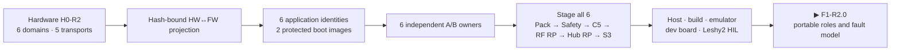

# F0-R2 result — six-domain product contracts

[Home](../README.md) · [Roadmap](roadmap.md) · [Русский](f0-product-contracts-report.ru.md)

F0-R2 is **reviewed**. Firmware now has one hash-bound projection of the current
hardware architecture and machine-readable contracts for six target identities,
six independent rollback domains, one S3-last bundle transaction and five
non-substitutable execution-evidence layers.

## Reviewed result

| Boundary | Result |
|---|---|
| Hardware projection | 6 domains and 5 Hub-centered transports are bound to hardware source SHA-256 `e3ac657d…eb77e` |
| Target identity | 6 unique application projects/images; Pack and Safety also have independent boot images |
| Memory and rollback | 6 local dual-slot owners; identical RP/MSPM0 geometry never shares target identity, state or flash |
| Update | all inactive images stage first; pending/commit order is Pack → Safety → C5 → RF RP → Hub RP → S3; S3 journals power loss and commits itself last |
| Breaking IPC | rejected unless a separately signed bridge bundle proves old↔new transition compatibility |
| Execution evidence | 5 distinct layers; exact official emulator only for S3; exact module/MCU dev-board paths for S3/C5/Pack/Safety; Pico 2 is a stated surrogate for both RP2354B targets |

The machine closure is
[`f0_r2_review.json`](../config/f0_r2_review.json), executed by
[`review_f0_r2.py`](../tools/review_f0_r2.py).

## What this does not claim

- No R2 target project has been created or built.
- No C5, RP2354B or MSPM0 target has booted R2 firmware.
- No physical IPC, peripheral, flash rollback or Leshy2 HIL transition has run.
- The RP2350 16.7-second TBYB transaction budget is not measured.
- The production C1106 signature verifier has not yet passed size or fault injection.

These are downstream gates, not missing F0 requirements.

Execution summary: **0 R2 builds/dev-board/HIL runs**; the report closes
contracts only.

## Next phase

The exact current marker is `F1-R2.0`. F1 reuses the portable R1 core, adds Hub
and Airband roles plus the six-domain heartbeat/lease/update fault model, and
reruns deterministic normal and ASan/UBSan scenarios before F2 creates target
projects.
