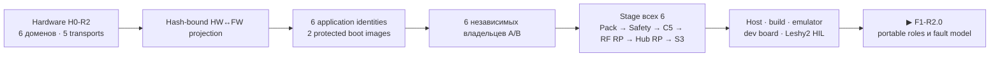

# Итог F0-R2 — контракты продукта из шести доменов

[На главную](../README.ru.md) · [Роадмап](roadmap.ru.md) · [English](f0-product-contracts-report.md)

F0-R2 **проведена ревью**. У firmware теперь есть единая hash-bound проекция
актуальной hardware-архитектуры и machine-readable контракты шести target
identities, шести независимых rollback-доменов, одной S3-last bundle
transaction и пяти незаменяемых друг другом слоёв execution evidence.

## Результат ревью

| Граница | Результат |
|---|---|
| Hardware projection | 6 доменов и 5 Hub-centered transports связаны с hardware source SHA-256 `e3ac657d…eb77e` |
| Target identity | 6 уникальных application projects/images; Pack и Safety также имеют независимые boot images |
| Memory и rollback | 6 локальных dual-slot владельцев; одинаковая геометрия RP/MSPM0 никогда не означает общий target identity, state или flash |
| Update | сначала staging всех inactive images; порядок pending/commit: Pack → Safety → C5 → RF RP → Hub RP → S3; S3 журналирует power loss и подтверждает себя последней |
| Breaking IPC | отвергается, пока отдельно подписанный bridge bundle не докажет переходную совместимость old↔new |
| Execution evidence | 5 отдельных слоёв; точный официальный emulator только у S3; точные module/MCU dev-board paths у S3/C5/Pack/Safety; Pico 2 явно отмечен surrogate обоих RP2354B |

Machine closure находится в
[`f0_r2_review.json`](../config/f0_r2_review.json), исполняет её
[`review_f0_r2.py`](../tools/review_f0_r2.py).

## Чего этот результат не заявляет

- Ни один target project R2 ещё не создан и не собран.
- Ни C5, ни RP2354B, ни MSPM0 ещё не загрузили firmware R2.
- Не выполнено ни одного физического IPC, peripheral, flash rollback или Leshy2 HIL transition.
- Budget transaction в 16,7-секундном окне TBYB RP2350 ещё не измерен.
- Production verifier подписи C1106 ещё не прошёл size gate и fault injection.

Это downstream gates, а не пропущенные требования F0.

Сводка execution: **0 R2 builds/dev-board/HIL runs**; отчёт закрывает только
контракты.

## Следующая фаза

Точный текущий маркер — `F1-R2.0`. F1 переиспользует portable core R1,
добавляет роли Hub/Airband и six-domain fault model heartbeat/lease/update,
затем повторяет deterministic normal и ASan/UBSan scenarios до создания target
projects в F2.
