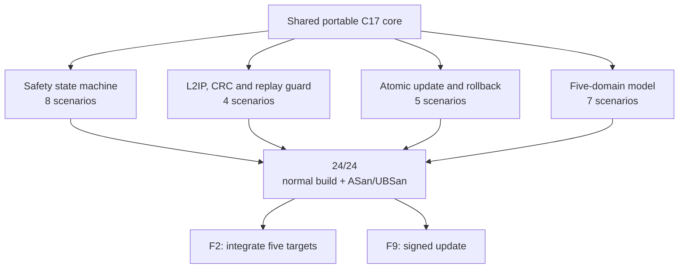

# F1 result · Portable cores

[Русский](f1-portable-cores-report.ru.md) · [Home](../README.md) ·
[Roadmap](roadmap.md)

**Status:** ✅ reviewed. Leshy2's shared portable logic is implemented in strict
C17 and passes `24 of 24` deterministic host scenarios in both the normal build
and AddressSanitizer/UndefinedBehaviorSanitizer builds.

## Product result

| Block | Verified result | Scenarios |
|---|---|---:|
| Safety | heartbeat, lease, priorities and fail-safe transition | 8 |
| L2IP | framing, CRC and duplicate/replay rejection | 4 |
| Update | preparation, atomic activation and rollback | 5 |
| Five-domain model | S3, C5, RP, Pack and Safety in nominal and fault paths | 7 |
| **Total** | **one shared implementation with no target-specific GPIO** | **24** |

Regression tests retain the previously found heartbeat-loss, lease-boundary,
late-update and invalid-enum cases. F2 target projects consume these portable
cores, while the update/rollback model becomes an input to F9.

## Evidence

- Implementation: [`common/src`](../common/src) and public contracts in
  [`common/include/leshy2`](../common/include/leshy2).
- Scenarios: [`host/tests`](../host/tests).
- Normal run: `make host-test`.
- Repeatable sanitizer run: `make host-sanitize`.
- Pre-order verification contract:
  [`config/preorder_verification_contract.json`](../config/preorder_verification_contract.json).
- The original review ran on 22 August 2026; normal and sanitizer runs were
  reconfirmed on 25 August 2026.

## Evidence boundary

F1 proves portable product logic on a host machine. It does **not** prove target
image boot, instruction-set/peripheral emulation, real GPIO, radio paths, the
display or an assembled board. F2–F10 and hardware H4–H8 close those layers, so
F2 remains the current firmware phase.
