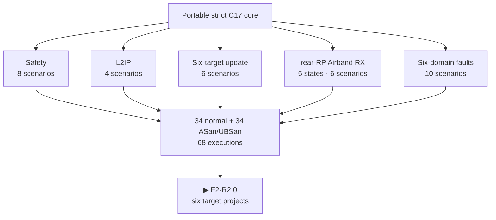

# F1-R2 result · Six-domain portable cores

[Русский](f1-portable-cores-report.ru.md) · [Home](../README.md) ·
[Roadmap](roadmap.md)

F1-R2 is **reviewed**. The target-neutral strict-C17 core now distinguishes all
six hardware domains, models the S3-last six-image transaction, owns a
receive-only rear-RP Airband state machine and fails closed across Hub, Pack and
Safety loss. All `34` F1 scenarios pass both normal and ASan/UBSan host runs:
`68` scenario executions in total.

## Product result

| Block | Reviewed behavior | Scenarios per run |
|---|---|---:|
| Safety | advancing heartbeat, bounded TX lease/evidence, thermal/power faults and watchdog service | 8 |
| L2IP | framing, CRC and duplicate/replay rejection retained from R1 | 4 |
| Update | independent Pack/Safety/C5/RF-RP/Hub-RP/S3 state and exact S3-last activation/rollback | 6 |
| Receiver | disabled, direct FM/SW, Airband settling, Airband active and latched fault; no Airband TX API | 6 |
| Integrated system | scheduler plus Hub/Pack/Safety loss, receiver shutdown, downstream isolation and retained first fault | 10 |
| **Total** | **one target-neutral implementation; normal and ASan/UBSan clean** | **34** |

Airband maps 118–137 MHz to 6–25 MHz using the reviewed fixed 112-MHz LO. It
cannot enter active state until both LO-lock and RF-path-settle evidence are
present. Loss of either proof or the Hub link latches disabled outputs and needs
an explicit clear. There is no Airband transmit state or function.

The update model stages six independent images and orders Pack → Safety → C5 →
RF RP → Hub RP → S3. RF RP and Hub RP share neither identity nor state. The
portable upper bound follows the unqualified 16,700-ms RP TBYB window; actual
boot/commit timing remains a downstream measurement.

## Evidence

- Machine closure: [`f1_r2_review.json`](../config/f1_r2_review.json), executed
  by [`review_f1_r2.py`](../tools/review_f1_r2.py).
- Implementation: [`common/src`](../common/src) and public interfaces in
  [`common/include/leshy2`](../common/include/leshy2).
- Scenarios: [`host/tests`](../host/tests).
- Repeatable commands: `make host-test`, `make host-sanitize`, `make test`.

## Evidence boundary

This result does **not** claim an R2 target project or build, target instruction
or peripheral execution, real transport timing, Airband reception, a physical
watchdog/`FAULT_KILL`, flash rollback or Leshy2 HIL. F2-R2 creates and builds
the six target projects; F3-R2 and H7/F10 close emulator, dev-board and physical
evidence.

The exact next marker is `F2-R2.0`.
