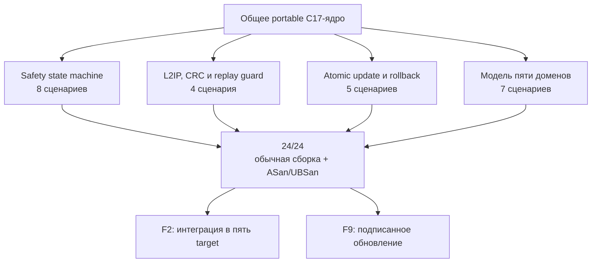

# Итог F1 · Portable cores

[English](f1-portable-cores-report.md) · [На главную](../README.ru.md) ·
[Роадмап](roadmap.ru.md)

**Статус:** ✅ проведено ревью. Общая переносимая логика Leshy2 реализована на
строгом C17 и прошла `24 из 24` детерминированных host-сценария как в обычной
сборке, так и под AddressSanitizer/UndefinedBehaviorSanitizer.

## Что получил продукт

| Блок | Проверенный результат | Сценарии |
|---|---|---:|
| Safety | heartbeat, lease, приоритеты и переход в безопасное состояние | 8 |
| L2IP | framing, CRC, duplicate/replay rejection | 4 |
| Update | подготовка, атомарная активация и rollback | 5 |
| Five-domain model | S3, C5, RP, Pack и Safety при штатной работе и отказах | 7 |
| **Итого** | **одна общая реализация без target-specific GPIO** | **24** |

Регрессионные тесты сохраняют найденные ранее случаи heartbeat loss, границы
lease, запоздалого update и недопустимого enum. Переносимые ядра подключаются к
target-проектам F2, а update/rollback-модель становится входом F9.

## Evidence

- Реализация: [`common/src`](../common/src) и публичные контракты
  [`common/include/leshy2`](../common/include/leshy2).
- Сценарии: [`host/tests`](../host/tests).
- Обычный прогон: `make host-test`.
- Повторяемый sanitizer-прогон: `make host-sanitize`.
- Контракт предзаказной проверки:
  [`config/preorder_verification_contract.json`](../config/preorder_verification_contract.json).
- Исходное ревью выполнено 22 августа 2026 года; обычный и sanitizer-прогоны
  повторно подтверждены 25 августа 2026 года.

## Граница доказанного

F1 доказывает переносимую бизнес-логику на host-машине. Она **не** доказывает
загрузку target-образов, instruction-set/peripheral emulation, реальные GPIO,
радиотракты, дисплей или собранную плату. Эти уровни закрываются F2–F10 и
аппаратными H4–H8; сборки F2 теперь прошли ревью, текущая firmware-фаза — F3.
