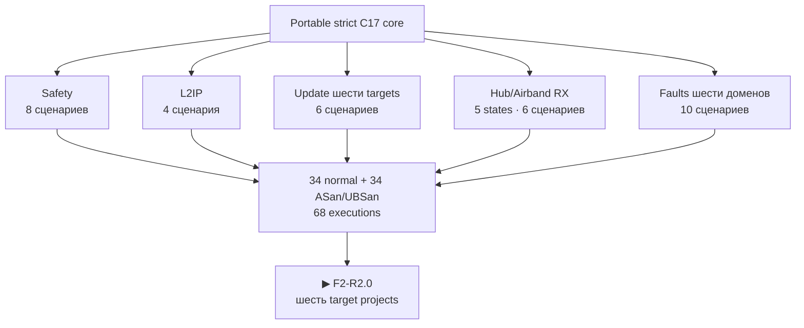

# Итог F1-R2 · Portable cores шести доменов

[English](f1-portable-cores-report.md) · [На главную](../README.ru.md) ·
[Роадмап](roadmap.ru.md)

F1-R2 **проведена ревью**. Target-neutral strict-C17 core теперь различает все
шесть аппаратных доменов, моделирует S3-last transaction шести images, содержит
receive-only state machine Hub/Airband и fail-closed обрабатывает loss Hub, Pack
и Safety. Все `34` сценария F1 проходят обычный и ASan/UBSan host runs: всего
`68` executions сценариев.

## Что получил продукт

| Блок | Поведение, проведённое ревью | Сценариев за run |
|---|---|---:|
| Safety | advancing heartbeat, bounded TX lease/evidence, thermal/power faults и watchdog service | 8 |
| L2IP | framing, CRC и duplicate/replay rejection, сохранённые из R1 | 4 |
| Update | независимые state Pack/Safety/C5/RF-RP/Hub-RP/S3 и точные S3-last activation/rollback | 6 |
| Receiver | disabled, direct FM/SW, Airband settling, Airband active и latched fault; Airband TX API отсутствует | 6 |
| Integrated system | scheduler, loss Hub/Pack/Safety, выключение receiver, downstream isolation и retained first fault | 10 |
| **Итого** | **одна target-neutral реализация; normal и ASan/UBSan чисты** | **34** |

Airband переносит 118–137 МГц в 6–25 МГц принятым фиксированным LO 112 МГц.
Переход в active невозможен без evidence LO-lock и RF-path-settle. Потеря любого
proof или связи Hub фиксирует отключённые outputs и требует явного clear.
Airband transmit state или function нет.

Update model выполняет staging шести независимых images и порядок Pack → Safety
→ C5 → RF RP → Hub RP → S3. RF RP и Hub RP не имеют общего identity или state.
Portable upper bound следует ещё не квалифицированному окну RP TBYB 16 700 мс;
реальный timing boot/commit остаётся последующим измерением.

## Evidence

- Machine closure: [`f1_r2_review.json`](../config/f1_r2_review.json), исполняет
  [`review_f1_r2.py`](../tools/review_f1_r2.py).
- Реализация: [`common/src`](../common/src) и публичные interfaces в
  [`common/include/leshy2`](../common/include/leshy2).
- Сценарии: [`host/tests`](../host/tests).
- Повторяемые команды: `make host-test`, `make host-sanitize`, `make test`.

## Граница доказанного

Результат **не заявляет** R2 target project или build, target instruction или
peripheral execution, реальный timing transport, приём Airband, физические
watchdog/`FAULT_KILL`, flash rollback или Leshy2 HIL. F2-R2 создаёт и собирает
шесть target projects; F3-R2 и H7/F10 закрывают emulator, dev-board и physical
evidence.

Точный следующий маркер — `F2-R2.0`.
