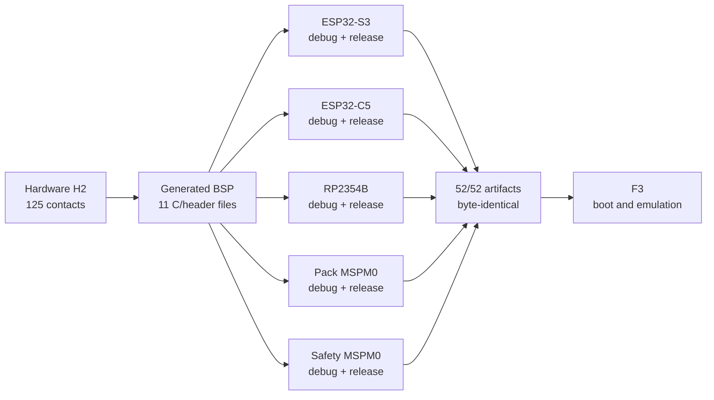

# F2 result · Five reproducible target builds

[Русский](f2-target-build-system-report.ru.md) · [Home](../README.md) ·
[Roadmap](roadmap.md)

**Status:** ✅ reviewed. The accepted hardware H2 contract now generates the BSP
for five production-SDK projects. Debug and release builds produce `52` checked
artifact instances, pass `10` image-size gates and reproduce byte-for-byte in
two complete clean passes.

## Product result

| Image | Production SDK | Debug application | Release application | Result |
|---|---|---:|---:|---|
| S3 | ESP-IDF `v6.0.2` | 180,160 B | 138,416 B | build and size gate pass |
| C5 | ESP-IDF `v6.0.2` | 172,224 B | 125,616 B | build and size gate pass; debug boot margin 2,240 B |
| RP2354B | Pico SDK `2.3.0` | 18,468 B | 10,656 B | `.elf`, `.bin`, `.uf2` and map pass |
| Pack | TI MSPM0 SDK `2.11.00.07` | 3,168 B | 3,168 B | application plus 256-B boot manager pass |
| Safety | TI MSPM0 SDK `2.11.00.07` | 3,296 B | 3,296 B | application plus 256-B boot manager pass |

The build environment is pinned by exact SDK revisions, archive hashes,
compiler versions and a hash-locked Python 3.12 environment. Configure and
build are offline and dispatched by one shell-free target matrix.

## Closing review

| Check | Evidence | Result |
|---|---:|---|
| Canonical target configurations | 5 targets × debug/release | 10/10 pass |
| Declared build outputs | two clean passes | 52/52 byte-identical |
| Link maps | ESP-IDF, Pico and TI | 14 present per pass |
| Image limits | application/boot partitions | 10/10 pass |
| Path privacy in distributable images | `.bin` and `.uf2` | 24 scanned, 0 workspace-path leaks |
| Portable regressions | normal + ASan/UBSan | 24/24 scenarios pass |

## Findings closed during F2

| Finding | Correction |
|---|---|
| TI linker inserted the wall-clock link time into eight map files | map reports normalize that field to the Git-derived `SOURCE_DATE_EPOCH` |
| Pico SDK debug assertions embedded the developer's absolute workspace path | repository-wide compiler prefix maps now apply to project and SDK sources |
| ESP-IDF reproducibility was implicit rather than a checked target default | `CONFIG_APP_REPRODUCIBLE_BUILD=y` is required for S3 and C5 |

These corrections improve artifact determinism without removing debug
information or weakening image, map or size checks.

## Evidence

- Two-pass manifest: [`config/f2_5_reproducibility_review.json`](../config/f2_5_reproducibility_review.json).
- Integrated build review: [`config/f2_4_build_review.json`](../config/f2_4_build_review.json).
- Environment preflight: [`config/f2_4_preflight_review.json`](../config/f2_4_preflight_review.json).
- Reproduction command: `make f2-5-reproducibility-review` checks committed
  evidence; `tools/review_f2_5_reproducibility.py --run` recreates it using the
  locked Python environment.

## Evidence boundary

F2 proves configuration, compilation, linking, artifact identity and static
size limits. It does **not** prove that an image boots, that a peripheral works,
or that a real board is electrically correct. F3 now owns instruction/runtime
execution and the emulator/dev-board evidence matrix; hardware H4 remains
blocked until that prerequisite closes.
