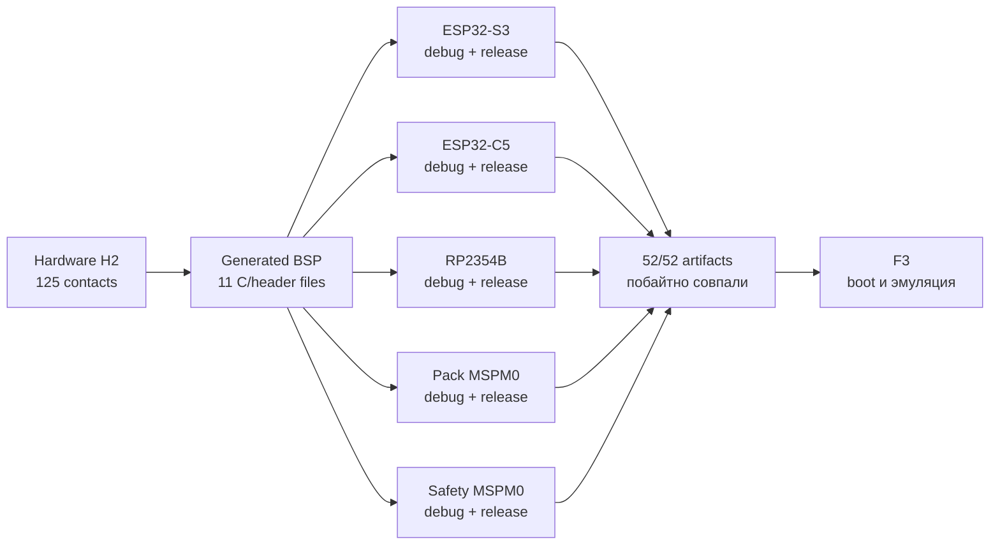

# Итог F2 · Пять воспроизводимых target-сборок

[English](f2-target-build-system-report.md) · [На главную](../README.ru.md) ·
[Роадмап](roadmap.ru.md)

**Статус:** ✅ проведено ревью. Принятый hardware-контракт H2 теперь генерирует
BSP для пяти проектов на production SDK. Debug и release сборки создают `52`
проверяемых экземпляра artifacts, проходят `10` image-size gates и совпадают
байт-в-байт в двух полных чистых проходах.

## Что получил продукт

| Образ | Production SDK | Debug application | Release application | Результат |
|---|---|---:|---:|---|
| S3 | ESP-IDF `v6.0.2` | 180 160 Б | 138 416 Б | build и size gate прошли |
| C5 | ESP-IDF `v6.0.2` | 172 224 Б | 125 616 Б | build и size gate прошли; запас debug boot — 2 240 Б |
| RP2354B | Pico SDK `2.3.0` | 18 468 Б | 10 656 Б | `.elf`, `.bin`, `.uf2` и map прошли |
| Pack | TI MSPM0 SDK `2.11.00.07` | 3 168 Б | 3 168 Б | application и boot manager 256 Б прошли |
| Safety | TI MSPM0 SDK `2.11.00.07` | 3 296 Б | 3 296 Б | application и boot manager 256 Б прошли |

Среда сборки закреплена точными SDK revisions, hash архивов, версиями
компиляторов и Python 3.12 environment с hash-lock. Configure и build работают
offline через одну shell-free target matrix.

## Закрывающее ревью

| Проверка | Evidence | Результат |
|---|---:|---|
| Канонические target configurations | 5 targets × debug/release | 10/10 прошли |
| Заявленные build outputs | два чистых прохода | 52/52 побайтно совпали |
| Link maps | ESP-IDF, Pico и TI | 14 на каждый проход |
| Лимиты образов | application/boot partitions | 10/10 прошли |
| Приватность путей в распространяемых образах | `.bin` и `.uf2` | проверено 24, утечек workspace path — 0 |
| Portable regressions | обычный прогон + ASan/UBSan | 24/24 сценария прошли |

## Несоответствия, закрытые в F2

| Несоответствие | Исправление |
|---|---|
| TI linker записывал текущее время линковки в восемь map-файлов | это поле map-отчёта нормализуется в Git-derived `SOURCE_DATE_EPOCH` |
| Debug assertions Pico SDK содержали абсолютный путь разработчика | repository-wide compiler prefix maps теперь применяются к project и SDK sources |
| Воспроизводимый режим ESP-IDF был неявным, а не проверяемым default | для S3 и C5 обязателен `CONFIG_APP_REPRODUCIBLE_BUILD=y` |

Исправления повышают детерминированность artifacts, не удаляя debug information
и не ослабляя проверки images, maps или размеров.

## Evidence

- Манифест двух проходов: [`config/f2_5_reproducibility_review.json`](../config/f2_5_reproducibility_review.json).
- Сводное build review: [`config/f2_4_build_review.json`](../config/f2_4_build_review.json).
- Environment preflight: [`config/f2_4_preflight_review.json`](../config/f2_4_preflight_review.json).
- Команда `make f2-5-reproducibility-review` проверяет сохранённый evidence;
  `tools/review_f2_5_reproducibility.py --run` пересоздаёт его в locked Python
  environment.

## Граница доказанного

F2 доказывает configuration, compilation, linking, идентичность artifacts и
статические size limits. Она **не** доказывает загрузку образов, работу
периферии или электрическую корректность реальной платы. Instruction/runtime
execution и emulator/dev-board evidence matrix теперь принадлежат F3;
аппаратная H4 остаётся заблокирована до закрытия этого пререквизита.
