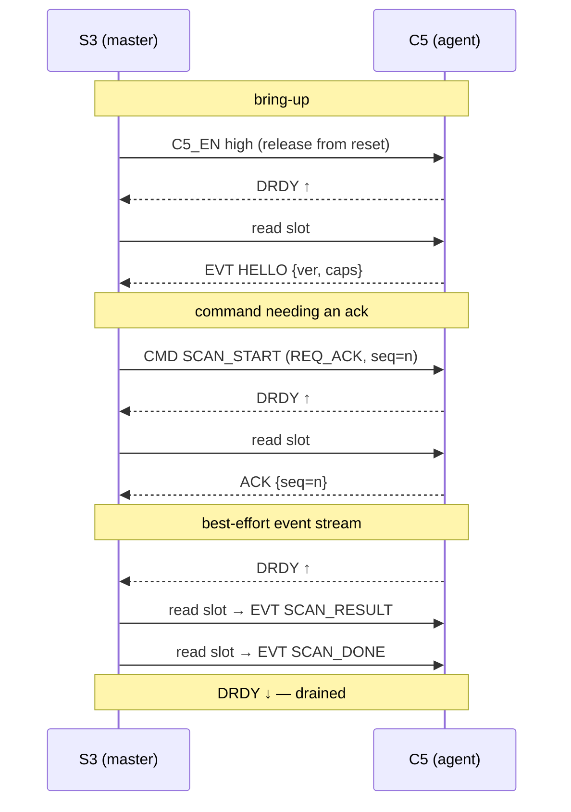
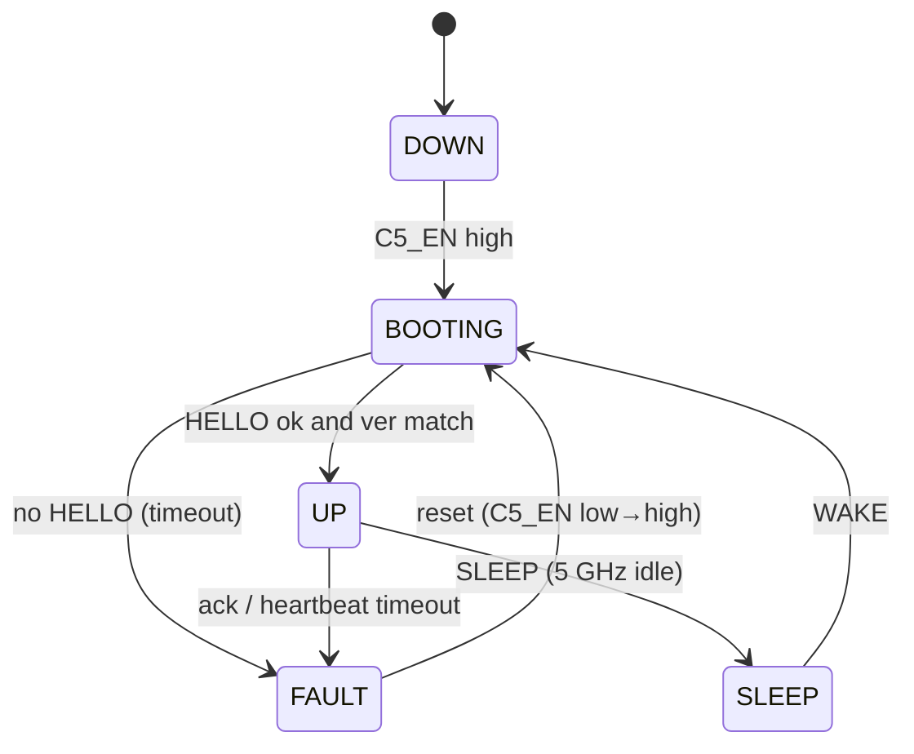
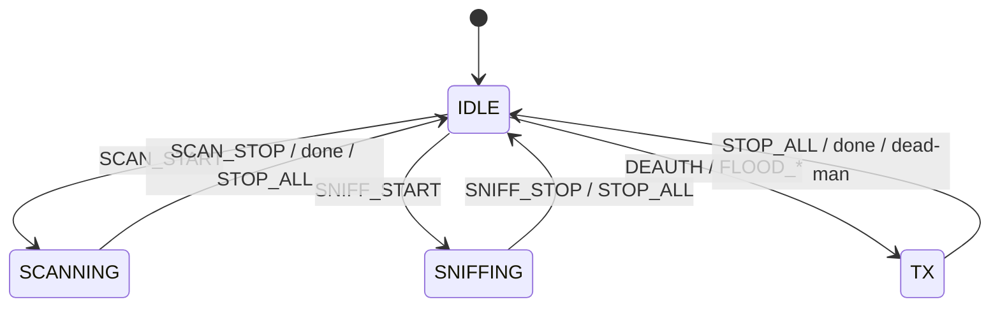

# S3↔C5 Link Protocol (v1)

*Read this in: **English** · [Русский](link-protocol.ru.md)*

The deep-dive for the [System architecture](../README.md#5-system-architecture) decision. The **ESP32-S3** is the brain and bus master; the **ESP32-C5** is the co-processor — on its own board it drives 5 GHz Wi-Fi (+ 802.15.4) **and** the 3× nRF24L01+ (2.4 GHz raw) **and** IR — an agent that can only be clocked by the S3. This document is the narrow, versioned contract between them: how a byte on the wire becomes a command or an event, and how the link stays correct when frames are lost.

The wiring (pins, power gating) is owned by the hardware repo — see the [c5-buses sheet](https://github.com/anton-vinogradov/esp32-leshy2/tree/main/hardware/c5-buses). This doc references it, it does not redefine it.

---

## 1. Physical layer

A **dedicated SPI3 bus** carries the link — separate from the shared SPI2 that drives the display, SD, and wired radios. The S3 is master, the C5 is slave in **SPI Slave HD (half-duplex) mode with DMA**.

| Line | Dir | Role |
|------|-----|------|
| `SCLK` | S3 → C5 | clock (master-driven; the C5 never clocks) |
| `MOSI` | S3 → C5 | downstream data (commands) |
| `MISO` | C5 → S3 | upstream data (events) |
| `CS` | S3 → C5 | chip select |
| `DRDY` | C5 → S3 | **data-ready / attention** — a plain GPIO interrupt, not clocked |
| `C5_EN` | S3 → C5 | power / reset gate (slow line, via PCA9555 #2) |

- **Clock:** SPI mode 0, MSB-first. 20 MHz nominal (10 MHz on first bring-up, up to 40 MHz once proven — [§9](#9-timing-constants-v1-defaults)).
- **DRDY** is the C5's only way to ask for attention. A slave cannot clock the bus, so **every transfer is master-initiated**; DRDY lets the C5 say "I have an event queued — come read it."
- **`C5_EN`** lives on the I²C expander, not on a fast GPIO. It is a one-shot power/reset control, not a per-transfer signal, so its latency does not matter.
- **Flashing / OTA.** The C5 flashes standalone over **its own USB-C** on the bench. In the field, **OTA rides the SPI3 link itself** — the S3 pushes the C5 image over the link (`OTA_BEGIN` / `OTA_DATA` / `OTA_END`), the C5 self-flashes and reboots. There is no S3→C5 UART flashing bridge.
- **Dedicated bus = fault isolation.** A wedged C5 that holds MISO low can only break the link, never the main SPI2 bus that the UI and wired radios depend on. This is a deliberate robustness choice (a shared bus would let one stuck slave stall everything).

---

## 2. Transport and slots

The link moves **fixed-size 64-byte slots**. One logical frame occupies one slot; a frame larger than a slot is split across slots with the `MORE` flag. Fixed slots keep the DMA simple and the latency bounded (important for `STOP_ALL`). All multi-byte fields are **little-endian** (both chips are LE).

**SPI Slave HD mapping** (the transport binding — the codec above it stays hardware-free, see [§10](#10-testability)):

- **Downstream (S3 → C5, a command):** the master writes one slot into the C5's receive DMA buffer. The C5 driver gets a "buffer received" callback and parses the frame.
- **Upstream (C5 → S3, an event):** the C5 loads one slot into its send DMA buffer and raises **DRDY**. The S3's DRDY interrupt wakes the link task, which reads one slot.
- **Slave registers:** a few SPI-HD shared registers expose cheap status without a full transfer — protocol version, upstream-queue depth, and a dropped-events counter. The S3 can poll these to learn how many slots are waiting and whether the C5 overflowed.

---

## 3. Frame format

Every frame is an **8-byte header + payload + 2-byte CRC**, padded to the 64-byte slot.

| Offset | Field | Size | Notes |
|-------:|-------|:----:|-------|
| 0 | `sync` | 1 | `0xA5` — frame start / resync anchor |
| 1 | `ver` | 1 | protocol version (`0x01`) |
| 2 | `type` | 1 | `CMD` / `EVT` / `ACK` / `NAK` (below) |
| 3 | `opcode` | 1 | operation ([§4](#4-opcodes-v1)) |
| 4 | `seq` | 1 | per-direction sequence, wraps at 256 |
| 5 | `flags` | 1 | bitfield (below) |
| 6 | `len` | 2 | payload length, 0…54 (LE) |
| 8 | `payload` | `len` | opcode-specific |
| 8+`len` | `crc` | 2 | CRC-16/CCITT-FALSE over bytes `0 … 8+len-1` |

**`type`** — `0x01 CMD` (S3→C5), `0x02 EVT` (C5→S3), `0x03 ACK`, `0x04 NAK`. An `ACK`/`NAK` echoes the acknowledged frame's `seq` and `opcode`; its payload is one status byte.

**`flags`** — bit0 `REQ_ACK` (sender wants an ACK), bit1 `MORE` (another fragment follows), bit2 `OVERFLOW` (upstream only: the C5 dropped one or more events before this one), bits 3–7 reserved (0).

**`crc`** — CRC-16/CCITT-FALSE (poly `0x1021`, init `0xFFFF`, no reflection, xorout `0x0000`). Covers the header and payload. A slot with a bad CRC is dropped.

---

## 4. Opcodes (v1)

The C5 agent covers 5 GHz Wi-Fi, the 3× nRF24 (2.4 raw), IR, and OTA-over-link. Payloads are sketches; exact structs live in `common/link/`.

**Commands — S3 → C5**

| Op | Name | Payload | Notes |
|----|------|---------|-------|
| `0x01` | `PING` | `nonce:u32` | liveness; answered by `PONG` |
| `0x02` | `GET_INFO` | — | answered by `INFO` |
| `0x03` | `SET_REGION` | `region:u8, tx_caps…` | mirror the per-region TX caps onto the C5 |
| `0x10` | `SCAN_START` | `scan_id:u16, chans…, dwell_ms:u16, mode:u8` | 5 GHz recon; results stream back |
| `0x11` | `SCAN_STOP` | `scan_id:u16` | |
| `0x20` | `SNIFF_START` | `chan:u8, filter:u8` | on-chip triage; **raw frames are not piped over the link** |
| `0x21` | `SNIFF_STOP` | — | |
| `0x30` | `DEAUTH` | `bssid:6, sta:6, count:u8, reason:u16` | own-network only; region- and safety-gated |
| `0x31` | `FLOOD_BEACON` | params | |
| `0x32` | `FLOOD_PROBE` | params | |
| `0x33` | `NRF_SCAN` | `mode:u8, chans…, dwell_ms:u16` | 2.4 raw: RPD energy spectrum / ESB sniff; results stream back |
| `0x34` | `NRF_TX` | `mode:u8, chans…, power:u8` | multi-channel TX / carrier / narrowband jam — TX-gated |
| `0x35` | `NRF_MOUSEJACK` | `mode:u8, addr…, payload…` | MouseJack scan / keystroke inject — TX-gated |
| `0x38` | `IR_SEND` | `proto:u8, code…` | transmit an IR code (RMT) |
| `0x39` | `IR_LEARN` | — | capture the next IR frame; returns `IR_CODE` |
| `0x3F` | `STOP_ALL` | — | **highest priority — kill every C5 TX now (Wi-Fi, nRF24, IR)** |
| `0x40` | `SLEEP` | — | park the C5 (5 GHz idle) |
| `0x41` | `WAKE` | — | |
| `0x50` | `KEEPALIVE` | — | refresh the C5 dead-man while it transmits ([§6](#6-reliability)) |
| `0x51` | `OTA_BEGIN` | `size:u32, sha256:32` | start a C5 firmware push over the link |
| `0x52` | `OTA_DATA` | `offset:u32, bytes…` | image fragment (uses the `MORE` flag) |
| `0x53` | `OTA_END` | — | verify + commit → the C5 reboots into the new image |

**Events — C5 → S3**

| Op | Name | Payload | Notes |
|----|------|---------|-------|
| `0x81` | `HELLO` | `ver:u8, caps:u16, fw_id…` | sent once after boot |
| `0x82` | `PONG` | `nonce:u32` | echoes `PING` |
| `0x83` | `INFO` | `fw_ver, caps, counters…` | answers `GET_INFO` |
| `0x90` | `SCAN_RESULT` | `bssid:6, chan:u8, rssi:i8, auth:u8, ssid_len:u8, ssid…` | one AP per frame |
| `0x91` | `SCAN_DONE` | `scan_id:u16, count:u16` | |
| `0x92` | `STA_SEEN` | `sta:6, bssid:6, chan:u8, rssi:i8` | client seen |
| `0x93` | `NRF_RESULT` | `mode:u8, chan:u8, rssi:i8, data…` | 2.4-raw spectrum bin / ESB packet / MouseJack device |
| `0x94` | `IR_CODE` | `proto:u8, code…` | a captured IR frame (answers `IR_LEARN`) |
| `0xA0` | `LOG` | `level:u8, text…` | C5 diagnostics → S3 console / SD |
| `0xA1` | `ERROR` | `code:u16, ctx:u16` | |
| `0xA2` | `STATUS` | `state:u8, tx_queue:u8, dropped:u16` | |
| `0xA3` | `OTA_STATUS` | `state:u8, offset:u32` | OTA progress / done / error |

---

## 5. DRDY handshake and transactions

The rules follow from one fact: **the master initiates everything; DRDY is the slave's only push.**

- **S3 → C5:** the S3 may write a command slot at any time (the C5 keeps a receive buffer armed).
- **C5 → S3:** the C5 raises DRDY, the S3 reads one slot per assertion, and **drains until DRDY goes low**. The queue-depth register lets the S3 batch reads.
- **Backpressure:** the C5's upstream queue is bounded. If it fills, the C5 sets `OVERFLOW` on the next event it does send and bumps the dropped-events counter; the S3 records the loss. Scan telemetry is expendable — a missing AP row is fine, a desynced stream is not.

---

## 6. Reliability

Reliability is **asymmetric on purpose**: the master pulls anything that matters, so the slave never has to guarantee a push.

- **Sequence numbers** run per direction. The receiver tracks the next expected `seq`; a gap on the upstream side means lost events (counted, not recovered).
- **CRC** guards every slot; a bad slot is dropped.
- **State-changing commands carry `REQ_ACK`.** The S3 waits `T_ack` for the `ACK`; on timeout it retransmits up to `N` times, then declares the link **FAULT**. Read-only pings/queries use the same request/timeout shape.
- **Events are best-effort but ordered.** The S3 does not ACK each event. Anything the S3 truly needs, it *requests* (it sends `PING`/`GET_INFO` and waits) — so upstream criticals are pulled, never pushed-and-hoped.
- **Idempotency.** Commands are idempotent where possible (`SET_REGION`, `STOP_ALL`). `SCAN_START` carries a `scan_id`; a duplicate delivered by an ACK-loss retransmit is deduped by id, so a scan never starts twice.
- **Resync.** Piled-up CRC errors or a `seq` disagreement trigger a `PING`/`PONG` nonce exchange. If it fails, the S3 hard-resets the C5 by driving `C5_EN` low→high and re-runs the boot handshake. The `0xA5` sync byte re-anchors framing.
- **Heartbeat.** While the C5 is UP and idle, the S3 pings every `T_hb`; `k_miss` missed `PONG`s → FAULT → reset.
- **Dead-man on TX (safety).** Whenever the C5 is transmitting (deauth, flood), it requires a periodic `KEEPALIVE` (or any command) from the S3. If the link goes silent for `T_deadman`, the C5 **stops its own TX** — so a dead S3 or a broken link cannot leave the C5 transmitting. This is the protocol-level half of the "[STOP kills all TX](../README.md#1-vision--scope)" safety blocker; `STOP_ALL` is the graceful path and `C5_EN` low is the hard kill.

---

## 7. State machines

**Link (S3's view of the C5):**

**C5 agent:**

`STOP_ALL` forces `IDLE` (TX off) from any state and is serviced ahead of every other command.

---

## 8. Versioning and capability

The `ver` byte gates the whole format. On boot the C5 sends `HELLO {ver, caps}`; `caps` is a bitmap of what this C5 build actually does (5 GHz scan, sniff, deauth, flood, …). The S3:

- refuses the link if `ver` is newer than it understands (and logs it),
- offers only the features the `caps` bitmap advertises,
- bumps `ver` on any breaking frame change; additive opcodes within a version are fine (unknown opcode → `NAK`).

---

## 9. Timing constants (v1 defaults)

Tunable; the final values are set on-hardware in [bring-up (§11)](../README.md#11-on-hardware-bring-up).

| Constant | Default | Meaning |
|----------|---------|---------|
| `SCLK` | 20 MHz | 10 MHz first bring-up, ≤40 MHz target |
| `SLOT` | 64 B | fixed transfer size |
| `T_ack` | 20 ms | wait for an `ACK` before retransmit |
| `N_retry` | 3 | retransmits before FAULT |
| `T_hb` | 500 ms | heartbeat `PING` period when idle |
| `k_miss` | 3 | missed `PONG`s before FAULT |
| `T_deadman` | 250 ms | link-silence timeout that self-stops C5 TX |
| `T_hello` | 500 ms | wait for `HELLO` after `C5_EN` high |

---

## 10. Testability

The **codec** — framing, CRC, sequence and ACK logic, the two state machines — lives in `common/link/` as **portable C with no ESP-IDF calls**. It talks to the wire only through a `link_transport` interface (`send_slot`, `recv_slot`, `drdy` state). That seam is the whole point:

- **On target**, `link_transport` is backed by SPI Slave HD (C5) and SPI master + ESSL (S3).
- **On the host**, it is backed by a fake transport, so the exact same codec runs under the [Linux host-target + CMock harness](../README.md#9-emulation--test-harness) — loss, CRC errors, ACK timeouts, and resync are all exercised in CI with no hardware.

Because both firmwares compile the *same* `common/link/` sources, the S3 and the C5 can never drift out of protocol with each other.
