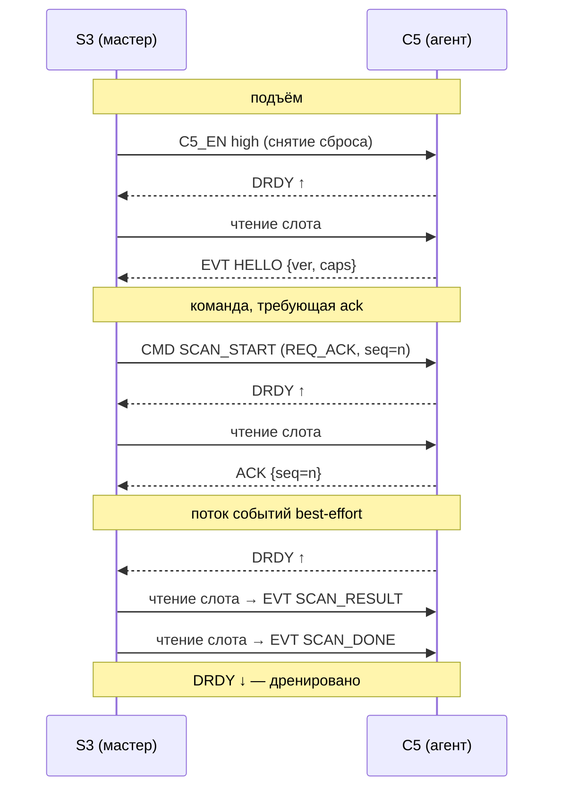
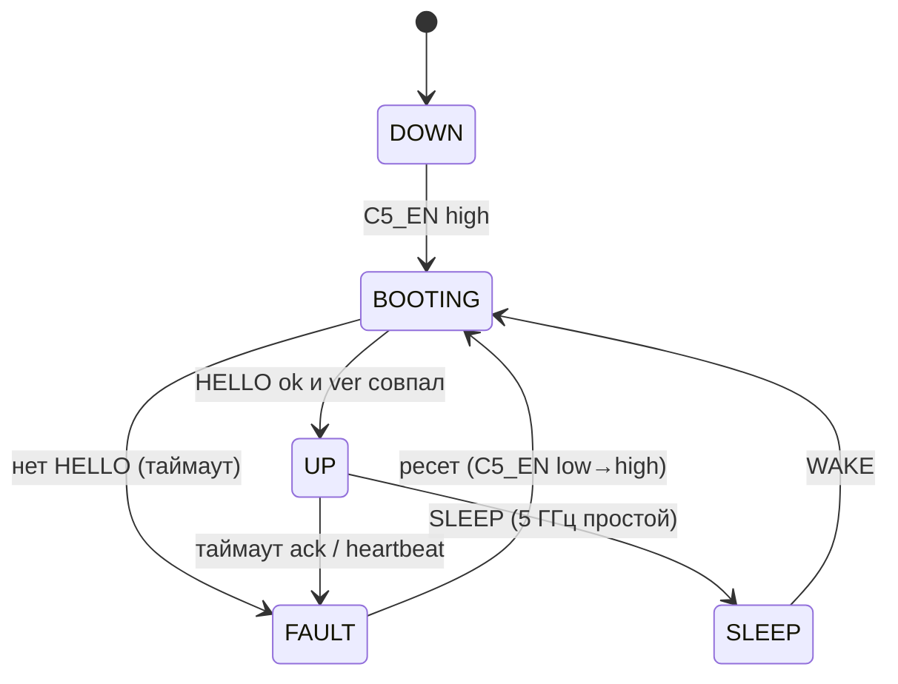
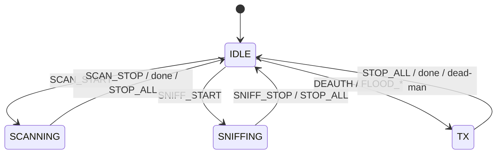

# Протокол линка S3↔C5 (v1)

*Читать на: [English](link-protocol.md) · **Русский***

Глубокая дока к решению [«Архитектура системы»](../README.ru.md#5-архитектура-системы). **ESP32-S3** — мозг и мастер шины; **ESP32-C5** — сопроцессор: на своей плате ведёт 5 ГГц Wi-Fi (+ 802.15.4) **и** 3× nRF24L01+ (2.4 ГГц raw) **и** ИК — агент, которого может тактировать только S3. Этот документ — узкий версионированный контракт между ними: как байт на проводе становится командой или событием и как линк остаётся корректным при потере кадров.

Разводка (ноги, гейт питания) принадлежит репо железа — см. [лист c5-buses](https://github.com/anton-vinogradov/esp32-leshy2/tree/main/hardware/c5-buses). Эта дока на него ссылается, а не переопределяет.

---

## 1. Физический уровень

Линк несёт **выделенная шина SPI3** — отдельная от общей SPI2, что ведёт дисплей, SD и проводные радио. S3 — мастер, C5 — слейв в режиме **SPI Slave HD (half-duplex) с DMA**.

| Линия | Напр. | Роль |
|-------|-------|------|
| `SCLK` | S3 → C5 | тактирование (задаёт мастер; C5 не тактирует никогда) |
| `MOSI` | S3 → C5 | нисходящие данные (команды) |
| `MISO` | C5 → S3 | восходящие данные (события) |
| `CS` | S3 → C5 | выбор кристалла |
| `DRDY` | C5 → S3 | **готовность данных / внимание** — обычное GPIO-прерывание, не тактируется |
| `C5_EN` | S3 → C5 | гейт питания / сброса (медленная линия, через PCA9555 #2) |

- **Тактирование:** SPI mode 0, MSB-first. Номинал 20 МГц (10 МГц на первом bring-up, до 40 МГц после проверки — [§9](#9-константы-таймингов-дефолты-v1)).
- **DRDY** — единственный способ C5 попросить внимания. Слейв не может тактировать шину, поэтому **каждый обмен инициирует мастер**; DRDY даёт C5 сказать «у меня в очереди событие — приди прочитай».
- **`C5_EN`** висит на I²C-экспандере, не на быстром GPIO. Это разовый орган питания/сброса, не сигнал на транзакцию, поэтому его латентность не важна.
- **Прошивка / OTA.** C5 шьётся автономно через **свой USB-C** на столе. В поле **OTA идёт по самому линку SPI3** — S3 толкает образ C5 по линку (`OTA_BEGIN` / `OTA_DATA` / `OTA_END`), C5 сам прошивается и перезагружается. Моста прошивки S3→C5 по UART нет.
- **Выделенная шина = изоляция отказа.** Залипший C5, удерживающий MISO, может сломать только линк, но никогда — основную SPI2, от которой зависят UI и проводные радио. Это осознанный выбор ради надёжности (общая шина дала бы одному застрявшему слейву застопорить всё).

---

## 2. Транспорт и слоты

Линк гоняет **слоты фиксированного размера 64 байта**. Один логический кадр занимает один слот; кадр больше слота дробится по слотам флагом `MORE`. Фиксированные слоты держат DMA простым, а латентность ограниченной (важно для `STOP_ALL`). Все многобайтовые поля — **little-endian** (оба чипа LE).

**Привязка к SPI Slave HD** (транспортная привязка — кодек над ней остаётся без железа, см. [§10](#10-тестируемость)):

- **Нисходяще (S3 → C5, команда):** мастер пишет один слот в приёмный DMA-буфер C5. Драйвер C5 получает колбэк «буфер принят» и парсит кадр.
- **Восходяще (C5 → S3, событие):** C5 грузит один слот в свой передающий DMA-буфер и поднимает **DRDY**. Прерывание DRDY на S3 будит link-задачу, та читает один слот.
- **Регистры слейва:** несколько разделяемых регистров SPI-HD отдают дешёвый статус без полного обмена — версию протокола, глубину восходящей очереди и счётчик отброшенных событий. S3 может опросить их, чтобы узнать, сколько слотов ждёт и не переполнился ли C5.

---

## 3. Формат кадра

Каждый кадр — **8-байтовый заголовок + payload + 2-байтовый CRC**, добитый до 64-байтового слота.

| Смещ. | Поле | Разм. | Примечание |
|------:|------|:-----:|------------|
| 0 | `sync` | 1 | `0xA5` — старт кадра / якорь ресинка |
| 1 | `ver` | 1 | версия протокола (`0x01`) |
| 2 | `type` | 1 | `CMD` / `EVT` / `ACK` / `NAK` (ниже) |
| 3 | `opcode` | 1 | операция ([§4](#4-опкоды-v1)) |
| 4 | `seq` | 1 | секвенс на направление, оборот на 256 |
| 5 | `flags` | 1 | битовое поле (ниже) |
| 6 | `len` | 2 | длина payload, 0…54 (LE) |
| 8 | `payload` | `len` | зависит от опкода |
| 8+`len` | `crc` | 2 | CRC-16/CCITT-FALSE по байтам `0 … 8+len-1` |

**`type`** — `0x01 CMD` (S3→C5), `0x02 EVT` (C5→S3), `0x03 ACK`, `0x04 NAK`. `ACK`/`NAK` повторяет `seq` и `opcode` подтверждаемого кадра; его payload — один байт статуса.

**`flags`** — бит0 `REQ_ACK` (отправитель хочет ACK), бит1 `MORE` (следует ещё фрагмент), бит2 `OVERFLOW` (только восходяще: C5 отбросил одно или больше событий перед этим), биты 3–7 резерв (0).

**`crc`** — CRC-16/CCITT-FALSE (полином `0x1021`, init `0xFFFF`, без реверса, xorout `0x0000`). Покрывает заголовок и payload. Слот с плохим CRC отбрасывается.

---

## 4. Опкоды (v1)

Агент C5 покрывает 5 ГГц Wi-Fi, 3× nRF24 (2.4 raw), ИК и OTA-по-линку. Payload'ы даны эскизом; точные структуры живут в `common/link/`.

**Команды — S3 → C5**

| Op | Имя | Payload | Примечание |
|----|-----|---------|------------|
| `0x01` | `PING` | `nonce:u32` | живость; отвечается `PONG` |
| `0x02` | `GET_INFO` | — | отвечается `INFO` |
| `0x03` | `SET_REGION` | `region:u8, tx_caps…` | зеркалить порегиональные лимиты TX на C5 |
| `0x10` | `SCAN_START` | `scan_id:u16, chans…, dwell_ms:u16, mode:u8` | 5 ГГц-разведка; результаты стримятся назад |
| `0x11` | `SCAN_STOP` | `scan_id:u16` | |
| `0x20` | `SNIFF_START` | `chan:u8, filter:u8` | триаж на кристалле; **сырые кадры по линку НЕ гонятся** |
| `0x21` | `SNIFF_STOP` | — | |
| `0x30` | `DEAUTH` | `bssid:6, sta:6, count:u8, reason:u16` | только своя сеть; гейт региона и safety |
| `0x31` | `FLOOD_BEACON` | params | |
| `0x32` | `FLOOD_PROBE` | params | |
| `0x33` | `NRF_SCAN` | `mode:u8, chans…, dwell_ms:u16` | 2.4 raw: RPD энерго-спектр / ESB снифф; результаты стримятся |
| `0x34` | `NRF_TX` | `mode:u8, chans…, power:u8` | мультиканальный TX / несущая / узкополосный jam — TX-гейт |
| `0x35` | `NRF_MOUSEJACK` | `mode:u8, addr…, payload…` | MouseJack скан / инъекция нажатий — TX-гейт |
| `0x38` | `IR_SEND` | `proto:u8, code…` | передать ИК-код (RMT) |
| `0x39` | `IR_LEARN` | — | захватить след. ИК-кадр; вернёт `IR_CODE` |
| `0x3F` | `STOP_ALL` | — | **высший приоритет — гасит весь TX C5 сейчас (Wi-Fi, nRF24, ИК)** |
| `0x40` | `SLEEP` | — | парковать C5 (5 ГГц простаивает) |
| `0x41` | `WAKE` | — | |
| `0x50` | `KEEPALIVE` | — | освежает dead-man C5 пока он передаёт ([§6](#6-надёжность)) |
| `0x51` | `OTA_BEGIN` | `size:u32, sha256:32` | старт заливки прошивки C5 по линку |
| `0x52` | `OTA_DATA` | `offset:u32, bytes…` | фрагмент образа (флаг `MORE`) |
| `0x53` | `OTA_END` | — | верификация + коммит → C5 ребутится в новый образ |

**События — C5 → S3**

| Op | Имя | Payload | Примечание |
|----|-----|---------|------------|
| `0x81` | `HELLO` | `ver:u8, caps:u16, fw_id…` | шлётся один раз после загрузки |
| `0x82` | `PONG` | `nonce:u32` | эхо `PING` |
| `0x83` | `INFO` | `fw_ver, caps, counters…` | ответ на `GET_INFO` |
| `0x90` | `SCAN_RESULT` | `bssid:6, chan:u8, rssi:i8, auth:u8, ssid_len:u8, ssid…` | одна точка на кадр |
| `0x91` | `SCAN_DONE` | `scan_id:u16, count:u16` | |
| `0x92` | `STA_SEEN` | `sta:6, bssid:6, chan:u8, rssi:i8` | замечен клиент |
| `0x93` | `NRF_RESULT` | `mode:u8, chan:u8, rssi:i8, data…` | 2.4-raw спектр-бин / ESB-пакет / MouseJack-девайс |
| `0x94` | `IR_CODE` | `proto:u8, code…` | захваченный ИК-кадр (ответ на `IR_LEARN`) |
| `0xA0` | `LOG` | `level:u8, text…` | диагностика C5 → консоль/SD на S3 |
| `0xA1` | `ERROR` | `code:u16, ctx:u16` | |
| `0xA2` | `STATUS` | `state:u8, tx_queue:u8, dropped:u16` | |
| `0xA3` | `OTA_STATUS` | `state:u8, offset:u32` | прогресс / готово / ошибка OTA |

---

## 5. Хендшейк DRDY и транзакции

Правила следуют из одного факта: **мастер инициирует всё; DRDY — единственный push слейва.**

- **S3 → C5:** мастер может писать командный слот в любой момент (C5 держит приёмный буфер взведённым).
- **C5 → S3:** C5 поднимает DRDY, S3 читает по одному слоту на подъём и **дренирует, пока DRDY не упадёт**. Регистр глубины очереди даёт S3 батчить чтения.
- **Backpressure:** восходящая очередь C5 ограничена. Если заполнилась — C5 ставит `OVERFLOW` на следующем отправляемом событии и инкрементит счётчик отброшенных; S3 фиксирует потерю. Скан-телеметрия расходная — пропавшая строка точки не беда, а рассинк потока — беда.

---

## 6. Надёжность

Надёжность **намеренно асимметрична**: мастер вытягивает всё важное, поэтому слейву не нужно гарантировать ни один push.

- **Секвенсы** идут на каждое направление. Приёмник ведёт следующий ожидаемый `seq`; разрыв на восходящей стороне = потерянные события (считаются, не восстанавливаются).
- **CRC** сторожит каждый слот; плохой слот отбрасывается.
- **Меняющие состояние команды несут `REQ_ACK`.** S3 ждёт `T_ack` под `ACK`; по таймауту ретрансмитит до `N` раз, затем объявляет линк **FAULT**. Read-only пинги/запросы — та же форма запрос/таймаут.
- **События best-effort, но упорядочены.** S3 не подтверждает каждое событие. Всё, что S3 реально нужно, он *запрашивает* (шлёт `PING`/`GET_INFO` и ждёт) — так восходящие критичные данные вытягиваются, а не «толкнул и надеемся».
- **Идемпотентность.** Команды идемпотентны где можно (`SET_REGION`, `STOP_ALL`). `SCAN_START` несёт `scan_id`; дубль от ретрансмита по потере ACK дедупится по id, так что скан не стартует дважды.
- **Ресинк.** Навал CRC-ошибок или расхождение `seq` запускает обмен nonce `PING`/`PONG`. Если не удался — S3 жёстко ресетит C5, гоня `C5_EN` low→high, и повторяет загрузочный хендшейк. Байт `0xA5` заново якорит фрейминг.
- **Heartbeat.** Пока C5 UP и простаивает, S3 пингует каждые `T_hb`; `k_miss` пропущенных `PONG` → FAULT → ресет.
- **Dead-man на TX (safety).** Всякий раз, когда C5 передаёт (deauth, flood), ему нужен периодический `KEEPALIVE` (или любая команда) от S3. Если линк молчит `T_deadman`, C5 **сам гасит свой TX** — так что мёртвый S3 или порванный линк не могут оставить C5 передающим. Это протокольная половина safety-блокера «[STOP гасит весь TX](../README.ru.md#1-видение-и-рамки)»; `STOP_ALL` — мягкий путь, `C5_EN` низко — жёсткое убийство.

---

## 7. Машины состояний

**Линк (взгляд S3 на C5):**

**Агент C5:**

`STOP_ALL` форсит `IDLE` (TX выкл) из любого состояния и обслуживается впереди всех прочих команд.

---

## 8. Версионирование и возможности

Байт `ver` гейтит весь формат. На загрузке C5 шлёт `HELLO {ver, caps}`; `caps` — битмап того, что эта сборка C5 реально умеет (5 ГГц-скан, снифф, deauth, flood, …). S3:

- отвергает линк, если `ver` новее понятного ему (и логирует),
- предлагает только те функции, что заявляет битмап `caps`,
- бампит `ver` на любое ломающее изменение кадра; аддитивные опкоды внутри версии допустимы (неизвестный опкод → `NAK`).

---

## 9. Константы таймингов (дефолты v1)

Настраиваемы; финальные значения ставятся на железе на [bring-up (§11)](../README.ru.md#11-bring-up-на-железе).

| Константа | Дефолт | Смысл |
|-----------|--------|-------|
| `SCLK` | 20 МГц | 10 МГц первый bring-up, ≤40 МГц цель |
| `SLOT` | 64 Б | фиксированный размер обмена |
| `T_ack` | 20 мс | ждать `ACK` до ретрансмита |
| `N_retry` | 3 | ретрансмитов до FAULT |
| `T_hb` | 500 мс | период heartbeat `PING` на простое |
| `k_miss` | 3 | пропущенных `PONG` до FAULT |
| `T_deadman` | 250 мс | таймаут молчания линка, что сам гасит TX C5 |
| `T_hello` | 500 мс | ждать `HELLO` после `C5_EN` high |

---

## 10. Тестируемость

**Кодек** — фрейминг, CRC, логика секвенсов и ACK, обе машины состояний — живёт в `common/link/` как **переносимый C без вызовов ESP-IDF**. С проводом он говорит только через интерфейс `link_transport` (`send_slot`, `recv_slot`, состояние `drdy`). Этот шов — вся суть:

- **На таргете** `link_transport` подпёрт SPI Slave HD (C5) и SPI-мастер + ESSL (S3).
- **На хосте** он подпёрт фейковым транспортом, так что тот же самый кодек гоняется под [стендом Linux host-target + CMock](../README.ru.md#9-эмуляция-и-тест-стенд) — потери, CRC-ошибки, таймауты ACK и ресинк прогоняются в CI без железа.

Поскольку обе прошивки компилируют *одни и те же* исходники `common/link/`, S3 и C5 никогда не разъедутся по протоколу друг с другом.
