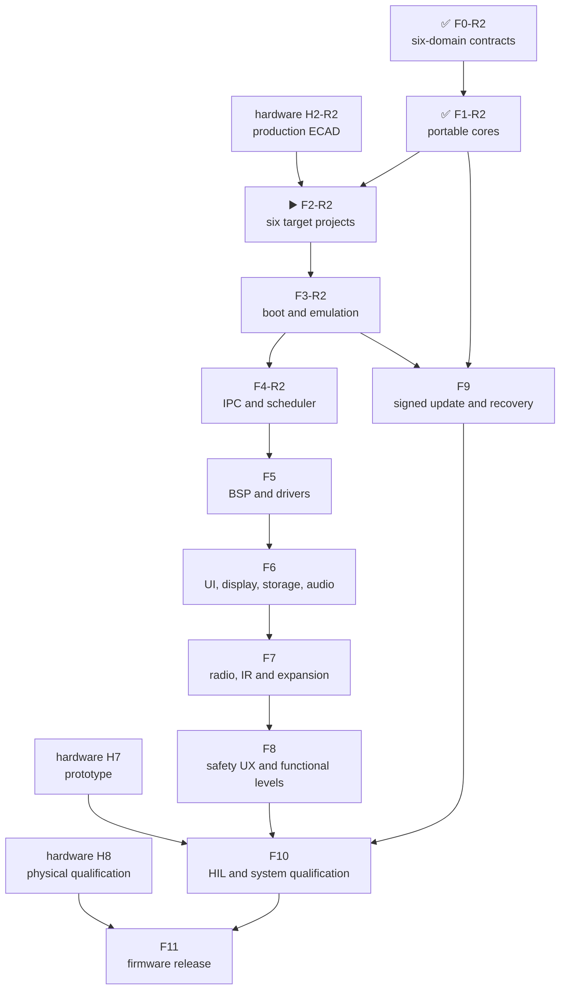

# Leshy2 firmware — roadmap to release

[Русский](roadmap.ru.md) · [Home](../README.md) ·
[Hardware roadmap](https://github.com/anton-vinogradov/esp32-leshy2/blob/main/docs/roadmap.md)

> **▶️ Current boundary: F2-R2.4 — target build qualification.** R1 F0–F4
> remains regression evidence, not the current topology. Hardware is at
> H1-R2.27; its locality-first two-board placement, Airband filter feasibility
> audit/tuning cell, exact MMCX/LDO closure and 3.75-A continuous / 4.25-A step
> 3V3_MAIN architecture, official K331 application/14-pin/24-channel evidence,
> K331 pin/power fit, exact TBS FPV antenna and independent
> Taoglas paper fallback pass their
> current checks. The official Sinopine SP331RX manual controls 28.7×23.1-mm
> nominal XY, 2.54-mm contact pitch and 1.4-mm edge offset for the matching family;
> hardware accepts a dual mutually exclusive post-PCBA receiver land inside a
> 30×24×8-mm reserve and retains 1.05 mm against 0.70 mm required after moving
> C5 DBG10. The vertical Molex `73415-2063` MMCX body,
> SMA handling and U214 service keepouts pass the coordinate audit. JLCPCB confirmed
> that K331 is absent from Parts Library and Global Sourcing and found no direct
> replacement. The normal PCBA BOM omits the receiver; exactly one post-reflow
> module is installed. Complete current exterior, separate direct
> turned-over inner-face, service and connector-proof views are generated; stable
> outer silkscreen now identifies the UI and RF/power board roles, `R2-EVT1` and
> `REV A`, while the changing `H1-R2.xx` marker remains documentation-only. This corrected
> the missing independent Hub USB/RESET/BOOT/DBG10 set. Primary K331 uses a
> tolerant 14-pad land; exact-drawing AWM666V is the degraded seven-channel nested
> fallback. The selected RF branch is completed at the MMCX launch and the unused
> branch is isolated there, without U.FL, cable or live stub. Actual-module and
> solder qualification move to H5/H7; a manufacturer package may simplify the footprint.
> Final DFM and optional Consigned Parts/function-test review belong to H5/H6/H7;
> RF/video and fallback-antenna qualification remain downstream H3/H5/H6/H8 work.
> No H1 engineering blocker remains; explicit acceptance of the complete mock-up
> is the final H1 action.
> Live RTC6715/RX5808 cards have zero stock and no purchasable drop-in route;
> a bare-chip receiver would add undocumented RF/IF implementation risk.

Status last reconciled: **28 August 2026**. This is the firmware repository's
own roadmap. Hardware intersections are explicit, but hardware stages are not
duplicated or given a second status here.

## Firmware position

| Area | Actual state |
|---|---|
| Six-domain HW↔FW projection | ✅ [F0-R2 reviewed](f0-product-contracts-report.md): H0-R2 source is hash-bound; identities, local rollback, S3-last update and five-layer execution gates are coherent |
| Portable safety, L2IP and update model | ✅ [F1-R2 reviewed](f1-portable-cores-report.md): 34 R2 scenarios pass normal plus sanitizer runs; six-domain update, rear-RP Airband receiver and integrated faults are current |
| S3/C5/RF-RP/Hub-RP/Pack/Safety projects | ✅ F2-R2.2: [six production-SDK roots are reviewed](../config/f2_r2_target_projects.json); RF-RP and Hub-RP use separate pin-free Pico SDK trees, entries and image identities |
| Generated R2 BSP ownership | ✅ F2-R2.3: [six deterministic H1-R2.27 domains](../config/f2_r2_bsp_generation.json) are generated and [each has one SDK owner](../config/f2_r2_bsp_consumption.json); the retained five-domain BSP is historical only |
| Target builds, maps and S3 QEMU | ▶️ F2-R2.4: qualify the 12 locked debug/release configurations, artifacts, maps and size gates; R1 F2/F3 evidence cannot qualify R2 |
| Hardware intersection | ▶️ Hardware H0-R2 is reviewed and H1-R2.27 is current; stable outer silk identifies each PCB role, `R2-EVT1` and `REV A`, while `H1-R2.xx` stays documentation-only; ten SMA ports are split 5+5, the rear FPV MMCX has no interboard tail, direct 32-MHz i8080-8 TX and camera RX remain S3-local, and the display flex points toward the antenna edge so F5/F6 rotate ST77922 memory and touch coordinates by 180°; TVP5150 stays front-local and exact 80-contact M1 carries one CVBS signal with 14 true NC reserves and a separate enclosure load path; the 30×24×8-mm dual post-PCBA K331/AWM666V bay installs exactly one receiver, retains 1.05 mm opposing clearance and leaves firmware controls/CVBS unchanged; five buffer footprints, two Schmitt-inverter footprints, 147 bypass capacitors and six ordinary 0402 resistor identities now use stocked exact or parametrically equivalent production parts without changing the BSP contract; H5/H7 own received-module/solder qualification, while explicit mock-up acceptance is the final H1 action |
| C5, both RP2354B and MSPM0 platform/dev-board tests | 🔒 Exact target boot/peripherals wait for the R2 build matrix and hardware |
| Menu, waterfall, storage, audio and radio features | ⏳ Described as target behavior; no production implementation |
| Complete signed all-in-one update | ⏳ Portable rollback model exists; target boot/flash/signature integration does not |
| HIL and release | 🔒 Waiting for hardware prototype H7 |

The host model verifies portable logic. It is not instruction-set, peripheral
or board emulation and is never presented as finished firmware.

## Current F2-R2 breakdown

<!-- current-substep: F2-R2.4 -->

▶️ **`F2-R2.4` — current.** [F2-R2.3](../config/f2_r2_bsp_generation.json)
generated six byte-reproducible domain descriptors from the hash-bound H1-R2.27
projection and [proved](../config/f2_r2_bsp_consumption.json) exactly one SDK
owner per descriptor. Exact S3 pins, exact Hub/RF-RP group membership and
identity-only boundaries for unpublished per-pin maps remain distinguishable;
no pin order was invented. The old five-domain tree is excluded from active R2
inputs. Qualify the 12 locked debug/release configurations, artifacts, maps and
size gates now. F2-R2.3 ran host generation/syntax checks only: zero target
configure/build or execution runs.
The exact marker and its evidence move together in every commit.

<strong>Retained R1 F2–F4 breakdown — not current topology</strong>

- `F2.0` — target/toolchain matrix.
  - ✅ `F2.0.0` — the five target identities and their flash, RAM and rollback
    contracts are registered.
  - ✅ `F2.0.1` — exact SDK/toolchain versions, first-party support status,
    lifecycle, license and build-host requirements for S3, C5, RP2354B and both
    MSPM0 images passed review.
  - ✅ `F2.0.2` — immutable SDK revisions, 26 archive URL/SHA-256 records for
    canonical local/CI hosts and a hash-locked ESP-IDF Python environment passed
    review.
  - ✅ `F2.0.3` — one [local/CI matrix and shell-free dispatcher](toolchains.md),
    fail-closed preflight and 26 named target artifacts passed review.
- `F2.1` — shared source/component tree, warning policy and generated-file
  boundaries without inventing target pins.
  - ✅ `F2.1.0` — [directories and single ownership](toolchains.md),
    target-neutral portable code and the empty-until-F2.3 generated-source
    boundary passed review.
  - ✅ `F2.1.1` — strict C17/C++17, warnings-as-errors for project code,
    debug/release optimization and map-producing link policy passed review.
  - ✅ `F2.1.2` — the integrated environment, source, build-policy, H2-contract
    and 24-scenario host review passed together.
- `F2.2` — minimal production-SDK projects for all five images.
  - ✅ `F2.2.0` — S3 ESP-IDF project, portable component, production memory
    defaults and debug/release inputs passed structural review.
  - ✅ `F2.2.1` — C5 ESP-IDF project, portable component, production memory
    defaults and debug/release inputs passed structural review.
  - ✅ `F2.2.2` — exact RP2354B Arm-secure project, 2-MiB custom board,
    partition input and debug/release policy passed structural review.
  - ✅ `F2.2.3` — the Pack MSPM0C1106 project, separate boot/application images,
    memory boundaries and debug/release policy passed structural review.
  - ✅ `F2.2.4` — the Safety MSPM0C1106 project, separate boot/application
    images, fail-closed entry and debug/release policy passed structural review.
  - ✅ `F2.2.5` — one integrated review passed for five projects, 37 files,
    26 artifacts and 20 debug/release command plans with zero target execution.
- `F2.3` — import the accepted generated pin/BSP contract.
  - ✅ `F2.3.0` — the immutable H2 source identity, 5 domains, 125 contacts,
    112 nets, 4 transports, 10 groups and proof-field model passed review.
  - ✅ `F2.3.1` — 11 generated C/header files preserve all 125 contacts, pass
    strict C17 syntax checks and reproduce byte-for-byte with a hashed manifest.
  - ✅ `F2.3.2` — every target consumes exactly its domain table and include
    path; no foreign table, copied BSP file or hand-authored pin was found.
  - ✅ `F2.3.3` — sibling H2, deterministic generation, strict C17 tables and
    one-owner consumption passed one integrated review.
- `F2.4` — reproducible debug/release builds, map files and image-size gates.
  - ✅ `F2.4.0` — locked-toolchain preflight for five targets passed review.
    - ✅ `F2.4.0.1` — exact ESP-IDF `v6.0.2`, Pico SDK/picotool `2.3.0` and TI
      MSPM0 SDK `2.11.00.07` sources and revisions passed review.
    - ✅ `F2.4.0.2` — exact S3/C5 compilers, debuggers, ULP tools, OpenOCD and
      ROM ELFs installed, recognized and passed review.
    - ✅ `F2.4.0.3` — hash-locked Python 3.12 environment and exact CMake/Ninja
      passed review; evidence is in [`config/f2_4_preflight_progress.json`](../config/f2_4_preflight_progress.json).
    - ✅ `F2.4.0.4` — hash-verified native Arm GNU `15.2.Rel1` passed review for RP2354B.
    - ✅ `F2.4.0.5` — hash-verified TI Arm Clang `4.0.5.LTS` and SysConfig
      `1.28.0.4712` passed review for Pack/Safety.
    - ✅ `F2.4.0.6` — 30 exact SDK, Git, lock, compiler and input checks plus
      debug/release dispatcher preflight passed; [machine evidence](../config/f2_4_preflight_review.json).
  - ✅ `F2.4.1` — S3 debug/release configure, build, ten-artifact presence and
    image-size gates passed; [machine evidence](../config/f2_4_s3_build_review.json).
  - ✅ `F2.4.2` — C5 debug/release configure, build, ten-artifact presence and
    image-size gates passed; [machine evidence](../config/f2_4_c5_build_review.json).
  - ✅ `F2.4.3` — RP debug/release configure, build, eight-artifact presence and
    image-size gates passed; [machine evidence](../config/f2_4_rp_build_review.json).
  - ✅ `F2.4.4` — Pack debug/release configure, build, twelve-artifact presence
    and image-size gates passed; [machine evidence](../config/f2_4_pack_build_review.json).
  - ✅ `F2.4.5` — Safety debug/release configure, build, twelve-artifact presence
    and image-size gates passed; [machine evidence](../config/f2_4_safety_build_review.json).
  - ✅ `F2.4.6` — all 52 debug/release artifacts, 14 maps and 10 image-size
    gates passed one integrated review; [machine evidence](../config/f2_4_build_review.json).
- ✅ `F2.5` — two full clean passes produced 52/52 byte-identical artifacts;
  24 distributable images contain no absolute workspace path. See the
  [F2 result](f2-target-build-system-report.md) and
  [machine evidence](../config/f2_5_reproducibility_review.json).
- `F3.0` — runtime-evidence contract.
  - ✅ `F3.0.0` — official emulator/simulator support, instruction coverage,
    boot observability and unavoidable dev-board gates for all five targets
    passed review: exact vendor QEMU exists only for S3;
    [machine matrix](../config/f3_execution_capability_matrix.json).
  - ✅ `F3.0.1` — exact hash-locked QEMU archives, debug/release recipes, six
    ordered boot markers, a 30-second timeout and fail-closed result contract
    passed review; [machine plan](../config/f3_runtime_plan.json).
  - ✅ `F3.0.2` — the five-target evidence matrix and one fail-closed runner
    passed review without executing a target; [machine matrix](../config/f3_acceptance_matrix.json).
- ✅ `F3.1` — both S3 debug and release skeletons passed six ordered markers in
  exact Espressif QEMU, including 8-MiB octal-PSRAM initialization and memory
  test; [debug evidence](../config/f3_1_s3_debug_runtime_review.json) and
  [release evidence](../config/f3_1_s3_release_runtime_review.json).
- ✅ `F3.2` — S3 debug/release each passed nine ordered markers for boot,
  self-test, retained-first-fault and failed-update RAM rollback; 24 portable
  scenarios also passed ASan/UBSan. This does not claim nonvolatile persistence
  or flash rollback; [integrated evidence](../config/f3_2_runtime_review.json).
- ✅ `F3.3` — a fresh double clean-build reproduced 52/52 artifacts; ten current
  image/RAM gates and five static rollback topologies fit. S3 debug is 187,040
  bytes with 6,890,848 bytes before its maximum; zero physical rollback
  transitions are claimed. See the
  [boundary evidence](../config/f3_3_boundary_review.json).
- ✅ `F3.4` — the [global F3 result](f3-boot-memory-emulation-report.md) closes
  the phase with exact S3 execution, 52 reproducible artifacts and five named
  physical target/HIL gates.
- `F4.0` — freeze the transport execution and evidence plan.
  - ✅ `F4.0.0` — [four transports and eight exact SDK endpoint bindings reviewed](../config/f4_0_transport_capability_matrix.json); QEMU proves none of their PHYs.
  - ✅ `F4.0.1` — [one fail-closed lifecycle, fixed ownership/queues, credits, duplicates, deadlines, reset and exact ESSL lock reviewed](../config/f4_0_1_adapter_contract.json).
  - ✅ `F4.0.2` — [one integrated runner, six evidence classes and 37 scenarios reviewed](../config/f4_0_2_acceptance_matrix.json); [baseline snapshot](../config/f4_0_2_acceptance_snapshot.json) claims zero transport runs.
- `F4.1` — implement and exercise S3↔C5 SDIO.
  - ✅ `F4.1.0` — [exact offline ESSL 1.1.2 payload and single-owner S3↔C5 source boundary reviewed](../config/f4_1_s3_c5_source_boundary.json); [30-file manifest](../third_party/esp_serial_slave_link.vendor-lock.json).
  - ✅ `F4.1.1` — [common high-speed core reviewed](../config/f4_1_1_high_speed_core_review.json): 19 ASan/UBSan scenarios; cumulative duplicate-safe bulk grants replace the unsafe absolute-credit draft.
  - ✅ `F4.1.2` — [S3 host and C5 SDIO slave endpoints reviewed](../config/f4_1_2_s3_c5_endpoint_review.json): generated pins, one-bit 20-MHz SDIO, exact ESSL and two locked debug builds; zero QEMU/PHY claims.
  - ✅ `F4.1.3` — [exact builds and fake-SDIO QEMU reviewed](../config/f4_1_3_s3_c5_qemu_review.json): four target builds, two S3 QEMU runs, six scenarios per run and zero PHY claims.
  - ▶️ **`F4.1.4` — current:** run and review the named S3-C5 dev-board physical gate.
- `F4.2` — implement and exercise S3↔RP SPI+alert.
- `F4.3` — implement and exercise Pack/Safety I²C mailboxes.
- `F4.4` — inject saturation, duplicate, deadline, reset and link-loss faults.
- `F4.5` — reconcile target evidence and publish the global F4 result.

F3 is reviewed at its honest evidence boundary. F4 now turns the accepted
message contracts into real target transports while preserving safety/control
priority under waterfall and bulk traffic. Every substep updates evidence,
this exact marker and both language pages in the same commit.

## Dependencies

## Complete firmware path

| Stage | Status | Output | Exit criterion |
|---|---|---|---|
| **F0. Product contracts** | ✅ [Reviewed F0-R2 result](f0-product-contracts-report.md) | Six domains, Hub transports, identities, rollback, update and execution gates are coherent and machine-checked | Both repositories agree; no target, transport, recovery path or required state is unknown; R1 evidence is explicitly historical |
| **F1. Portable cores** | ✅ [Reviewed F1-R2 result](f1-portable-cores-report.md) | Six-domain update, receive-only rear-RP Airband and integrated faults pass 34 normal plus sanitizer scenarios | Normal and ASan/UBSan scenarios cover heartbeat, lease, receiver-mode and update ownership |
| **F2. Target projects and build system** | ▶️ Current: F2-R2.4 | Qualify 12 locked debug/release configurations for the reviewed six project roots and one-owner generated R2 BSP | 12 debug/release configurations reproduce; every target emits its named artifact/map and passes its size gate |
| **F3. Boot, memory and emulation** | ⏳ Waiting for F2-R2 | Requalify S3 QEMU, six-target artifacts, size/memory/rollback and named physical gates | Six images fit and reproduce; absent peripherals and non-S3 execution remain explicit dev-board gates |
| **F4. IPC and scheduling** | ⏳ Waiting for F3-R2 | S3↔Hub quad-SPI, Hub↔C5 SDIO, Hub↔RF-RP SPI+alert and Hub↔Pack/Safety I²C | CRC/replay/deadline/duplicate/reset recovery works end-to-end; display/UI remain local and safety/control preempts bulk traffic |
| **F5. BSP and drivers** | ⏳ Waiting for F4 and current schematic | Display/touch, microSD, codec, receiver, CTIA jack detect, `0x39` headset-source control, IR, 3×nRF24, CC, voice, U214, M5 Unit, controls, LEDs, sensors and power-state drivers | Every driver has a fake/host boundary and target smoke test; reset/off/no-back-power/quiet transitions are explicit; P02 remains input-only, selector reset/readback and seven reserve pins are checked; unmodeled peripherals have dev-board tests |
| **F6. UI, display, storage and audio** | ⏳ Waiting for F5 | Menu, dirty-region i8080 DMA rendering, scrolling waterfall, controls/PTT, recording, CTIA/TRS playback/capture state machine and fault viewer | UI remains responsive at maximum stream load; changed regions meet the display budget; insertion first silences the speaker, source changes are pop-safe, removal restores reset default before playback, storage/audio faults remain isolated and the retained fault cause is displayed |
| **F7. Radio, IR and expansion features** | ⏳ Waiting for F5/F6 | Normal receive/scan/record, full `3R/1T2R/2T1R/3T`, Wi-Fi/BLE/802.15.4, Sub-GHz, voice, IR and expansion profiles | One signal group is active; three nRF radios remain full-function concurrently; inactive interfaces are quiet; permission, region and antenna profile precede TX |
| **F8. Three functional levels and safety UX** | ⏳ Waiting for F7 | Normal, Laboratory and Laboratory → Controlled Zone behavior; local full-self-test interval setting | Every Controlled Zone entry shows a fresh banner; action requires preview, separate arm, authorized target/isolated environment and bounded lease; setup requires non-aggression agreement acceptance; 24-hour/default-48-hour/startup-only proof selection cannot weaken watchdog, thermal, power-fault or TX-lease enforcement |
| **F9. Signed bundle, update and recovery** | ⏳ Waiting for F1/F3 | One owner/release-signed six-target bundle with local owner roots, readback, ordered activation and rollback | Substituted/incompatible bundles fail; Pack→Safety→C5→RF-RP→Hub-RP→S3 self-test; failure restores a compatible set; USB/UART/SWD recovery remains owner-accessible |
| **F10. HIL and system qualification** | 🔒 Waiting for F4–F9 and hardware H7 | Automated prototype tests, fault injection and RF/power/thermal/endurance evidence | Real transports/peripherals, 3×nRF concurrency, quiet state, watchdog, thermal, brownout and interrupted update pass; qualified-USB endurance runs for 24 and 48 hours and battery-to-protected-cutoff measurements are evidence, not runtime promises |
| **F11. Firmware release** | 🔒 Waiting for F10 and hardware H8 | Reproducible images, installer, release notes, recovery kit and compatible tag | Zero blocker; target binaries are reproducible and signed; SBOM/licenses/tests are published; site matches implementation; firmware tag matches hardware release |

## Advancement rules

1. Firmware never invents GPIO, polarity, rail or recovery paths; they come
   from the accepted hardware contract.
2. Portable cores are shared by all targets instead of being rewritten six
   times.
3. Anything QEMU/host does not represent is not called tested and enters the
   dev-board/HIL matrix.
4. A potentially dangerous function receives permission, evidence, revoke and
   fault tests before features; UI cannot bypass hardware `FAULT_KILL`.
5. **Reviewed** reopens when target or HIL evidence contradicts it.
6. Closing each top-level `F*` phase publishes a bilingual result report and a
   link from the roadmap tables and landing page. An internal substep updates
   the exact current marker but does not receive a separate global report.

## Next action

The current boundary is `F2-R2.4`. Six production-SDK roots consume six
deterministic, H1-R2.27-bound descriptors with one owner each. Run the named
locked configure/build commands for all 12 debug/release configurations, then
review artifacts, maps and size gates. Retained R1 BSP/build/QEMU evidence is
historical and zero R2 target configure/build runs are claimed by F2-R2.3.
