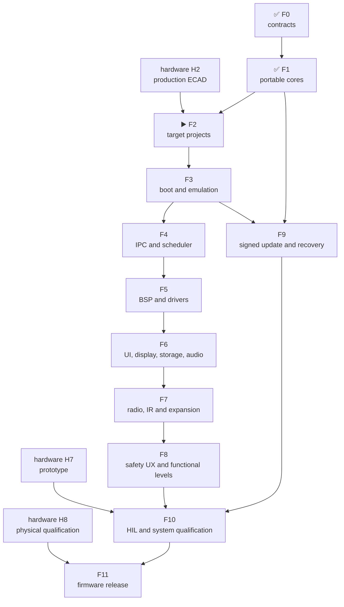

# Leshy2 firmware — roadmap to release

[Русский](roadmap.ru.md) · [Home](../README.md) ·
[Hardware roadmap](https://github.com/anton-vinogradov/esp32-leshy2/blob/main/docs/roadmap.md)

> **▶️ Current boundary: F2 — target projects and reproducible builds.** F0
> and F1 are reviewed. The accepted hardware H2 production ECAD and generated
> pin/BSP contract are available. No target image or target emulator has run.

Status last reconciled: **25 August 2026**. This is the firmware repository's
own roadmap. Hardware intersections are explicit, but hardware stages are not
duplicated or given a second status here.

## Firmware position

| Area | Actual state |
|---|---|
| Five-domain, memory/rollback and HW↔FW contracts | ✅ Reviewed at architecture/configuration level |
| Portable safety, L2IP, update and five-domain model | ✅ [F1 result](f1-portable-cores-report.md): 24 deterministic C scenarios; clean ASan/UBSan |
| S3/C5/RP/Pack/Safety target projects | ✅ Five structures and generated H2 domain tables reviewed; no configure/build claim |
| Target builds and map files | ⏳ Not run |
| ESP32-S3 QEMU | ⏳ Not run |
| C5, RP2354B and MSPM0 platform/dev-board tests | 🔒 Waiting for target BSP and hardware |
| Menu, waterfall, storage, audio and radio features | ⏳ Described as target behavior; no production implementation |
| Complete signed all-in-one update | ⏳ Portable rollback model exists; target boot/flash/signature integration does not |
| HIL and release | 🔒 Waiting for hardware prototype H7 |

The host model verifies portable logic. It is not instruction-set, peripheral
or board emulation and is never presented as finished firmware.

## Current F2 breakdown

<!-- current-substep: F2.4.2 -->

**Exact marker: `F2.4.2`** — configure, build and verify C5 in debug and release.
The integrated preflight passes 29 exact checks. S3 debug/release builds and all
ten declared S3 artifacts passed review; no emulator or hardware run is claimed.

- `F2.0` — target/toolchain matrix.
  - ✅ `F2.0.0` — the five target identities and their flash, RAM and rollback
    contracts are registered.
  - ✅ `F2.0.1` — exact SDK/toolchain versions, first-party support status,
    lifecycle, license and build-host requirements for S3, C5, RP2354B and both
    MSPM0 images passed review.
  - ✅ `F2.0.2` — immutable SDK revisions, 26 archive URL/SHA-256 records for
    canonical local/CI hosts and a hash-locked ESP-IDF Python environment passed
    review.
  - ✅ `F2.0.3` — one [local/CI matrix and shell-free dispatcher](toolchains.md),
    fail-closed preflight and 26 named target artifacts passed review.
- `F2.1` — shared source/component tree, warning policy and generated-file
  boundaries without inventing target pins.
  - ✅ `F2.1.0` — [directories and single ownership](toolchains.md),
    target-neutral portable code and the empty-until-F2.3 generated-source
    boundary passed review.
  - ✅ `F2.1.1` — strict C17/C++17, warnings-as-errors for project code,
    debug/release optimization and map-producing link policy passed review.
  - ✅ `F2.1.2` — the integrated environment, source, build-policy, H2-contract
    and 24-scenario host review passed together.
- `F2.2` — minimal production-SDK projects for all five images.
  - ✅ `F2.2.0` — S3 ESP-IDF project, portable component, production memory
    defaults and debug/release inputs passed structural review.
  - ✅ `F2.2.1` — C5 ESP-IDF project, portable component, production memory
    defaults and debug/release inputs passed structural review.
  - ✅ `F2.2.2` — exact RP2354B Arm-secure project, 2-MiB custom board,
    partition input and debug/release policy passed structural review.
  - ✅ `F2.2.3` — the Pack MSPM0C1106 project, separate boot/application images,
    memory boundaries and debug/release policy passed structural review.
  - ✅ `F2.2.4` — the Safety MSPM0C1106 project, separate boot/application
    images, fail-closed entry and debug/release policy passed structural review.
  - ✅ `F2.2.5` — one integrated review passed for five projects, 29 files,
    26 artifacts and 20 debug/release command plans with zero target execution.
- `F2.3` — import the accepted generated pin/BSP contract.
  - ✅ `F2.3.0` — the immutable H2 source identity, 5 domains, 125 contacts,
    112 nets, 4 transports, 10 groups and proof-field model passed review.
  - ✅ `F2.3.1` — 11 generated C/header files preserve all 125 contacts, pass
    strict C17 syntax checks and reproduce byte-for-byte with a hashed manifest.
  - ✅ `F2.3.2` — every target consumes exactly its domain table and include
    path; no foreign table, copied BSP file or hand-authored pin was found.
  - ✅ `F2.3.3` — sibling H2, deterministic generation, strict C17 tables and
    one-owner consumption passed one integrated review.
- `F2.4` — reproducible debug/release builds, map files and image-size gates.
  - ✅ `F2.4.0` — locked-toolchain preflight for five targets passed review.
    - ✅ `F2.4.0.1` — exact ESP-IDF `v6.0.2`, Pico SDK `2.3.0` and TI MSPM0
      SDK `2.11.00.07` sources and revisions passed review.
    - ✅ `F2.4.0.2` — exact S3/C5 compilers, debuggers, ULP tools, OpenOCD and
      ROM ELFs installed, recognized and passed review.
    - ✅ `F2.4.0.3` — hash-locked Python 3.12 environment and exact CMake/Ninja
      passed review; evidence is in [`config/f2_4_preflight_progress.json`](../config/f2_4_preflight_progress.json).
    - ✅ `F2.4.0.4` — hash-verified native Arm GNU `15.2.Rel1` passed review for RP2354B.
    - ✅ `F2.4.0.5` — hash-verified TI Arm Clang `4.0.5.LTS` and SysConfig
      `1.28.0.4712` passed review for Pack/Safety.
    - ✅ `F2.4.0.6` — 29 exact SDK, Git, lock, compiler and input checks plus
      debug/release dispatcher preflight passed; [machine evidence](../config/f2_4_preflight_review.json).
  - ✅ `F2.4.1` — S3 debug/release configure, build, ten-artifact presence and
    image-size gates passed; [machine evidence](../config/f2_4_s3_build_review.json).
  - ▶️ **`F2.4.2` — current:** configure/build/verify C5 debug and release.
  - ⏳ `F2.4.3` — configure/build/verify RP debug and release.
  - ⏳ `F2.4.4` — configure/build/verify Pack debug and release.
  - ⏳ `F2.4.5` — configure/build/verify Safety debug and release.
  - ⏳ `F2.4.6` — review all 26 artifacts, map files and image-size gates.
- ⏳ `F2.5` — F2 evidence review; only then does F3 boot/emulation begin.

`F2.4.1` is complete. The S3 application is 180,240 bytes in debug and 138,480
bytes in release against a 7,340,032-byte OTA slot. This proves compilation,
linking and artifact limits, not boot, peripherals or byte reproducibility.
Every later substep closure updates its evidence, this exact marker and both
language pages in the same commit before work advances.

## Dependencies

## Complete firmware path

| Stage | Status | Output | Exit criterion |
|---|---|---|---|
| **F0. Product contracts** | ✅ Reviewed | Five domains, owners, L2IP, memory/partition, safety, update and HW↔FW boundary | Both repositories agree; no target, transport, recovery path or required state is unknown |
| **F1. Portable cores** | ✅ Reviewed | [F1 result](f1-portable-cores-report.md): C safety state machine, CRC/L2IP, replay guard, atomic update/rollback, priority queues and five-domain fault model | 24 scenarios pass normal and ASan/UBSan builds; heartbeat, lease-boundary, late-update and invalid-enum defects remain covered by regression tests |
| **F2. Target projects and build system** | ▶️ Current boundary; H2 contract available | Five minimal production-SDK projects: ESP-IDF S3/C5, Pico SDK RP2354B and TI MSPM0 SDK ×2 | Projects configure reproducibly; pin/BSP source is generated from the accepted HW contract; CI builds debug/release; no temporary pin assignment exists |
| **F3. Boot, memory and emulation** | ⏳ Waiting for F2 | Bootable skeleton images, map/size gates and maximum available virtual evidence | S3 boot/self-test/fault/update-failure runs in official QEMU; five ELF/bin images fit flash/RAM/rollback; shared code runs on host; non-emulated peripherals enter the dev-board matrix |
| **F4. IPC and scheduling** | ⏳ Waiting for F3 | Real SDIO S3↔C5, SPI+alert S3↔RP, Pack/Safety I²C mailboxes, typed results, credits and queues | CRC/replay/deadline/duplicate/reset recovery work end-to-end; waterfall/bulk saturation cannot delay safety/control; link loss closes local side effects |
| **F5. BSP and drivers** | ⏳ Waiting for F4 and current schematic | Display/touch, microSD, codec, receiver, CTIA jack detect, `0x39` headset-source control, IR, 3×nRF24, CC, voice, U214, M5 Unit, controls, LEDs, sensors and power-state drivers | Every driver has a fake/host boundary and target smoke test; reset/off/no-back-power/quiet transitions are explicit; P02 remains input-only, selector reset/readback and seven reserve pins are checked; unmodeled peripherals have dev-board tests |
| **F6. UI, display, storage and audio** | ⏳ Waiting for F5 | Menu, dirty-region QSPI rendering, scrolling waterfall, controls/PTT, recording, CTIA/TRS playback/capture state machine and fault viewer | UI remains responsive at maximum stream load; changed regions meet the display budget; insertion first silences the speaker, source changes are pop-safe, removal restores reset default before playback, storage/audio faults remain isolated and the retained fault cause is displayed |
| **F7. Radio, IR and expansion features** | ⏳ Waiting for F5/F6 | Normal receive/scan/record, full `3R/1T2R/2T1R/3T`, Wi-Fi/BLE/802.15.4, Sub-GHz, voice, IR and expansion profiles | One signal group is active; three nRF radios remain full-function concurrently; inactive interfaces are quiet; permission, region and antenna profile precede TX |
| **F8. Three functional levels and safety UX** | ⏳ Waiting for F7 | Normal, Laboratory and Laboratory → Controlled Zone behavior; local full-self-test interval setting | Every Controlled Zone entry shows a fresh banner; action requires preview, separate arm, authorized target/isolated environment and bounded lease; setup requires non-aggression agreement acceptance; 24-hour/default-48-hour/startup-only proof selection cannot weaken watchdog, thermal, power-fault or TX-lease enforcement |
| **F9. Signed bundle, update and recovery** | ⏳ Waiting for F1/F3 | One owner/release-signed five-target bundle with local owner roots, readback, ordered activation and rollback | Substituted/incompatible bundles fail; Pack→Safety→C5→RP→S3 self-test; failure restores a compatible set; USB/UART/SWD recovery remains owner-accessible |
| **F10. HIL and system qualification** | 🔒 Waiting for F4–F9 and hardware H7 | Automated prototype tests, fault injection and RF/power/thermal/endurance evidence | Real transports/peripherals, 3×nRF concurrency, quiet state, watchdog, thermal, brownout and interrupted update pass; qualified-USB endurance runs for 24 and 48 hours and battery-to-protected-cutoff measurements are evidence, not runtime promises |
| **F11. Firmware release** | 🔒 Waiting for F10 and hardware H8 | Reproducible images, installer, release notes, recovery kit and compatible tag | Zero blocker; target binaries are reproducible and signed; SBOM/licenses/tests are published; site matches implementation; firmware tag matches hardware release |

## Advancement rules

1. Firmware never invents GPIO, polarity, rail or recovery paths; they come
   from the accepted hardware contract.
2. Portable cores are shared by all targets instead of being rewritten five
   times.
3. Anything QEMU/host does not represent is not called tested and enters the
   dev-board/HIL matrix.
4. A potentially dangerous function receives permission, evidence, revoke and
   fault tests before features; UI cannot bypass hardware `FAULT_KILL`.
5. **Reviewed** reopens when target or HIL evidence contradicts it.
6. Closing each top-level `F*` phase publishes a bilingual result report and a
   link from the roadmap tables and landing page. An internal substep updates
   the exact current marker but does not receive a separate global report.

## Next action

The current boundary is F2. The accepted H2 production schematic and generated
pin/BSP contract are available. F2.0–F2.2 now establish reproducible targets;
F2.3 then consumes that contract before target builds and emulator execution.
