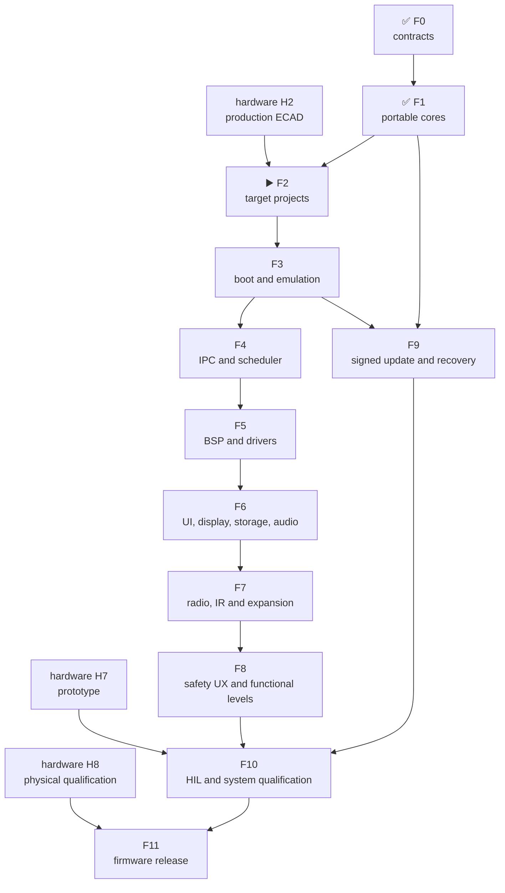

# Leshy2 firmware — roadmap to release

[Русский](roadmap.ru.md) · [Home](../README.md) ·
[Hardware roadmap](https://github.com/anton-vinogradov/esp32-leshy2/blob/main/docs/roadmap.md)

> **▶️ Current boundary: F2 — target projects and reproducible builds.** F0
> and F1 are reviewed. Target/BSP implementation depends on the current
> production ECAD schematic at hardware H2, which does not yet exist. No target
> image or target emulator has run.

Status last reconciled: **23 August 2026**. This is the firmware repository's
own roadmap. Hardware intersections are explicit, but hardware stages are not
duplicated or given a second status here.

## Firmware position

| Area | Actual state |
|---|---|
| Five-domain, memory/rollback and HW↔FW contracts | ✅ Reviewed at architecture/configuration level |
| Portable safety, L2IP, update and five-domain model | ✅ Reviewed: 24 deterministic C scenarios; clean ASan/UBSan |
| S3/C5/RP/Pack/Safety target projects | ▶️ F2; not created |
| Target builds and map files | ⏳ Not run |
| ESP32-S3 QEMU | ⏳ Not run |
| C5, RP2354B and MSPM0 platform/dev-board tests | 🔒 Waiting for target BSP and hardware |
| Menu, waterfall, storage, audio and radio features | ⏳ Described as target behavior; no production implementation |
| Complete signed all-in-one update | ⏳ Portable rollback model exists; target boot/flash/signature integration does not |
| HIL and release | 🔒 Waiting for hardware prototype H7 |

The host model verifies portable logic. It is not instruction-set, peripheral
or board emulation and is never presented as finished firmware.

## Current F2 breakdown

<!-- current-substep: F2.0.1 -->

**Exact marker: `F2.0.1`** — verify and pin the supported production SDK and
toolchain version for each of the five targets. Choices recovered from archived
documents are candidates only until checked against current primary sources.

- `F2.0` — target/toolchain matrix.
  - ✅ `F2.0.0` — the five target identities and their flash, RAM and rollback
    contracts are registered.
  - ▶️ **`F2.0.1` — current:** verify exact SDK/toolchain versions, first-party
    support status, lifecycle, license and build-host requirements for S3, C5,
    RP2354B and both MSPM0 images.
  - ⏳ `F2.0.2` — create reproducible environment manifests, checksums and
    dependency locks without silently floating versions.
  - ⏳ `F2.0.3` — define the single local/CI matrix and canonical configure,
    build, clean and artifact commands.
- ⏳ `F2.1` — shared source/component tree, warning policy and generated-file
  boundaries without inventing target pins.
- ⏳ `F2.2` — minimal production-SDK projects for S3, C5, RP, Pack and Safety.
- 🔒 `F2.3` — generated pin/BSP contract import, blocked until hardware H2.
- ⏳ `F2.4` — reproducible debug/release builds, map files and image-size gates
  for all five targets.
- ⏳ `F2.5` — F2 evidence review; only then does F3 boot/emulation begin.

`F2.0.1` exits when every target names a current first-party source, exact
supported toolchain version, host requirements, license and known platform
limits. Closing any substep requires changing the exact marker on both landing
and roadmap pages in the same commit before advancing work.

## Dependencies

## Complete firmware path

| Stage | Status | Output | Exit criterion |
|---|---|---|---|
| **F0. Product contracts** | ✅ Reviewed | Five domains, owners, L2IP, memory/partition, safety, update and HW↔FW boundary | Both repositories agree; no target, transport, recovery path or required state is unknown |
| **F1. Portable cores** | ✅ Reviewed | C safety state machine, CRC/L2IP, replay guard, atomic update/rollback, priority queues and five-domain fault model | 24 scenarios pass normal and ASan/UBSan builds; heartbeat, lease-boundary, late-update and invalid-enum defects remain covered by regression tests |
| **F2. Target projects and build system** | ▶️ Current boundary; depends on hardware H2 | Five minimal production-SDK projects: ESP-IDF S3/C5, Pico SDK RP2354B and TI MSPM0 SDK ×2 | Projects configure reproducibly; pin/BSP source is generated from the accepted HW contract; CI builds debug/release; no temporary pin assignment exists |
| **F3. Boot, memory and emulation** | ⏳ Waiting for F2 | Bootable skeleton images, map/size gates and maximum available virtual evidence | S3 boot/self-test/fault/update-failure runs in official QEMU; five ELF/bin images fit flash/RAM/rollback; shared code runs on host; non-emulated peripherals enter the dev-board matrix |
| **F4. IPC and scheduling** | ⏳ Waiting for F3 | Real SDIO S3↔C5, SPI+alert S3↔RP, Pack/Safety I²C mailboxes, typed results, credits and queues | CRC/replay/deadline/duplicate/reset recovery work end-to-end; waterfall/bulk saturation cannot delay safety/control; link loss closes local side effects |
| **F5. BSP and drivers** | ⏳ Waiting for F4 and current schematic | Display/touch, microSD, codec, receiver, IR, 3×nRF24, CC, voice, U214, M5 Unit, controls, LEDs, sensors and power-state drivers | Every driver has a fake/host boundary and target smoke test; reset/off/no-back-power/quiet transitions are explicit; unmodeled peripherals have dev-board tests |
| **F6. UI, display, storage and audio** | ⏳ Waiting for F5 | Menu, dirty-region QSPI rendering, scrolling waterfall, controls/PTT, recording, playback/capture and fault viewer | UI remains responsive at maximum stream load; changed regions meet the display budget; storage/audio faults remain isolated; safe retained fault cause is displayed |
| **F7. Radio, IR and expansion features** | ⏳ Waiting for F5/F6 | Normal receive/scan/record, full `3R/1T2R/2T1R/3T`, Wi-Fi/BLE/802.15.4, Sub-GHz, voice, IR and expansion profiles | One signal group is active; three nRF radios remain full-function concurrently; inactive interfaces are quiet; permission, region and antenna profile precede TX |
| **F8. Three functional levels and safety UX** | ⏳ Waiting for F7 | Normal, Laboratory and Laboratory → Controlled Zone behavior | Every Controlled Zone entry shows a fresh banner; action requires preview, separate arm, authorized target/isolated environment and bounded lease; setup requires non-aggression agreement acceptance |
| **F9. Signed bundle, update and recovery** | ⏳ Waiting for F1/F3 | One owner/release-signed five-target bundle with local owner roots, readback, ordered activation and rollback | Substituted/incompatible bundles fail; Pack→Safety→C5→RP→S3 self-test; failure restores a compatible set; USB/UART/SWD recovery remains owner-accessible |
| **F10. HIL and system qualification** | 🔒 Waiting for F4–F9 and hardware H7 | Automated prototype tests, fault injection and RF/power/thermal/endurance evidence | Real transports/peripherals, 3×nRF concurrency, quiet state, watchdog, thermal, brownout, interrupted update, 24–48-hour run and safe recovery pass |
| **F11. Firmware release** | 🔒 Waiting for F10 and hardware H8 | Reproducible images, installer, release notes, recovery kit and compatible tag | Zero blocker; target binaries are reproducible and signed; SBOM/licenses/tests are published; site matches implementation; firmware tag matches hardware release |

## Advancement rules

1. Firmware never invents GPIO, polarity, rail or recovery paths; they come
   from the accepted hardware contract.
2. Portable cores are shared by all targets instead of being rewritten five
   times.
3. Anything QEMU/host does not represent is not called tested and enters the
   dev-board/HIL matrix.
4. A potentially dangerous function receives permission, evidence, revoke and
   fault tests before features; UI cannot bypass hardware `FAULT_KILL`.
5. **Reviewed** reopens when target or HIL evidence contradicts it.

## Next action

The current boundary is F2. Before hardware H2, only reproducible project/CI
structure may be prepared without invented pin/BSP details. Target BSP freeze
and real emulator execution start after the accepted production schematic.
