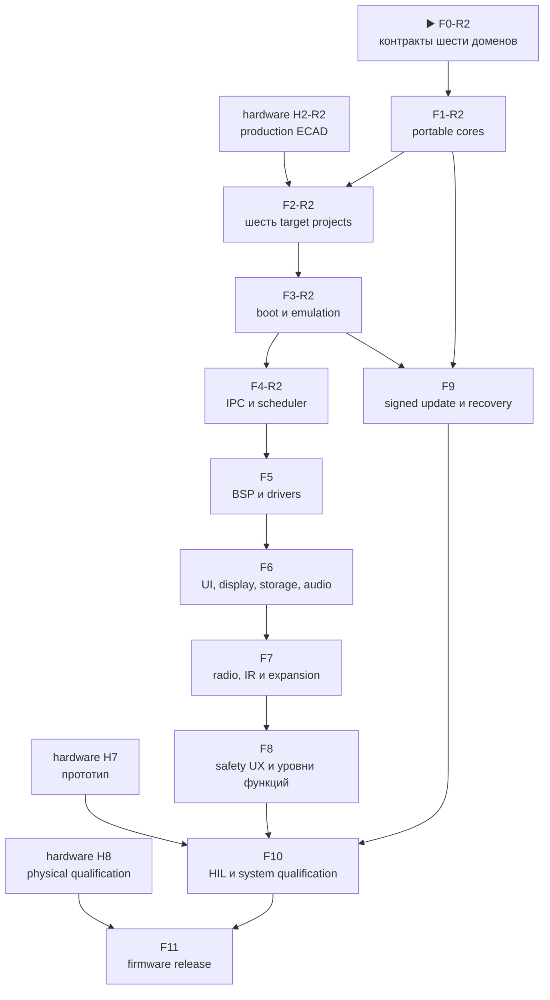

# Leshy2 firmware — роадмап до release

[English](roadmap.md) · [На главную](../README.ru.md) ·
[Аппаратный роадмап](https://github.com/anton-vinogradov/esp32-leshy2/blob/main/docs/roadmap.ru.md)

> **▶️ Текущая граница: F0-R2.0 — пересборка контракта шести доменов.**
> Работа F0–F4 R1 сохранена как regression evidence, а не текущая топология.
> Железо находится на H1-R2.2; инкрементальное размещение Hub/Airband/FPV и
> закрытие точных MMCX/LDO
> проходит проверки коллизий, но полного rail, BSP и layout R2 ещё нет.

Последняя сверка статуса: **27 августа 2026 года**. Это собственный роадмап
firmware-репозитория. Пересечения с железом указаны явно, но hardware-этапы не
дублируются и не получают здесь нового статуса.

## Где находится прошивка

| Область | Фактическое состояние |
|---|---|
| HW↔FW projection шести доменов | ▶️ Сгенерирован из H0-R2 и связан с hardware SHA-256; части memory/update/build/HIL остаются открыты |
| Portable safety, L2IP и update model | ⏳ [Итог F1 R1](f1-portable-cores-report.ru.md) сохранён: 24 детерминированных C-сценария; Hub/Airband и six-target rerun ожидают закрытия F0-R2 |
| Проекты S3/C5/RF-RP/Hub-RP/Pack/Safety | ⏳ Пять структур R1 сохранены; target Hub и six-image matrix ещё не собраны |
| Target builds, maps и S3 QEMU | ⏳ Evidence F2/F3 R1 сохранено, но не квалифицирует топологию R2 |
| Пересечение с железом | ▶️ H0-R2 проведено ревью, H1-R2.2 сейчас; placement Hub/Airband/FPV и точные MMCX/LDO проходят, полные placement, power и production-схема R2 открыты |
| C5, оба RP2354B и MSPM0 platform/dev-board tests | 🔒 Точный target boot/peripherals ожидает R2 build matrix и hardware |
| Меню, waterfall, storage, audio и radio features | ⏳ Описаны как целевой продукт, production-кода ещё нет |
| Полный подписанный all-in-one update | ⏳ Portable rollback-модель есть; target boot/flash/signature integration отсутствует |
| HIL и release | 🔒 Ожидают аппаратный прототип H7 |

Host-модель проверяет переносимую логику, но не заменяет instruction-set,
peripheral или board emulation и никогда не показывается как готовая прошивка.

## Детальный состав текущей F0-R2

<!-- current-substep: F0-R2.0 -->

▶️ **`F0-R2.0` — сейчас.** Пересобрать полный firmware-контракт вокруг
шести targets и Hub-centered топологии. Этот точный маркер уже содержит
ownership доменов, бюджеты S3/Hub, transports, прямые display/FPV, receive-only
Airband и power rebaseline. F0-R2 ещё должен закрыть ownership memory/rollback,
порядок six-image update, identities targets и emulator/dev-board gates.
Маркер и evidence меняются вместе в каждом commit.

<strong>Сохранённый состав F2–F4 R1 — не текущая топология</strong>

- `F2.0` — target/toolchain matrix.
  - ✅ `F2.0.0` — зарегистрированы пять target и их flash, RAM и rollback
    contracts.
  - ✅ `F2.0.1` — точные SDK/toolchain versions, first-party support status,
    lifecycle, license и требования к build host для S3, C5, RP2354B и обоих
    MSPM0 images прошли ревью.
  - ✅ `F2.0.2` — неизменяемые SDK revisions, 26 записей URL/SHA-256 архивов
    для канонических local/CI hosts и ESP-IDF Python environment с hash-lock
    прошли ревью.
  - ✅ `F2.0.3` — единая [local/CI matrix и shell-free dispatcher](toolchains.ru.md),
    fail-closed preflight и 26 названных target artifacts прошли ревью.
- `F2.1` — общее дерево source/components, warning policy и границы generated
  files без выдуманных target pins.
  - ✅ `F2.1.0` — [каталоги и единоличное владение](toolchains.ru.md),
    target-neutral portable code и пустая до F2.3 граница generated sources
    прошли ревью.
  - ✅ `F2.1.1` — строгие C17/C++17, warnings-as-errors для project code,
    debug/release optimization и link policy с map-файлом прошли ревью.
  - ✅ `F2.1.2` — единым прогоном прошли environment, source, build-policy,
    H2-contract и 24 host-сценария.
- `F2.2` — минимальные production-SDK projects для всех пяти образов.
  - ✅ `F2.2.0` — S3 ESP-IDF project, portable component, production memory
    defaults и debug/release inputs прошли структурное ревью.
  - ✅ `F2.2.1` — C5 ESP-IDF project, portable component, production memory
    defaults и debug/release inputs прошли структурное ревью.
  - ✅ `F2.2.2` — точный RP2354B Arm-secure project, custom board на 2 МиБ,
    partition input и debug/release policy прошли структурное ревью.
  - ✅ `F2.2.3` — Pack MSPM0C1106 project, раздельные boot/application images,
    memory boundaries и debug/release policy прошли структурное ревью.
  - ✅ `F2.2.4` — Safety MSPM0C1106 project, раздельные boot/application images,
    fail-closed entry и debug/release policy прошли структурное ревью.
  - ✅ `F2.2.5` — единое ревью прошло для пяти projects, 37 файлов,
    26 artifacts и 20 debug/release command plans без target execution.
- `F2.3` — импорт принятого генерируемого pin/BSP contract.
  - ✅ `F2.3.0` — неизменяемая H2 source identity, 5 domains, 125 contacts,
    112 nets, 4 transports, 10 groups и модель proof fields прошли ревью.
  - ✅ `F2.3.1` — 11 generated C/header files сохраняют все 125 contacts,
    проходят строгий C17 syntax-check и побайтно воспроизводятся по manifest.
  - ✅ `F2.3.2` — каждый target потребляет ровно свою domain table и include
    path; чужих таблиц, BSP-копий и ручных pins не найдено.
  - ✅ `F2.3.3` — sibling H2, детерминированная генерация, строгие C17 tables и
    one-owner consumption прошли единое ревью.
- `F2.4` — воспроизводимые debug/release builds, map files и image-size gates.
  - ✅ `F2.4.0` — locked-toolchain preflight пяти targets прошёл ревью.
    - ✅ `F2.4.0.1` — точные sources/revisions ESP-IDF `v6.0.2`, Pico
      SDK/picotool `2.3.0` и TI MSPM0 SDK `2.11.00.07` прошли ревью.
    - ✅ `F2.4.0.2` — установлены и распознаны ESP-IDF tool manager точные
      S3/C5 compilers, debuggers, ULP tools, OpenOCD и ROM ELFs прошли ревью.
    - ✅ `F2.4.0.3` — hash-locked Python 3.12 environment и точные CMake/Ninja
      прошли ревью; evidence — [`config/f2_4_preflight_progress.json`](../config/f2_4_preflight_progress.json).
    - ✅ `F2.4.0.4` — hash-verified native Arm GNU `15.2.Rel1` прошёл ревью для RP2354B.
    - ✅ `F2.4.0.5` — hash-verified TI Arm Clang `4.0.5.LTS` и SysConfig
      `1.28.0.4712` прошли ревью для Pack/Safety.
    - ✅ `F2.4.0.6` — прошли 30 точных проверок SDK, Git, lock, compiler и
      обязательных входов плюс debug/release dispatcher preflight; [машинный evidence](../config/f2_4_preflight_review.json).
  - ✅ `F2.4.1` — S3 debug/release configure, build, наличие десяти artifacts
    и image-size gates прошли ревью; [машинный evidence](../config/f2_4_s3_build_review.json).
  - ✅ `F2.4.2` — C5 debug/release configure, build, наличие десяти artifacts
    и image-size gates прошли ревью; [машинный evidence](../config/f2_4_c5_build_review.json).
  - ✅ `F2.4.3` — RP debug/release configure, build, наличие восьми artifacts
    и image-size gates прошли ревью; [машинный evidence](../config/f2_4_rp_build_review.json).
  - ✅ `F2.4.4` — Pack debug/release configure, build, наличие двенадцати
    artifacts и image-size gates прошли ревью; [машинный evidence](../config/f2_4_pack_build_review.json).
  - ✅ `F2.4.5` — Safety debug/release configure, build, наличие двенадцати
    artifacts и image-size gates прошли ревью; [машинный evidence](../config/f2_4_safety_build_review.json).
  - ✅ `F2.4.6` — все 52 debug/release artifacts, 14 maps и 10 image-size gates
    прошли единое ревью; [машинный evidence](../config/f2_4_build_review.json).
- ✅ `F2.5` — два полных чистых прохода дали 52/52 побайтно идентичных
  artifacts; в 24 распространяемых образах нет абсолютного workspace path.
  См. [итог F2](f2-target-build-system-report.ru.md) и
  [машинный evidence](../config/f2_5_reproducibility_review.json).
- `F3.0` — контракт runtime evidence.
  - ✅ `F3.0.0` — официальная поддержка emulator/simulator, instruction
    coverage, наблюдаемость boot и неизбежные dev-board gates всех пяти targets
    прошли ревью: точный vendor QEMU есть только для S3;
    [машинная матрица](../config/f3_execution_capability_matrix.json).
  - ✅ `F3.0.1` — точные hash-locked QEMU archives, debug/release recipes,
    шесть последовательных boot markers, 30-секундный timeout и fail-closed
    result contract прошли ревью; [машинный план](../config/f3_runtime_plan.json).
  - ✅ `F3.0.2` — матрица evidence пяти targets и единый fail-closed runner
    прошли ревью без запуска target; [машинная матрица](../config/f3_acceptance_matrix.json).
- ✅ `F3.1` — S3 debug и release skeletons прошли по шесть последовательных
  markers в точном Espressif QEMU, включая инициализацию и memory test 8-МиБ
  octal PSRAM; [debug evidence](../config/f3_1_s3_debug_runtime_review.json) и
  [release evidence](../config/f3_1_s3_release_runtime_review.json).
- ✅ `F3.2` — S3 debug/release прошли по девять markers для boot, self-test,
  retained-first-fault и failed-update RAM rollback; ещё 24 portable-сценария
  прошли ASan/UBSan. Nonvolatile persistence и flash rollback этим не заявлены;
  [сводный evidence](../config/f3_2_runtime_review.json).
- ✅ `F3.3` — новый двойной clean-build воспроизвёл 52/52 artifacts; десять
  актуальных image/RAM gates и пять статических rollback topologies помещаются.
  S3 debug занимает 187 040 байт с запасом 6 890 848 байт до maximum; физических
  rollback transitions заявлено ноль. См.
  [boundary evidence](../config/f3_3_boundary_review.json).
- ✅ `F3.4` — [глобальный итог F3](f3-boot-memory-emulation-report.ru.md)
  закрывает фазу точным S3 execution, 52 воспроизводимыми artifacts и пятью
  названными физическими target/HIL gates.
- `F4.0` — зафиксировать план исполнения и evidence transports.
  - ✅ `F4.0.0` — [проведены четыре transport и восемь точных SDK endpoint bindings](../config/f4_0_transport_capability_matrix.json); QEMU не исполняет ни один их PHY.
  - ✅ `F4.0.1` — [проведены единый fail-closed lifecycle, фиксированные ownership/queues, credits, duplicates, deadlines, reset и точный ESSL lock](../config/f4_0_1_adapter_contract.json).
  - ✅ `F4.0.2` — [проведены единый runner, шесть классов evidence и 37 сценариев](../config/f4_0_2_acceptance_matrix.json); [baseline snapshot](../config/f4_0_2_acceptance_snapshot.json) заявляет ноль transport runs.
- `F4.1` — реализовать и исполнить SDIO S3↔C5.
  - ✅ `F4.1.0` — [проведены точный offline payload ESSL 1.1.2 и single-owner source boundary S3↔C5](../config/f4_1_s3_c5_source_boundary.json); [manifest 30 файлов](../third_party/esp_serial_slave_link.vendor-lock.json).
  - ✅ `F4.1.1` — [проведён общий high-speed core](../config/f4_1_1_high_speed_core_review.json): 19 сценариев ASan/UBSan; unsafe absolute-credit draft заменён накопительными duplicate-safe grants.
  - ✅ `F4.1.2` — [проведены endpoints S3 host и C5 SDIO slave](../config/f4_1_2_s3_c5_endpoint_review.json): generated pins, однобитный SDIO 20 МГц, точный ESSL и две locked debug builds; QEMU/PHY claims — ноль.
  - ✅ `F4.1.3` — [проведены exact builds и fake-SDIO QEMU](../config/f4_1_3_s3_c5_qemu_review.json): четыре target builds, два S3 QEMU runs, по шесть сценариев и ноль PHY claims.
  - ▶️ **`F4.1.4` — сейчас:** выполнить и провести ревью физического dev-board gate S3-C5.
- `F4.2` — реализовать и исполнить SPI+alert S3↔RP.
- `F4.3` — реализовать и исполнить I²C mailboxes Pack/Safety.
- `F4.4` — внедрить saturation, duplicate, deadline, reset и link-loss faults.
- `F4.5` — свести target evidence и опубликовать глобальный итог F4.

F3 прошла ревью на честной границе evidence. Теперь F4 превращает принятые
message contracts в реальные target transports, сохраняя приоритет
safety/control под waterfall и bulk traffic. Каждый подэтап обновляет evidence,
точный маркер и обе языковые страницы в одном commit.

## Зависимости

## Полный путь прошивки

| Этап | Статус | Результат | Критерий выхода |
|---|---|---|---|
| **F0. Контракты продукта** | ▶️ Сейчас: F0-R2.0 | Шесть доменов, Hub-centered transports, ownership, pins, memory/partition, safety, update и HW↔FW boundary | Оба репозитория согласованы; нет неизвестного target, transport, recovery path или обязательного state; evidence R1 явно историческое |
| **F1. Portable cores** | ⏳ Ожидает F0-R2 | Переиспользовать [итог F1 R1](f1-portable-cores-report.ru.md), добавить Hub/Airband states и six-domain fault model | Normal и ASan/UBSan сценарии покрывают новые heartbeat, lease, receiver-mode и update ownership |
| **F2. Target-проекты и build system** | ⏳ Ожидает F1-R2 и hardware H2-R2 | Шесть projects на production SDK: ESP-IDF S3/C5, Pico SDK RF/Hub RP2354B и TI MSPM0 SDK ×2; generated BSP R2 | 12 debug/release configurations воспроизводятся; каждый target потребляет только свои generated R2 pins |
| **F3. Boot, память и эмуляция** | ⏳ Ожидает F2-R2 | Повторная квалификация S3 QEMU, artifacts шести targets, size/memory/rollback и физических gates | Шесть образов укладываются и воспроизводятся; отсутствующая периферия и non-S3 execution остаются dev-board gates |
| **F4. IPC и scheduling** | ⏳ Ожидает F3-R2 | S3↔Hub quad-SPI, Hub↔C5 SDIO, Hub↔RF-RP SPI+alert и Hub↔Pack/Safety I²C | CRC/replay/deadline/duplicate/reset recovery работают end-to-end; display/UI локальны, safety/control вытесняет bulk traffic |
| **F5. BSP и drivers** | ⏳ Ожидает F4 и актуальную схему | Драйверы display/touch, microSD, codec, receiver, detect CTIA-разъёма, управление источником гарнитуры по `0x39`, IR, 3×nRF24, CC, voice, U214, M5 Unit, controls, LEDs, sensors и power states | Каждый driver имеет fake/host boundary и target smoke test; reset/off/no-back-power/quiet transitions явны; P02 остаётся только входом, проверены reset/readback селектора и семь резервных pins; неподдерживаемая эмулятором периферия имеет dev-board test |
| **F6. UI, display, storage и audio** | ⏳ Ожидает F5 | Меню, dirty-region QSPI rendering, бегущий waterfall, touch/D-pad/keys/encoder/PTT, запись, CTIA/TRS playback/capture state machine и fault viewer | UI остаётся отзывчивым под максимальным потоком; малые области укладываются в display occupancy budget; вставка сначала отключает динамик, источник меняется без pop, извлечение восстанавливает reset-default до playback; storage/audio ошибки изолированы, причина аварии сохраняется и показывается |
| **F7. Radio, IR и expansion features** | ⏳ Ожидает F5/F6 | Normal-mode receive/scan/record, полноценные `3R/1T2R/2T1R/3T`, Wi-Fi/BLE/802.15.4, Sub-GHz, voice, IR и профили расширений | Одна signal group активна; три nRF работают одновременно без программного урезания; inactive interfaces quiet; права, регион и antenna profile проверяются до TX |
| **F8. Три уровня функций и safety UX** | ⏳ Ожидает F7 | Основной режим, Лаборатория и Лаборатория → Контролируемая зона; локальная настройка интервала полной самопроверки | Каждый вход в Controlled Zone показывает новый обязательный баннер; действие требует preview, separate arm, разрешённую цель/изолированную среду и bounded lease; установка требует принятия акта о ненападении; выбор 24 ч/48 ч по умолчанию/только при старте не может ослабить watchdog, thermal, power-fault или TX-lease enforcement |
| **F9. Signed bundle, update и recovery** | ⏳ Ожидает F1/F3 | Один owner/release-signed bundle для шести targets с local owner roots, readback, activation order и rollback | Подмена и несовместимый bundle отвергаются; Pack→Safety→C5→RF-RP→Hub-RP→S3 подтверждаются self-test; сбой возвращает совместимый комплект; USB/UART/SWD recovery остаётся открытым владельцу |
| **F10. HIL и системная квалификация** | 🔒 Ожидает F4–F9 и hardware H7 | Автоматизированные тесты на собранном прототипе, fault injection, RF/power/thermal/endurance | Пройдены реальные transports/peripherals, 3×nRF concurrency, quiet-state, watchdog, thermal, brownout и update interruption; USB endurance 24/48 ч и измерения от батарей до protected cutoff являются evidence, а не обещанием времени работы |
| **F11. Firmware release** | 🔒 Ожидает F10 и hardware H8 | Воспроизводимые образы, installer, release notes, recovery kit и совместимый тег | Ноль blocker; target binaries воспроизводимы и подписаны; SBOM/licenses/tests опубликованы; сайт описывает реализованные возможности; firmware tag совместим с hardware release |

## Правила продвижения

1. Прошивка не придумывает GPIO, polarity, rail или recovery path: они приходят
   из принятого hardware-контракта.
2. Portable core используется всеми target, а не переписывается шесть раз.
3. То, что QEMU/host не моделирует, не считается проверенным и переносится в
   dev-board/HIL matrix.
4. Любая потенциально опасная функция сначала получает permission, evidence,
   revoke и fault tests; UI не может обойти hardware `FAULT_KILL`.
5. Статус **«Проведено ревью»** открывается повторно, если target или HIL
   обнаруживает несоответствие.
6. Закрытие каждой глобальной фазы `F*` публикует двуязычный итоговый отчёт и
   ссылку из таблиц roadmap и стартовой страницы. Внутренний подэтап обновляет
   точный текущий маркер, но отдельным глобальным отчётом не считается.

## Следующее действие

Текущая граница — `F0-R2.0`. Нужно закрыть machine-readable части memory,
rollback, six-image activation и execution gates R2, затем строго перейти
F1→F2→F3. Target matrix R1 и S3 QEMU runs остаются полезным regression evidence,
но не квалифицируют добавленный Hub и изменённые transports.
