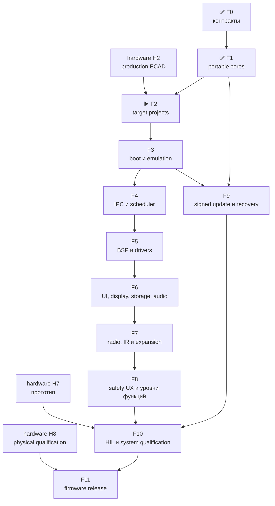

# Leshy2 firmware — роадмап до release

[English](roadmap.md) · [На главную](../README.ru.md) ·
[Аппаратный роадмап](https://github.com/anton-vinogradov/esp32-leshy2/blob/main/docs/roadmap.ru.md)

> **▶️ Текущая граница: F2 — target-проекты и воспроизводимая сборка.** F0 и
> F1 прошли ревью. Начало target/BSP-реализации зависит от актуальной
> production ECAD-схемы hardware H2, которой пока нет. Ни один target-образ и
> ни один target-эмулятор ещё не запускались.

Последняя сверка статуса: **23 августа 2026 года**. Это собственный роадмап
firmware-репозитория. Пересечения с железом указаны явно, но hardware-этапы не
дублируются и не получают здесь нового статуса.

## Где находится прошивка

| Область | Фактическое состояние |
|---|---|
| Контракты пяти доменов, memory/rollback и HW↔FW boundary | ✅ Проведено ревью на уровне архитектуры и конфигураций |
| Portable safety, L2IP, update и five-domain model | ✅ Проведено ревью: 24 детерминированных C-сценария; ASan/UBSan чистые |
| Target-проекты S3/C5/RP/Pack/Safety | ▶️ F2; ещё не созданы |
| Target-сборки и map-файлы | ⏳ Не выполнялись |
| ESP32-S3 QEMU | ⏳ Не запускался |
| C5, RP2354B и MSPM0 platform/dev-board tests | 🔒 Ожидают target BSP и hardware |
| Меню, waterfall, storage, audio и radio features | ⏳ Описаны как целевой продукт, production-кода ещё нет |
| Полный подписанный all-in-one update | ⏳ Portable rollback-модель есть; target boot/flash/signature integration отсутствует |
| HIL и release | 🔒 Ожидают аппаратный прототип H7 |

Host-модель проверяет переносимую логику, но не заменяет instruction-set,
peripheral или board emulation и никогда не показывается как готовая прошивка.

## Детальный состав текущей F2

<!-- current-substep: F2.0.1 -->

**Точный маркер: `F2.0.1`** — проверить и зафиксировать поддерживаемую
production-версию SDK и toolchain для каждого из пяти target. Варианты из
архивных документов остаются лишь кандидатами до проверки по актуальным
первоисточникам.

- `F2.0` — target/toolchain matrix.
  - ✅ `F2.0.0` — зарегистрированы пять target и их flash, RAM и rollback
    contracts.
  - ▶️ **`F2.0.1` — сейчас:** проверить точные SDK/toolchain versions,
    first-party support status, lifecycle, license и требования к build host
    для S3, C5, RP2354B и обоих MSPM0 images.
  - ⏳ `F2.0.2` — создать воспроизводимые environment manifests, checksums и
    dependency locks без молчаливо плавающих версий.
  - ⏳ `F2.0.3` — определить единую local/CI matrix и канонические команды
    configure, build, clean и получения artifacts.
- ⏳ `F2.1` — общее дерево source/components, warning policy и границы
  generated files без выдуманных target pins.
- ⏳ `F2.2` — минимальные production-SDK projects для S3, C5, RP, Pack и
  Safety.
- 🔒 `F2.3` — импорт генерируемого pin/BSP contract; заблокирован до hardware
  H2.
- ⏳ `F2.4` — воспроизводимые debug/release builds, map files и image-size
  gates для всех пяти target.
- ⏳ `F2.5` — ревью evidence F2; только после него начинается F3 boot/emulation.

`F2.0.1` завершается, когда для каждого target названы актуальный first-party
source, точная поддерживаемая version toolchain, host requirements, license и
известные platform limits. Закрытие любой подзадачи требует в том же commit
изменить точный маркер на стартовой странице и в роадмапе до перехода дальше.

## Зависимости

## Полный путь прошивки

| Этап | Статус | Результат | Критерий выхода |
|---|---|---|---|
| **F0. Контракты продукта** | ✅ Проведено ревью | Пять доменов, владельцы функций, L2IP, memory/partition, safety, update и HW↔FW boundary | Конфигурации обоих репозиториев совпадают; нет неизвестного target, транспорта, recovery-пути или обязательного состояния |
| **F1. Portable cores** | ✅ Проведено ревью | C-реализация safety state machine, CRC/L2IP, replay guard, atomic update/rollback, priority queues и five-domain fault model | 24 сценария проходят обычную сборку и ASan/UBSan; закрыты обнаруженные ошибки heartbeat, lease boundary, late update и invalid enum |
| **F2. Target-проекты и build system** | ▶️ Текущая граница; зависит от hardware H2 | Пять минимальных проектов на production SDK: ESP-IDF S3/C5, Pico SDK RP2354B и TI MSPM0 SDK ×2 | Все проекты воспроизводимо конфигурируются; pin/BSP source генерируется из принятого HW-контракта; CI строит debug/release; никаких временных pin assignments |
| **F3. Boot, память и эмуляция** | ⏳ Ожидает F2 | Загружаемые skeleton images, map/size gates и максимально доступная виртуальная проверка | S3 boot/self-test/fault/update-failure проходит официальный QEMU; все пять ELF/bin укладываются в flash/RAM/rollback; shared code проходит host platform; отсутствующая периферия попадает в dev-board matrix |
| **F4. IPC и scheduling** | ⏳ Ожидает F3 | Реальные SDIO S3↔C5, SPI+alert S3↔RP, I²C mailboxes Pack/Safety, typed results, credits и priority queues | CRC/replay/deadline/duplicate/reset recovery работают end-to-end; waterfall/bulk saturation не задерживает safety/control; link loss локально закрывает side effects |
| **F5. BSP и drivers** | ⏳ Ожидает F4 и актуальную схему | Драйверы display/touch, microSD, codec, receiver, IR, 3×nRF24, CC, voice, U214, M5 Unit, controls, LEDs, sensors и power states | Каждый driver имеет fake/host boundary и target smoke test; reset/off/no-back-power/quiet transitions явны; неподдерживаемая эмулятором периферия имеет dev-board test |
| **F6. UI, display, storage и audio** | ⏳ Ожидает F5 | Меню, dirty-region QSPI rendering, бегущий waterfall, touch/D-pad/keys/encoder/PTT, запись, playback/capture и fault viewer | UI остаётся отзывчивым под максимальным потоком; малые области укладываются в display occupancy budget; storage/audio ошибки изолированы; безопасная причина аварии сохраняется и показывается |
| **F7. Radio, IR и expansion features** | ⏳ Ожидает F5/F6 | Normal-mode receive/scan/record, полноценные `3R/1T2R/2T1R/3T`, Wi-Fi/BLE/802.15.4, Sub-GHz, voice, IR и профили расширений | Одна signal group активна; три nRF работают одновременно без программного урезания; inactive interfaces quiet; права, регион и antenna profile проверяются до TX |
| **F8. Три уровня функций и safety UX** | ⏳ Ожидает F7 | Основной режим, Лаборатория и Лаборатория → Контролируемая зона | Каждый вход в Controlled Zone показывает новый обязательный баннер; действие требует preview, separate arm, разрешённую цель/изолированную среду и bounded lease; установка требует принятия акта о ненападении |
| **F9. Signed bundle, update и recovery** | ⏳ Ожидает F1/F3 | Один owner/release-signed bundle для пяти target с local owner roots, readback, activation order и rollback | Подмена и несовместимый bundle отвергаются; Pack→Safety→C5→RP→S3 подтверждаются self-test; сбой возвращает совместимый комплект; USB/UART/SWD recovery остаётся открытым владельцу |
| **F10. HIL и системная квалификация** | 🔒 Ожидает F4–F9 и hardware H7 | Автоматизированные тесты на собранном прототипе, fault injection, RF/power/thermal/endurance | Пройдены реальные transports/peripherals, 3×nRF concurrency, quiet-state, watchdog, thermal, brownout, update interruption, длительная работа 24–48 ч и безопасное восстановление |
| **F11. Firmware release** | 🔒 Ожидает F10 и hardware H8 | Воспроизводимые образы, installer, release notes, recovery kit и совместимый тег | Ноль blocker; target binaries воспроизводимы и подписаны; SBOM/licenses/tests опубликованы; сайт описывает реализованные возможности; firmware tag совместим с hardware release |

## Правила продвижения

1. Прошивка не придумывает GPIO, polarity, rail или recovery path: они приходят
   из принятого hardware-контракта.
2. Portable core используется всеми target, а не переписывается пять раз.
3. То, что QEMU/host не моделирует, не считается проверенным и переносится в
   dev-board/HIL matrix.
4. Любая потенциально опасная функция сначала получает permission, evidence,
   revoke и fault tests; UI не может обойти hardware `FAULT_KILL`.
5. Статус **«Проведено ревью»** открывается повторно, если target или HIL
   обнаруживает несоответствие.

## Следующее действие

Текущая граница — F2. До hardware H2 можно подготовить только воспроизводимую
структуру проектов и CI без выдуманных pin/BSP details. Фиксация target BSP и
реальный emulator run начинаются после принятой production ECAD-схемы.
