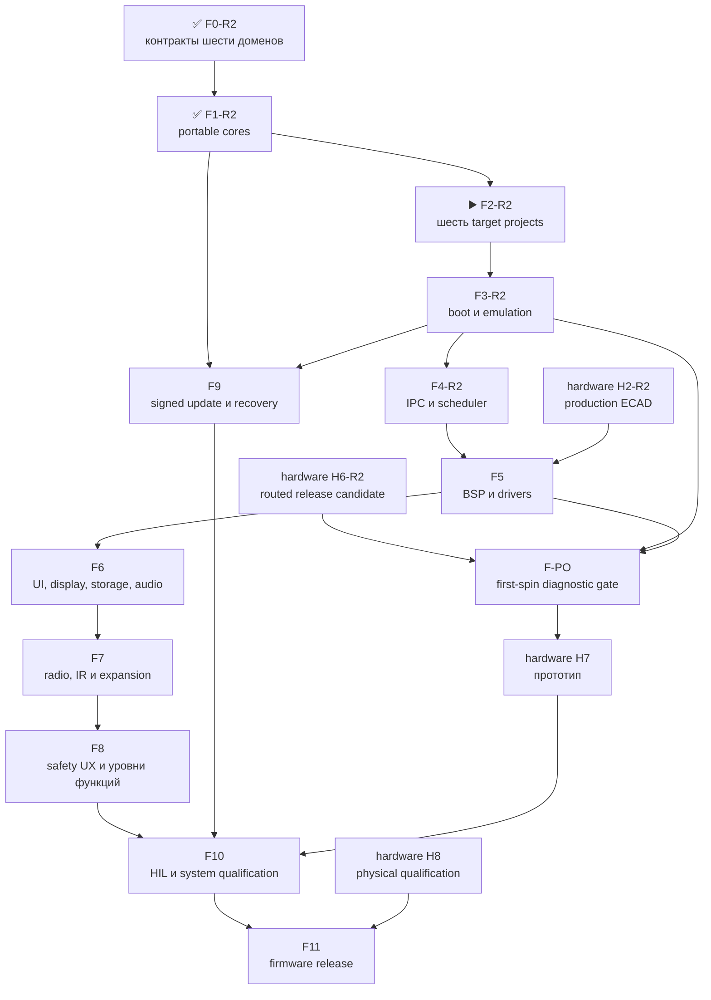

# Leshy2 firmware — роадмап до release

[English](roadmap.md) · [На главную](../README.ru.md) ·
[Аппаратный роадмап](https://github.com/anton-vinogradov/esp32-leshy2/blob/main/docs/roadmap.ru.md)

> **▶️ Текущая граница: F2-R2.5 — квалификация воспроизводимости.**
> Работа F0–F4 R1 сохранена как regression evidence, а не текущая топология.
> Физическое железо находится на H1-R2.36 и готово к визуальному принятию компоновки; точной импортированной pin/config
> authority остаётся прошедший ревью артефакт H1-R2.31. Locality-first
> размещение двух плат, фильтр Airband, архитектура 3V3_MAIN 3,75 А continuous /
> 4,25 А step, точный дисплей и все корпуса U219 проходят текущие структурные
> проверки. Реестр из 226 тел также содержит все восемь точных TX-детекторов,
> пять coupler и восемь ограниченных локальных evidence-островов без изменения
> видимого прошивке контракта. Бортовой видеоприёмник, декодер, разъём и требующая ручной пайки зона
> модуля удалены; 11 GPIO S3, 8 GPIO заднего RP и два контакта M1 остаются
> резервами. Внешние, прямые внутренние после переворота плат и сервисные виды
> сгенерированы. H1 всё ещё требует явного принятия мокапа и не разрешает ECAD
> или заказ.

Последняя сверка статуса: **28 августа 2026 года**. Это собственный роадмап
firmware-репозитория. Пересечения с железом указаны явно, но hardware-этапы не
дублируются и не получают здесь нового статуса.

## Где находится прошивка

| Область | Фактическое состояние |
|---|---|
| HW↔FW projection шести доменов | ✅ [F0-R2 проведено ревью](f0-product-contracts-report.ru.md): source H0-R2 связан hash; identities, local rollback, S3-last update и пять слоёв execution gates согласованы |
| Portable safety, L2IP и update model | ✅ [F1-R2 проведено ревью](f1-portable-cores-report.ru.md): 34 сценария R2 проходят normal+sanitizer runs; six-domain update, Airband заднего RP и integrated faults актуальны |
| Политика опционального U219 Cap | 🧪 [Host policy реализована](../config/u219_cap_policy.json): исполняются подписанные взаимоисключающие профили U214/U219, fail-low power/direction sequence, режимы общей SPI, RX-only firewall CC1101 и allowlist NFC poll/read; генерация поля `EV_N9` остаётся заблокированной compile/runtime до VNA/HIL |
| Проекты S3/C5/RF-RP/Hub-RP/Pack/Safety | ✅ F2-R2.2: [шесть production-SDK roots проведены ревью](../config/f2_r2_target_projects.json); RF-RP и Hub-RP используют разные pin-free Pico SDK trees, entries и image identities |
| Владение generated BSP R2 | ✅ F2-R2.3 обновлён на F2-R2.4: [шесть детерминированных доменов H1-R2.31](../config/f2_r2_bsp_generation.json) содержат точные карты S3 и двух RP плюс шесть фиксированных C5 SDIO pins; [у каждого один SDK owner](../config/f2_r2_bsp_consumption.json), а сохранённый BSP пяти доменов только исторический |
| Authority R2 и production H2 | 🔒 [Fail-closed gate](../config/r2_h2_sync_gate.json): точные рабочие карты двух RP и C5 4-bit mux импортированы как pre-H2 authority, но сохранённый H2.0.3 — исторический R1 и не авторизует R2; открыть только после six-domain H2 export и закрытия production gates mux/latch |
| Target builds, maps и S3 QEMU | ▶️ F2-R2.5: [F2-R2.4](../config/f2_r2_build_qualification.json) прошёл все 12 locked debug/release builds, 60 artifacts, 16 maps и 16 size gates; остаются два чистых побайтно идентичных прохода, а S3 QEMU остаётся F3-R2 |
| Пересечение с железом | ▶️ H0-R2 проведено ревью, физический H1-R2.36 геометрически завершён и ожидает визуального принятия, а импортированной machine pin/config authority остаётся H1-R2.31; точная легальная fixed-mux карта двух RP даёт задний I2C0 на GP4/5, независимый Cap I2C1 на GP30/31 и M5-профиль PIO2 на GP7/8; десять SMA разделены 5+5; прямой i8080-8 24 МГц к `ER-TFT035IPS-6` + `ER-TPC035-6` остаётся локален S3, шлейф направлен к антенному торцу, поэтому F5/F6 разворачивают память ILI9488 и touch-координаты FT6236 на 180°; 11 GPIO S3 остаются резервами, а точный M1 на 80 контактов содержит 24 сигнала, 24 возврата и 16 настоящих NC; модель из 226 тел включает все 18 компонентов U219, NFC-loop, swept volume штатной антенны, восемь точных TX-детекторов, пять coupler и восемь локальных evidence-островов |
| C5, оба RP2354B и MSPM0 platform/dev-board tests | 🔒 Точный target boot/peripherals ожидает R2 build matrix и hardware |
| Меню, waterfall, storage, audio и radio features | ⏳ Описаны как целевой продукт, production-кода ещё нет |
| Полный подписанный all-in-one update | ⏳ Portable rollback-модель есть; target boot/flash/signature integration отсутствует |
| Допуск первого экземпляра `F-PO` | 🔒 [Machine gate запланирован и заблокирован](../config/first_spin_preorder_gate.json): ждёт финальные H2/H6 hash и `FPO1`–`FPO7`; полные F6–F8 не являются условием заказа |
| HIL и release | 🔒 Ожидают аппаратный прототип H7 |

Host-модель проверяет переносимую логику, но не заменяет instruction-set,
peripheral или board emulation и никогда не показывается как готовая прошивка.

## Допуск ровно одного первого экземпляра · `F-PO`

`F-PO-R2` — отдельный fail-closed стык аппаратного и firmware-роадмапов, а не
новая заявка о готовности. Фабрика должна детерминированно изготовить и собрать
**ровно одного** `R2-EVT1` по неизменяемому production package, включая точный
серийный дисплей и явно назначенные операции финальной сборки. Платный powered
Function Test не является пререквизитом; его можно добавить только как
необязательную страховку, если итоговая смета делает его почти бесплатным.
Первое полное включение выполняет владелец после доставки.

У F-PO есть жёсткая зависимость от предзаказного подмножества F5, а не от
завершения всех пользовательских функций: диагностический срез драйверов должен
покрывать каждого установленного endpoint из точного H2 manifest. Для каждого
нужны явные present/missing behavior в fake-HAL и diagnostic smoke evidence на
каждом доступном target или dev-board path. Недоступная реальная периферия
остаётся именованным gate первого экземпляра; эмуляция не закрывает его молча.

| Gate | Что обязано существовать до разрешения заказа |
|---|---|
| `FPO1` | Финальные hash H2/H6 и импортированный six-domain BSP: pins, polarity, rails, fitted options и recovery; ни рабочая pre-H2 карта, ни R1 не являются authority |
| `FPO2` | Воспроизводимые диагностические образы S3, C5, Hub-RP, RF-RP, Pack и Safety включают предзаказный срез F5 для каждого установленного endpoint и имеют проверенный partition fit |
| `FPO3` | Точный S3 diagnostic image загружается в официальный QEMU и проходит memory, retained-fault, diagnostic-menu и framebuffer test-pattern сценарии без ложных claims о реальном display/touch/USB |
| `FPO4` | Normal+sanitizer host/fake-HAL проверяет каждый установленный endpoint, UI, controls, ориентацию display/touch, present/missing identities, link/power/thermal faults и fail-closed останов |
| `FPO5` | Диагностический срез имеет smoke evidence на каждом доступном пути: S3, C5, Pack и Safety используют exact dev boards, оба RP — явно неточный RP2350 surrogate, а недоступная периферия и RP2354B/package/flash/PCB остаются gates первого экземпляра |
| `FPO6` | Один hash-manifested flash/recovery bundle описывает USB/UART/SWD, identity, порядок образов, readback, retry и unbrick для всех шести доменов |
| `FPO7` | Скрипт первого включения сначала проверяет rails/faults при ограниченном токе, затем programming/recovery, четыре transport, display pattern/touch grid, controls/LEDs, storage, audio и identity/IRQ установленных устройств; у каждого сбоя есть безопасный stop |

Полные menu/waterfall, каталог radio-функций и три уровня UX из F6–F8 могут
развиваться после заказа. До заказа обязательны именно диагностические срезы,
которые позволяют отличить ошибку питания, монтажа, шины, периферии и прошивки.
Эмуляция доказывает builds, S3 CPU/memory/control flow, UI/state machines,
protocol/fault behavior и полноту bring-up package. Она не доказывает пайку,
питание и тепло реальной платы, electrical margins USB/SDIO/SPI/I²C,
display/flex/touch, RF/антенны, analog audio/IR или механический fit — эти
границы честно остаются первому физическому экземпляру.

## Детальный состав текущей F2-R2

<!-- current-substep: F2-R2.5 -->

▶️ **`F2-R2.5` — сейчас.** Атомарный
[evidence F2-R2.4](../config/f2_r2_build_qualification.json) фиксирует 12
успешных configure/build jobs шести production-SDK roots, 60 проверенных
artifacts, 16 maps и 16 пройденных size gates без warnings. Результат доказывает
компиляцию, линковку и статическую помещаемость с точным BSP R2; он не доказывает
byte reproducibility, target boot, peripherals, emulation или физическое железо.
Теперь нужно выполнить два чистых прохода и побайтно сравнить каждый объявленный
artifact. Двуязычный итог F2-R2 публикуется только после прохождения этого gate.
Точный маркер и его evidence меняются вместе в каждом commit.

<strong>Сохранённый состав F2–F4 R1 — не текущая топология</strong>

- `F2.0` — target/toolchain matrix.
  - ✅ `F2.0.0` — зарегистрированы пять target и их flash, RAM и rollback
    contracts.
  - ✅ `F2.0.1` — точные SDK/toolchain versions, first-party support status,
    lifecycle, license и требования к build host для S3, C5, RP2354B и обоих
    MSPM0 images прошли ревью.
  - ✅ `F2.0.2` — неизменяемые SDK revisions, 26 записей URL/SHA-256 архивов
    для канонических local/CI hosts и ESP-IDF Python environment с hash-lock
    прошли ревью.
  - ✅ `F2.0.3` — единая [local/CI matrix и shell-free dispatcher](toolchains.ru.md),
    fail-closed preflight и 26 названных target artifacts прошли ревью.
- `F2.1` — общее дерево source/components, warning policy и границы generated
  files без выдуманных target pins.
  - ✅ `F2.1.0` — [каталоги и единоличное владение](toolchains.ru.md),
    target-neutral portable code и пустая до F2.3 граница generated sources
    прошли ревью.
  - ✅ `F2.1.1` — строгие C17/C++17, warnings-as-errors для project code,
    debug/release optimization и link policy с map-файлом прошли ревью.
  - ✅ `F2.1.2` — единым прогоном прошли environment, source, build-policy,
    H2-contract и 24 host-сценария.
- `F2.2` — минимальные production-SDK projects для всех пяти образов.
  - ✅ `F2.2.0` — S3 ESP-IDF project, portable component, production memory
    defaults и debug/release inputs прошли структурное ревью.
  - ✅ `F2.2.1` — C5 ESP-IDF project, portable component, production memory
    defaults и debug/release inputs прошли структурное ревью.
  - ✅ `F2.2.2` — точный RP2354B Arm-secure project, custom board на 2 МиБ,
    partition input и debug/release policy прошли структурное ревью.
  - ✅ `F2.2.3` — Pack MSPM0C1106 project, раздельные boot/application images,
    memory boundaries и debug/release policy прошли структурное ревью.
  - ✅ `F2.2.4` — Safety MSPM0C1106 project, раздельные boot/application images,
    fail-closed entry и debug/release policy прошли структурное ревью.
  - ✅ `F2.2.5` — единое ревью прошло для пяти projects, 37 файлов,
    26 artifacts и 20 debug/release command plans без target execution.
- `F2.3` — импорт принятого генерируемого pin/BSP contract.
  - ✅ `F2.3.0` — неизменяемая H2 source identity, 5 domains, 125 contacts,
    112 nets, 4 transports, 10 groups и модель proof fields прошли ревью.
  - ✅ `F2.3.1` — 11 generated C/header files сохраняют все 125 contacts,
    проходят строгий C17 syntax-check и побайтно воспроизводятся по manifest.
  - ✅ `F2.3.2` — каждый target потребляет ровно свою domain table и include
    path; чужих таблиц, BSP-копий и ручных pins не найдено.
  - ✅ `F2.3.3` — sibling H2, детерминированная генерация, строгие C17 tables и
    one-owner consumption прошли единое ревью.
- `F2.4` — воспроизводимые debug/release builds, map files и image-size gates.
  - ✅ `F2.4.0` — locked-toolchain preflight пяти targets прошёл ревью.
    - ✅ `F2.4.0.1` — точные sources/revisions ESP-IDF `v6.0.2`, Pico
      SDK/picotool `2.3.0` и TI MSPM0 SDK `2.11.00.07` прошли ревью.
    - ✅ `F2.4.0.2` — установлены и распознаны ESP-IDF tool manager точные
      S3/C5 compilers, debuggers, ULP tools, OpenOCD и ROM ELFs прошли ревью.
    - ✅ `F2.4.0.3` — hash-locked Python 3.12 environment и точные CMake/Ninja
      прошли ревью; evidence — [`config/f2_4_preflight_progress.json`](../config/f2_4_preflight_progress.json).
    - ✅ `F2.4.0.4` — hash-verified native Arm GNU `15.2.Rel1` прошёл ревью для RP2354B.
    - ✅ `F2.4.0.5` — hash-verified TI Arm Clang `4.0.5.LTS` и SysConfig
      `1.28.0.4712` прошли ревью для Pack/Safety.
    - ✅ `F2.4.0.6` — прошли 30 точных проверок SDK, Git, lock, compiler и
      обязательных входов плюс debug/release dispatcher preflight; [машинный evidence](../config/f2_4_preflight_review.json).
  - ✅ `F2.4.1` — S3 debug/release configure, build, наличие десяти artifacts
    и image-size gates прошли ревью; [машинный evidence](../config/f2_4_s3_build_review.json).
  - ✅ `F2.4.2` — C5 debug/release configure, build, наличие десяти artifacts
    и image-size gates прошли ревью; [машинный evidence](../config/f2_4_c5_build_review.json).
  - ✅ `F2.4.3` — RP debug/release configure, build, наличие восьми artifacts
    и image-size gates прошли ревью; [машинный evidence](../config/f2_4_rp_build_review.json).
  - ✅ `F2.4.4` — Pack debug/release configure, build, наличие двенадцати
    artifacts и image-size gates прошли ревью; [машинный evidence](../config/f2_4_pack_build_review.json).
  - ✅ `F2.4.5` — Safety debug/release configure, build, наличие двенадцати
    artifacts и image-size gates прошли ревью; [машинный evidence](../config/f2_4_safety_build_review.json).
  - ✅ `F2.4.6` — все 52 debug/release artifacts, 14 maps и 10 image-size gates
    прошли единое ревью; [машинный evidence](../config/f2_4_build_review.json).
- ✅ `F2.5` — два полных чистых прохода дали 52/52 побайтно идентичных
  artifacts; в 24 распространяемых образах нет абсолютного workspace path.
  См. [итог F2](f2-target-build-system-report.ru.md) и
  [машинный evidence](../config/f2_5_reproducibility_review.json).
- `F3.0` — контракт runtime evidence.
  - ✅ `F3.0.0` — официальная поддержка emulator/simulator, instruction
    coverage, наблюдаемость boot и неизбежные dev-board gates всех пяти targets
    прошли ревью: точный vendor QEMU есть только для S3;
    [машинная матрица](../config/f3_execution_capability_matrix.json).
  - ✅ `F3.0.1` — точные hash-locked QEMU archives, debug/release recipes,
    шесть последовательных boot markers, 30-секундный timeout и fail-closed
    result contract прошли ревью; [машинный план](../config/f3_runtime_plan.json).
  - ✅ `F3.0.2` — матрица evidence пяти targets и единый fail-closed runner
    прошли ревью без запуска target; [машинная матрица](../config/f3_acceptance_matrix.json).
- ✅ `F3.1` — S3 debug и release skeletons прошли по шесть последовательных
  markers в точном Espressif QEMU, включая инициализацию и memory test 8-МиБ
  octal PSRAM; [debug evidence](../config/f3_1_s3_debug_runtime_review.json) и
  [release evidence](../config/f3_1_s3_release_runtime_review.json).
- ✅ `F3.2` — S3 debug/release прошли по девять markers для boot, self-test,
  retained-first-fault и failed-update RAM rollback; ещё 24 portable-сценария
  прошли ASan/UBSan. Nonvolatile persistence и flash rollback этим не заявлены;
  [сводный evidence](../config/f3_2_runtime_review.json).
- ✅ `F3.3` — новый двойной clean-build воспроизвёл 52/52 artifacts; десять
  актуальных image/RAM gates и пять статических rollback topologies помещаются.
  S3 debug занимает 187 040 байт с запасом 6 890 848 байт до maximum; физических
  rollback transitions заявлено ноль. См.
  [boundary evidence](../config/f3_3_boundary_review.json).
- ✅ `F3.4` — [глобальный итог F3](f3-boot-memory-emulation-report.ru.md)
  закрывает фазу точным S3 execution, 52 воспроизводимыми artifacts и пятью
  названными физическими target/HIL gates.
- `F4.0` — зафиксировать план исполнения и evidence transports.
  - ✅ `F4.0.0` — [проведены четыре transport и восемь точных SDK endpoint bindings](../config/f4_0_transport_capability_matrix.json); QEMU не исполняет ни один их PHY.
  - ✅ `F4.0.1` — [проведены единый fail-closed lifecycle, фиксированные ownership/queues, credits, duplicates, deadlines, reset и точный ESSL lock](../config/f4_0_1_adapter_contract.json).
  - ✅ `F4.0.2` — [проведены единый runner, шесть классов evidence и 37 сценариев](../config/f4_0_2_acceptance_matrix.json); [baseline snapshot](../config/f4_0_2_acceptance_snapshot.json) заявляет ноль transport runs.
- `F4.1` — реализовать и исполнить SDIO S3↔C5.
  - ✅ `F4.1.0` — [проведены точный offline payload ESSL 1.1.2 и single-owner source boundary S3↔C5](../config/f4_1_s3_c5_source_boundary.json); [manifest 30 файлов](../third_party/esp_serial_slave_link.vendor-lock.json).
  - ✅ `F4.1.1` — [проведён общий high-speed core](../config/f4_1_1_high_speed_core_review.json): 19 сценариев ASan/UBSan; unsafe absolute-credit draft заменён накопительными duplicate-safe grants.
  - ✅ `F4.1.2` — [проведены endpoints S3 host и C5 SDIO slave](../config/f4_1_2_s3_c5_endpoint_review.json): generated pins, однобитный SDIO 20 МГц, точный ESSL и две locked debug builds; QEMU/PHY claims — ноль.
  - ✅ `F4.1.3` — [проведены exact builds и fake-SDIO QEMU](../config/f4_1_3_s3_c5_qemu_review.json): четыре target builds, два S3 QEMU runs, по шесть сценариев и ноль PHY claims.
  - ⛔ `F4.1.4` — не выполнен; заменён R2-трактом Hub↔C5 4-bit.
- `F4.2` — реализовать и исполнить SPI+alert S3↔RP.
- `F4.3` — реализовать и исполнить I²C mailboxes Pack/Safety.
- `F4.4` — внедрить saturation, duplicate, deadline, reset и link-loss faults.
- `F4.5` — свести target evidence и опубликовать глобальный итог F4.

F3 прошла ревью на честной границе evidence. Теперь F4 превращает принятые
message contracts в реальные target transports, сохраняя приоритет
safety/control под waterfall и bulk traffic. Каждый подэтап обновляет evidence,
точный маркер и обе языковые страницы в одном commit.

## Зависимости

## Полный путь прошивки

| Этап | Статус | Результат | Критерий выхода |
|---|---|---|---|
| **F0. Контракты продукта** | ✅ [Итог F0-R2 проведён ревью](f0-product-contracts-report.ru.md) | Шесть доменов, Hub transports, identities, rollback, update и execution gates согласованы и проверяются машинно | Firmware согласована с hash-bound source H0; прежний single-RP export H2 исторический, а отдельный production gate R2/H2 остаётся закрытым |
| **F1. Portable cores** | ✅ [Итог F1-R2 проведён ревью](f1-portable-cores-report.ru.md) | Six-domain update, receive-only Airband заднего RP и integrated faults проходят 34 normal+sanitizer scenarios | Normal и ASan/UBSan сценарии покрывают heartbeat, lease, receiver-mode и update ownership |
| **F2. Target-проекты и build system** | ▶️ Сейчас: F2-R2.5 | Повторить квалифицированную 12-job matrix двумя чистыми проходами и побайтно сравнить все объявленные artifacts | 12 debug/release configurations воспроизводятся; каждый target выдаёт named artifact/map и проходит size gate |
| **F3. Boot, память и эмуляция** | ⏳ Ожидает F2-R2 | Повторная квалификация S3 QEMU, artifacts шести targets, size/memory/rollback и физических gates | Шесть образов укладываются и воспроизводятся; отсутствующая периферия и non-S3 execution остаются dev-board gates |
| **F4. IPC и scheduling** | ⏳ Ожидает F3-R2 | S3↔Hub quad-SPI, Hub↔C5 SDIO, Hub↔RF-RP SPI+alert и Hub↔Pack/Safety I²C | CRC/replay/deadline/duplicate/reset recovery работают end-to-end; display/UI локальны, safety/control вытесняет bulk traffic |
| **F5. BSP и drivers** | ⏳ Ожидает F4 и актуальную схему | Драйверы display/touch, microSD, codec, receiver, detect CTIA-разъёма, управление источником гарнитуры по `0x39`, IR, 3×nRF24, CC, voice, взаимоисключающие U214/U219, M5 Unit, controls, LEDs, sensors и power states | Каждый driver имеет fake/host boundary и target smoke test; Cap reset/unknown безопасен для U214 и выключен, sequence контактов 8/10 и общей SPI точна, U219 остаётся RX плюс NFC poll/read, а непредставленная периферия сохраняет dev-board/HIL gate |
| **F6. UI, display, storage и audio** | ⏳ Ожидает F5 | Меню, dirty-region i8080 DMA rendering, бегущий waterfall, touch/D-pad/keys/encoder/PTT, запись, CTIA/TRS playback/capture state machine и fault viewer | UI остаётся отзывчивым под максимальным потоком; малые области укладываются в display occupancy budget; вставка сначала отключает динамик, источник меняется без pop, извлечение восстанавливает reset-default до playback; storage/audio ошибки изолированы, причина аварии сохраняется и показывается |
| **F7. Radio, IR и expansion features** | ⏳ Ожидает F5/F6 | Normal-mode receive/scan/record, полноценные `3R/1T2R/2T1R/3T`, Wi-Fi/BLE/802.15.4, Sub-GHz, voice, IR и профили расширений | Одна signal group активна; CC1101 U219 не может передавать ни через API, ни raw command; NFC ограничен poll/read, а его поле недоступно, пока не совпали signed profile, VNA/HIL closure и physical lease `EV_N9` |
| **F8. Три уровня функций и safety UX** | ⏳ Ожидает F7 | Основной режим, Лаборатория и Лаборатория → Контролируемая зона; локальная настройка интервала полной самопроверки | Каждый вход в Controlled Zone показывает новый обязательный баннер; действие требует preview, separate arm, разрешённую цель/изолированную среду и bounded lease; установка требует принятия акта о ненападении; выбор 24 ч/48 ч по умолчанию/только при старте не может ослабить watchdog, thermal, power-fault или TX-lease enforcement |
| **F9. Signed bundle, update и recovery** | ⏳ Ожидает F1/F3 | Один owner/release-signed bundle для шести targets с local owner roots, readback, activation order и rollback | Подмена и несовместимый bundle отвергаются; Pack→Safety→C5→RF-RP→Hub-RP→S3 подтверждаются self-test; сбой возвращает совместимый комплект; USB/UART/SWD recovery остаётся открытым владельцу |
| **F-PO. Допуск первого экземпляра** | 🔒 [Запланирован и заблокирован](../config/first_spin_preorder_gate.json) | Диагностический и recovery package, связанный с проведённым H2/H6 candidate review для ровно одного собранного `R2-EVT1`, включая предзаказный срез F5 для каждого установленного endpoint | `FPO1`–`FPO7` проведены ревью на одинаковых candidate hash; затем P8 фиксирует один immutable order release; fake-HAL и каждый доступный target smoke path пройдены; полный F6–F8 не нужен; factory powered FCT необязателен; владелец одобрил exact-one quote |
| **F10. HIL и системная квалификация** | 🔒 Ожидает F4–F9 и hardware H7 | Автоматизированные тесты на собранном прототипе, fault injection, RF/power/thermal/endurance | Пройдены реальные transports/peripherals, 3×nRF concurrency, quiet-state, watchdog, thermal, brownout и update interruption; compile-gate U219 нельзя закрыть до VNA-настройки pickup, timing evidence, false-negative/positive, detuning и read-range tests |
| **F11. Firmware release** | 🔒 Ожидает F10 и hardware H8 | Воспроизводимые образы, installer, release notes, recovery kit и совместимый тег | Ноль blocker; target binaries воспроизводимы и подписаны; SBOM/licenses/tests опубликованы; сайт описывает реализованные возможности; firmware tag совместим с hardware release |

## Правила продвижения

1. Прошивка не придумывает GPIO, polarity, rail или recovery path: они приходят
   из принятого hardware-контракта.
2. Portable core используется всеми target, а не переписывается шесть раз.
3. То, что QEMU/host не моделирует, не считается проверенным и переносится в
   dev-board/HIL matrix.
4. Любая потенциально опасная функция сначала получает permission, evidence,
   revoke и fault tests; UI не может обойти hardware `FAULT_KILL`.
5. Статус **«Проведено ревью»** открывается повторно, если target или HIL
   обнаруживает несоответствие.
6. Закрытие каждой глобальной фазы `F*` публикует двуязычный итоговый отчёт и
   ссылку из таблиц roadmap и стартовой страницы. Внутренний подэтап обновляет
   точный текущий маркер, но отдельным глобальным отчётом не считается.
7. Ни H6, ни заказ не могут считать F-PO выполненным по одному build или
   скриншоту эмулятора: все семь evidence относятся к одному H2/H6 candidate hash;
   immutable order release появляется только после последующего P8 lock.

## Следующее действие

Текущая граница — `F2-R2.5`. F2-R2.4 прошёл locked 12-job matrix, проверил все
60 artifacts и 16 maps и прошёл все 16 size gates. Теперь нужно выполнить два
чистых прохода и побайтно сравнить каждый объявленный artifact. Runtime и S3
QEMU остаются gates F3-R2; F2-R2.4 не заявляет emulator, development-board или
hardware execution.
