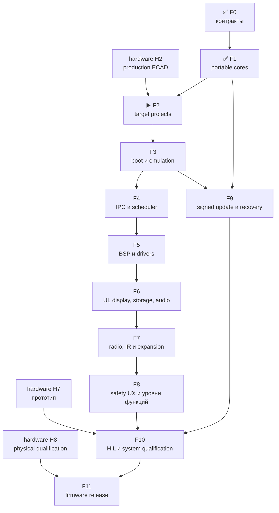

# Leshy2 firmware — роадмап до release

[English](roadmap.md) · [На главную](../README.ru.md) ·
[Аппаратный роадмап](https://github.com/anton-vinogradov/esp32-leshy2/blob/main/docs/roadmap.ru.md)

> **▶️ Текущая граница: F2 — target-проекты и воспроизводимая сборка.** F0 и
> F1 прошли ревью. Принятые production ECAD hardware H2 и генерируемый pin/BSP
> contract уже доступны. Ни один target-образ и ни один target-эмулятор ещё не
> запускались.

Последняя сверка статуса: **25 августа 2026 года**. Это собственный роадмап
firmware-репозитория. Пересечения с железом указаны явно, но hardware-этапы не
дублируются и не получают здесь нового статуса.

## Где находится прошивка

| Область | Фактическое состояние |
|---|---|
| Контракты пяти доменов, memory/rollback и HW↔FW boundary | ✅ Проведено ревью на уровне архитектуры и конфигураций |
| Portable safety, L2IP, update и five-domain model | ✅ [Итог F1](f1-portable-cores-report.ru.md): 24 детерминированных C-сценария; ASan/UBSan чистые |
| Target-проекты S3/C5/RP/Pack/Safety | ✅ Пять структур и generated H2 domain tables прошли ревью; configure/build не заявлены |
| Target-сборки и map-файлы | ⏳ Не выполнялись |
| ESP32-S3 QEMU | ⏳ Не запускался |
| C5, RP2354B и MSPM0 platform/dev-board tests | 🔒 Ожидают target BSP и hardware |
| Меню, waterfall, storage, audio и radio features | ⏳ Описаны как целевой продукт, production-кода ещё нет |
| Полный подписанный all-in-one update | ⏳ Portable rollback-модель есть; target boot/flash/signature integration отсутствует |
| HIL и release | 🔒 Ожидают аппаратный прототип H7 |

Host-модель проверяет переносимую логику, но не заменяет instruction-set,
peripheral или board emulation и никогда не показывается как готовая прошивка.

## Детальный состав текущей F2

<!-- current-substep: F2.4.5 -->

**Точный маркер: `F2.4.5`** — configure, build и verify Safety MSPM0C1106 в
debug и release. S3, C5, RP и Pack builds вместе со всеми 40 созданными artifacts
прошли ревью; emulator и hardware runs не заявлены.

- `F2.0` — target/toolchain matrix.
  - ✅ `F2.0.0` — зарегистрированы пять target и их flash, RAM и rollback
    contracts.
  - ✅ `F2.0.1` — точные SDK/toolchain versions, first-party support status,
    lifecycle, license и требования к build host для S3, C5, RP2354B и обоих
    MSPM0 images прошли ревью.
  - ✅ `F2.0.2` — неизменяемые SDK revisions, 26 записей URL/SHA-256 архивов
    для канонических local/CI hosts и ESP-IDF Python environment с hash-lock
    прошли ревью.
  - ✅ `F2.0.3` — единая [local/CI matrix и shell-free dispatcher](toolchains.ru.md),
    fail-closed preflight и 26 названных target artifacts прошли ревью.
- `F2.1` — общее дерево source/components, warning policy и границы generated
  files без выдуманных target pins.
  - ✅ `F2.1.0` — [каталоги и единоличное владение](toolchains.ru.md),
    target-neutral portable code и пустая до F2.3 граница generated sources
    прошли ревью.
  - ✅ `F2.1.1` — строгие C17/C++17, warnings-as-errors для project code,
    debug/release optimization и link policy с map-файлом прошли ревью.
  - ✅ `F2.1.2` — единым прогоном прошли environment, source, build-policy,
    H2-contract и 24 host-сценария.
- `F2.2` — минимальные production-SDK projects для всех пяти образов.
  - ✅ `F2.2.0` — S3 ESP-IDF project, portable component, production memory
    defaults и debug/release inputs прошли структурное ревью.
  - ✅ `F2.2.1` — C5 ESP-IDF project, portable component, production memory
    defaults и debug/release inputs прошли структурное ревью.
  - ✅ `F2.2.2` — точный RP2354B Arm-secure project, custom board на 2 МиБ,
    partition input и debug/release policy прошли структурное ревью.
  - ✅ `F2.2.3` — Pack MSPM0C1106 project, раздельные boot/application images,
    memory boundaries и debug/release policy прошли структурное ревью.
  - ✅ `F2.2.4` — Safety MSPM0C1106 project, раздельные boot/application images,
    fail-closed entry и debug/release policy прошли структурное ревью.
  - ✅ `F2.2.5` — единое ревью прошло для пяти projects, 29 файлов,
    26 artifacts и 20 debug/release command plans без target execution.
- `F2.3` — импорт принятого генерируемого pin/BSP contract.
  - ✅ `F2.3.0` — неизменяемая H2 source identity, 5 domains, 125 contacts,
    112 nets, 4 transports, 10 groups и модель proof fields прошли ревью.
  - ✅ `F2.3.1` — 11 generated C/header files сохраняют все 125 contacts,
    проходят строгий C17 syntax-check и побайтно воспроизводятся по manifest.
  - ✅ `F2.3.2` — каждый target потребляет ровно свою domain table и include
    path; чужих таблиц, BSP-копий и ручных pins не найдено.
  - ✅ `F2.3.3` — sibling H2, детерминированная генерация, строгие C17 tables и
    one-owner consumption прошли единое ревью.
- `F2.4` — воспроизводимые debug/release builds, map files и image-size gates.
  - ✅ `F2.4.0` — locked-toolchain preflight пяти targets прошёл ревью.
    - ✅ `F2.4.0.1` — точные sources/revisions ESP-IDF `v6.0.2`, Pico
      SDK/picotool `2.3.0` и TI MSPM0 SDK `2.11.00.07` прошли ревью.
    - ✅ `F2.4.0.2` — установлены и распознаны ESP-IDF tool manager точные
      S3/C5 compilers, debuggers, ULP tools, OpenOCD и ROM ELFs прошли ревью.
    - ✅ `F2.4.0.3` — hash-locked Python 3.12 environment и точные CMake/Ninja
      прошли ревью; evidence — [`config/f2_4_preflight_progress.json`](../config/f2_4_preflight_progress.json).
    - ✅ `F2.4.0.4` — hash-verified native Arm GNU `15.2.Rel1` прошёл ревью для RP2354B.
    - ✅ `F2.4.0.5` — hash-verified TI Arm Clang `4.0.5.LTS` и SysConfig
      `1.28.0.4712` прошли ревью для Pack/Safety.
    - ✅ `F2.4.0.6` — прошли 30 точных проверок SDK, Git, lock, compiler и
      обязательных входов плюс debug/release dispatcher preflight; [машинный evidence](../config/f2_4_preflight_review.json).
  - ✅ `F2.4.1` — S3 debug/release configure, build, наличие десяти artifacts
    и image-size gates прошли ревью; [машинный evidence](../config/f2_4_s3_build_review.json).
  - ✅ `F2.4.2` — C5 debug/release configure, build, наличие десяти artifacts
    и image-size gates прошли ревью; [машинный evidence](../config/f2_4_c5_build_review.json).
  - ✅ `F2.4.3` — RP debug/release configure, build, наличие восьми artifacts
    и image-size gates прошли ревью; [машинный evidence](../config/f2_4_rp_build_review.json).
  - ✅ `F2.4.4` — Pack debug/release configure, build, наличие двенадцати
    artifacts и image-size gates прошли ревью; [машинный evidence](../config/f2_4_pack_build_review.json).
  - ▶️ **`F2.4.5` — сейчас:** configure/build/verify Safety debug и release.
  - ⏳ `F2.4.6` — проверить все 52 debug/release artifacts, map files и image-size gates.
- ⏳ `F2.5` — ревью evidence F2; только после него начинается F3 boot/emulation.

`F2.4.4` завершён. Pack application занимает 3 168 байт в обеих конфигурациях
при слоте 22 528 байт; отдельный boot-manager binary занимает 256 байт. Все
OUT, BIN и map outputs созданы. Это доказывает компиляцию и лимиты, но не boot или периферию.
Каждый следующий подэтап до перехода дальше обновляет evidence, точный маркер и
обе языковые страницы в одном commit.

## Зависимости

## Полный путь прошивки

| Этап | Статус | Результат | Критерий выхода |
|---|---|---|---|
| **F0. Контракты продукта** | ✅ Проведено ревью | Пять доменов, владельцы функций, L2IP, memory/partition, safety, update и HW↔FW boundary | Конфигурации обоих репозиториев совпадают; нет неизвестного target, транспорта, recovery-пути или обязательного состояния |
| **F1. Portable cores** | ✅ Проведено ревью | [Итог F1](f1-portable-cores-report.ru.md): C-реализация safety state machine, CRC/L2IP, replay guard, atomic update/rollback, priority queues и five-domain fault model | 24 сценария проходят обычную сборку и ASan/UBSan; закрыты обнаруженные ошибки heartbeat, lease boundary, late update и invalid enum |
| **F2. Target-проекты и build system** | ▶️ Текущая граница; контракт H2 доступен | Пять минимальных проектов на production SDK: ESP-IDF S3/C5, Pico SDK RP2354B и TI MSPM0 SDK ×2 | Все проекты воспроизводимо конфигурируются; pin/BSP source генерируется из принятого HW-контракта; CI строит debug/release; никаких временных pin assignments |
| **F3. Boot, память и эмуляция** | ⏳ Ожидает F2 | Загружаемые skeleton images, map/size gates и максимально доступная виртуальная проверка | S3 boot/self-test/fault/update-failure проходит официальный QEMU; все пять ELF/bin укладываются в flash/RAM/rollback; shared code проходит host platform; отсутствующая периферия попадает в dev-board matrix |
| **F4. IPC и scheduling** | ⏳ Ожидает F3 | Реальные SDIO S3↔C5, SPI+alert S3↔RP, I²C mailboxes Pack/Safety, typed results, credits и priority queues | CRC/replay/deadline/duplicate/reset recovery работают end-to-end; waterfall/bulk saturation не задерживает safety/control; link loss локально закрывает side effects |
| **F5. BSP и drivers** | ⏳ Ожидает F4 и актуальную схему | Драйверы display/touch, microSD, codec, receiver, detect CTIA-разъёма, управление источником гарнитуры по `0x39`, IR, 3×nRF24, CC, voice, U214, M5 Unit, controls, LEDs, sensors и power states | Каждый driver имеет fake/host boundary и target smoke test; reset/off/no-back-power/quiet transitions явны; P02 остаётся только входом, проверены reset/readback селектора и семь резервных pins; неподдерживаемая эмулятором периферия имеет dev-board test |
| **F6. UI, display, storage и audio** | ⏳ Ожидает F5 | Меню, dirty-region QSPI rendering, бегущий waterfall, touch/D-pad/keys/encoder/PTT, запись, CTIA/TRS playback/capture state machine и fault viewer | UI остаётся отзывчивым под максимальным потоком; малые области укладываются в display occupancy budget; вставка сначала отключает динамик, источник меняется без pop, извлечение восстанавливает reset-default до playback; storage/audio ошибки изолированы, причина аварии сохраняется и показывается |
| **F7. Radio, IR и expansion features** | ⏳ Ожидает F5/F6 | Normal-mode receive/scan/record, полноценные `3R/1T2R/2T1R/3T`, Wi-Fi/BLE/802.15.4, Sub-GHz, voice, IR и профили расширений | Одна signal group активна; три nRF работают одновременно без программного урезания; inactive interfaces quiet; права, регион и antenna profile проверяются до TX |
| **F8. Три уровня функций и safety UX** | ⏳ Ожидает F7 | Основной режим, Лаборатория и Лаборатория → Контролируемая зона; локальная настройка интервала полной самопроверки | Каждый вход в Controlled Zone показывает новый обязательный баннер; действие требует preview, separate arm, разрешённую цель/изолированную среду и bounded lease; установка требует принятия акта о ненападении; выбор 24 ч/48 ч по умолчанию/только при старте не может ослабить watchdog, thermal, power-fault или TX-lease enforcement |
| **F9. Signed bundle, update и recovery** | ⏳ Ожидает F1/F3 | Один owner/release-signed bundle для пяти target с local owner roots, readback, activation order и rollback | Подмена и несовместимый bundle отвергаются; Pack→Safety→C5→RP→S3 подтверждаются self-test; сбой возвращает совместимый комплект; USB/UART/SWD recovery остаётся открытым владельцу |
| **F10. HIL и системная квалификация** | 🔒 Ожидает F4–F9 и hardware H7 | Автоматизированные тесты на собранном прототипе, fault injection, RF/power/thermal/endurance | Пройдены реальные transports/peripherals, 3×nRF concurrency, quiet-state, watchdog, thermal, brownout и update interruption; USB endurance 24/48 ч и измерения от батарей до protected cutoff являются evidence, а не обещанием времени работы |
| **F11. Firmware release** | 🔒 Ожидает F10 и hardware H8 | Воспроизводимые образы, installer, release notes, recovery kit и совместимый тег | Ноль blocker; target binaries воспроизводимы и подписаны; SBOM/licenses/tests опубликованы; сайт описывает реализованные возможности; firmware tag совместим с hardware release |

## Правила продвижения

1. Прошивка не придумывает GPIO, polarity, rail или recovery path: они приходят
   из принятого hardware-контракта.
2. Portable core используется всеми target, а не переписывается пять раз.
3. То, что QEMU/host не моделирует, не считается проверенным и переносится в
   dev-board/HIL matrix.
4. Любая потенциально опасная функция сначала получает permission, evidence,
   revoke и fault tests; UI не может обойти hardware `FAULT_KILL`.
5. Статус **«Проведено ревью»** открывается повторно, если target или HIL
   обнаруживает несоответствие.
6. Закрытие каждой глобальной фазы `F*` публикует двуязычный итоговый отчёт и
   ссылку из таблиц roadmap и стартовой страницы. Внутренний подэтап обновляет
   точный текущий маркер, но отдельным глобальным отчётом не считается.

## Следующее действие

Текущая граница — F2. Принятая production ECAD-схема H2 и генерируемый pin/BSP
contract доступны. F2.0–F2.2 создают воспроизводимые targets, затем F2.3
подключает контракт до target builds и emulator execution.
